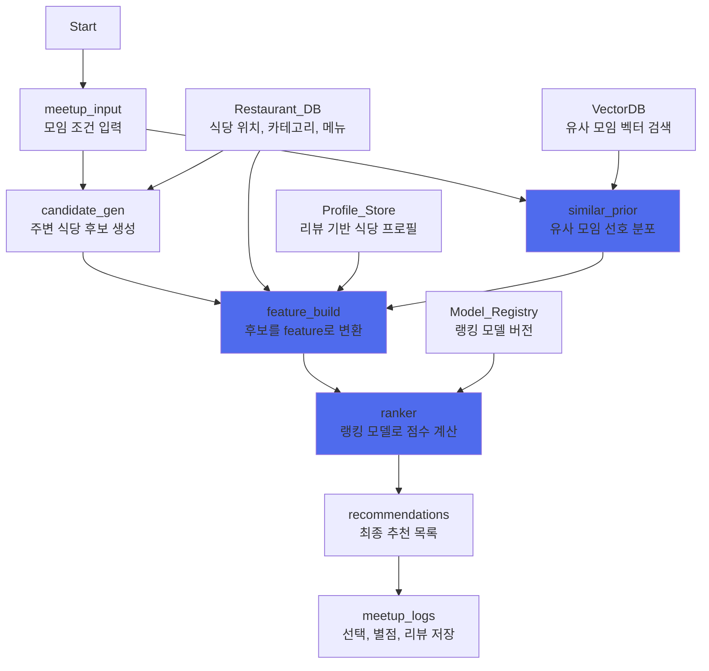
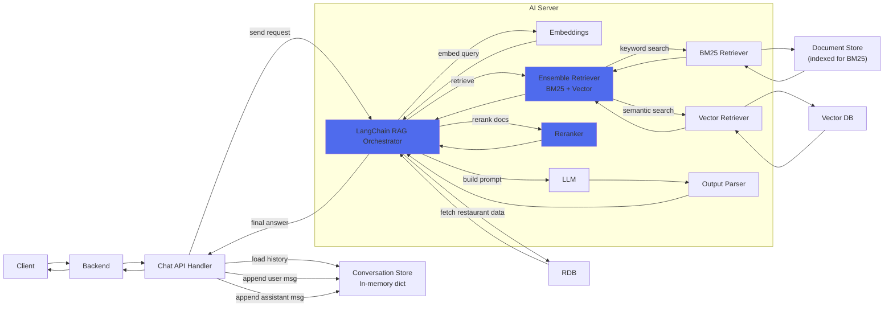

# 음식점 추천 기능
## 아키텍처 다이어그램

<br />

## 각 모듈의 책임(Domain)과 기능, 분리 이유

### 1. Recommendation Orchestrator (Serving Orchestrator)
> 온라인 추천 워크플로

#### 기능
- candidate -> similar prior -> feature -> ranker 호출 순서/조건 제어
- 타임아웃/폴백 (유사모임 실패 시 prior 없이 진행 등)
- observability (단계별 latency, 실패율)

#### 분리 이유
- 추천 로직을 단일 서비스로 합치면 너무 복잡해짐
- 각 서브 모듈을 독립 최적화하기 위해 오케스트레이션 분리

### 2. Candidate Generator (후보 생성)
> 후보 풀 생성

#### 기능
- Geo filter (반경 내 검색), 카테고리 필터/샘플링
- 거리 bins 샘플링 (근거리/중거리/원거리 비율) -> 한 곳에 쏠리지 않도록 함
- 프랜차이즈, 중복 제거
- 최종 후보 N개 생성

#### 분리 이유
- 후보 생성은 검색/필터링

### 3. Similar Meetup Prior Service (유사 모임 prior)
> 이번 모임은 어떤 취향/패턴인지 요약, 유사 모임의 패턴 반영

#### 기능
- Meetup context embedding → VectorDB kNN 검색
- 유사모임 가중치 계산: `sim^p * f(rating) * g(sentiment)`
- prior 생성 : 
 - `P_sim_cat` : 카테고리 확률
 - `A_sim` : 편의시설 확률/분포
 - 'M_sim` : menu tag 분포
- 입력 선호와 혼합 : `P_final_cat = λ P_input + (1-λ) P_sim_cat`

#### 분리 이유
- VectorDB, 임베딩, 근접 검색 수행

### 4. Feature Builder (특징 생성)
> 후보를 평가 가능한 숫자 벡터로 변환

#### 기능
- 후보별 feature 생성:
 - 거리/리뷰수/카테고리
 - 입력 선호/비선호 매칭
 - prior 매칭(amenities/menu/aspect)
 - 식당 프로필(별점/감성/리스크) 
 - feature schema 버저닝, 결측 처리, 정규화

#### 분리 이유
- 모델의 성능을 좌우하는 핵심 
- RDB, profile_store 등 여러 데이터 소스를 묶는 조립 과정

### 5. Ranker Service (LightGBM)
> 후보를 최종 순서로 정렬

#### 기능
- LightGBM Ranker로 후보 점수화 및 정렬
- 결과 topN 반환

#### 분리 이유
- 모델/런타임 최적화
- 모델 업데이트/롤백 분리 -> 운영 리스크 감소


<br><br>


# RAG 챗봇
## 아키텍처 다이어그램


<br><br>

### 1. Conversation Store (In-memory dict)
> 멀티턴을 위한 단기 대화 기록 저장소

#### 기능
- `dict[session_id] = [messages...]` 형태로 최근 N턴 저장
- 사용자 메시지 append

#### 분리 이유
- 멀티턴에서는 정확한 순서의 최근 N턴이 중요함

### 2. LangChain RAG ORchestrator (ORCH)
> RAG 전체 흐름을 조율하는 워크플로/오케스트레이션 계층

#### 기능
- 입력 정리 (질문 + 히스토리)
- 검색 -> 재정렬 -> RDB 보강 -> 프롬프트 구성 -> LLM 호출 -> 결과 검증
- 폴백 처리 (근거 부족 시 "근거에 없어 확인할 수 없어요")

#### 분리 이유
- Retriever/LLM을 분리해 변경 용이하도록 함
- 구성요소 교체 쉬움

### 3. BM25 Retriever (BM25)
> 키워드 기반 검색기

#### 기능 
- 메뉴명/가격/고유명사와 같이 정확한 토큰 매칭
- Document Store 기반 검색

#### 분리 이유
- vector만으로 놓치기 쉬운 정확한 키워드 검색 보완
- 인덱스/튜닝 방식이 벡터 검색과 다름

### 4. Vector Retriever (VR)
> 의미 기반 검색기

#### 기능
- 질문 임베딩을 이용해 Vector DB에서 유사 문서 검색
- 표현이 달라도 의미가 비슷한 문서 검색

#### 분리 이유
- 의미 유사 질문 대응
- VectorDB 튜닝을 독립적으로 개선 가능

### 5. Ensemble Retriever (BM25 + Vector)
> 문서 검색의 Recall을 책임지는 검색 계층

#### 기능
- BM23 Retriever 결과 + Vector Retriever 결과 결합
- topK 후보 문서 생성


### 6. Reranker
> 검색된 문서의 Precision을 책임지는 재정렬 계층

#### 기능
- Ensemble Retriever 결과를 재정렬하고 상위 문서만 유지


### 7. LLM
> 근거로부터 최종 답변 생성
#### 기능
- 근거 기반 답변 생성
#### 분리 이유
- 모델 교체와 서빙 최적화를 독립적으로 진행 가능


<br><br>

# OCR 기능
## 아키텍처 다이어그램


<br />

## 각 모듈의 책임(Domain)과 기능, 분리 이유

### OCR Service (AI / Model Serving Domain)

- **Domain(책임)**: 이미지 → 텍스트/라인아이템/금액 구조화(JSON) 변환
- **주요 기능**
    - 이미지 전처리(회전/크롭/리사이즈/노이즈 제거 등)
    - OCR 엔진 실행(문자 인식)
    - 파싱(라인아이템/수량/단가/금액/총액 추출)
        - LLM 기반 파싱(정확도 향상)
        - 실패 시 룰 기반 fallback(정규식/템플릿 파싱)
    - 결과 정규화/검증(스키마 고정, 값 보정: 숫자형 변환/음수 방지 등)
- 분리 이유
    - GPU/모델/추론 프레임워크/엔진 버전 변경이 잦고 운영 난이도가 높음 → **독립 서비스로 격리해야 교체/롤백이 쉬움**
    - 성능 튜닝(배치, 캐시, VRAM 관리)은 Backend와 관심사가 다름
    - 장애 격리: OCR 장애가 나도 Backend/정산 시스템이 같이 죽지 않도록 분리

<br />

## 모듈 간 인터페이스 설계 내용

### 공통 설계 원칙

- **Correlation / Idempotency Key**
    - 모든 요청과 응답에 `request_id` 포함
    - end-to-end 요청 추적 및 중복 처리 방지
- **통신 방식**
    - 내부 서비스 간: HTTP/HTTPS (내부망 + Reverse Proxy 권장)
    - 인증: `X-Internal-Token`(공유 시크릿) 또는 mTLS(가능한 경우)
- **데이터 포맷**
    - 이미지 업로드: `multipart/form-data`
    - 기타 요청/응답: `application/json`
    - 시간 포맷: ISO 8601 + timezone 포함
        
        (예: `2026-01-06T14:20:00+09:00`)
        


### Backend ↔ OCR Service 인터페이스

**OCR 실행 (이미지 → 구조화 JSON)**

- **Method**: `POST`
- **Endpoint**: `/api/v2/receipts/ocr`
- **Caller**: Backend
- **Authentication**: `X-Internal-Token: <INTERNAL_SHARED_SECRET>`
- **Content-Type**: `multipart/form-data`


**Request (multipart/form-data)**

- `user_id` (int, **필수**)
    
    → 요청 사용자 식별자
    
- `request_id` (string, **필수**)
    
    → Idempotency Key (중복 요청 방지)
    
- `image` (file, **필수**)
    
    → 영수증 이미지 파일
    


**Response (200, application/json)**

```json
{
"request_id":"req_20260106_0001",
"user_id":123,
"result":{
"items":[
{"name":"string","unit_price":0,"quantity":0,"amount":0}
],
"total_amount":0,
"discount_amount":0,
"paid_amount":0,
"source":"ocr_llm",
"created_at":"2026-01-06T14:20:00+09:00"
}
}


```
<br />

## 모듈화로 기대되는 효과와 장점

### 1. 안정성 향상 (장애 격리 + 장애 전파 차단)

- OCR은 **고비용·고지연**(이미지 전처리 + OCR + LLM 파싱) 작업이라 순간 트래픽/실패가 발생하기 쉽다.
- OCR을 Backend/Chatbot과 **분리**하면:
    - OCR에서 타임아웃/메모리 누수/모델 로딩 실패가 나도 **Backend는 정상 동작**(게시글/로그인/모임 생성 등 핵심 기능 유지)
    - 장애 범위를 OCR로 **국소화**할 수 있어, 운영 시 “전체 서비스 다운” 리스크가 줄어든다.

### 2. 성능 최적화 용이 (워크로드 별 튜닝)

- OCR 서비스는 GPU/배치/캐시/VRAM 관리 등 **추론 최적화**가 핵심이고,
- Backend는 DB 쿼리/캐시/비즈니스 로직이 핵심이라 최적화 포인트가 다르다.
- 분리하면 OCR만:
    - GPU 인스턴스 스케일링, 모델 warmup, batching, 결과 캐시, 타임아웃 정책
    - 모델 교체(LLM/파서/ocr엔진) 시 Backend 영향 최소화
        
        를 독립적으로 개선 가능.
        

### 3. 배포/롤백 속도 개선 (릴리즈 리스크 감소)

- Backend 코드 변경(권한/정산 로직 수정)과 OCR 모델 변경(버전업/프롬프트 수정/엔진 변경)은 변경 주기가 다름.
- 모듈화하면:
    - OCR만 롤백/핀 고정(“이 모델 버전은 안정적”) 가능
    - Backend는 기능 개발을 빠르게 배포해도 OCR 안정성에 영향 덜 줌
- 결과적으로 **배포 단위가 작아져** 장애 발생 시 복구가 빠르다.

<br />

## **모듈화된 설계가 팀의 서비스 시나리오에 부합함을 설명하는 근거**

### 1. 서비스 특성상 AI 처리와 일반 웹 트래픽의 성격이 명확히 다름

- 팀 서비스는 일반 웹 서비스 요청(로그인, 모임, 음식점 추천)과
    
    AI 기반 처리 요청(OCR, LLM 파싱)이 동시에 존재한다.
    
- 두 요청은 처리 시간, 실패 가능성, 리소스 요구 사항이 다르므로
    
    **동일한 모듈로 관리하는 것은 서비스 안정성과 운영 효율 측면에서 부적합**하다.
    
- 이에 따라 AI 처리를 별도 모듈로 분리한 설계는
    
    서비스의 실제 트래픽 특성과 자연스럽게 부합한다.
    


### 2. AI 기능은 반복적인 개선이 필요한 반면, 비즈니스 로직은 안정성이 우선됨

- OCR/LLM 기능은 인식률 개선, 모델 교체, 파싱 로직 수정 등 **지속적인 실험과 반복 개선이 전제되는 영역**이다.
- 반면 Backend의 비즈니스 로직은 데이터 정합성과 서비스 안정성이 최우선이다.
- 모듈화된 구조는
    
    **변동성이 큰 AI 영역과 안정성이 요구되는 핵심 로직을 명확히 분리**하여 팀 서비스의 개발 방향성과 일치한다.
    


### 3. 서비스 운영 관점에서 장애 허용 범위가 다름

- 팀 서비스 시나리오에서 OCR 실패는 “일시적인 처리 지연”으로 허용 가능하지만,
- 인증, 게시글, 모임 생성 등 핵심 기능의 장애는
    
    **서비스 신뢰도에 치명적**이다.
    
- OCR을 독립 모듈로 분리함으로써 서비스 시나리오에서 요구하는 **장애 허용 범위와 중요도 차이를 구조적으로 반영**할 수 있다.