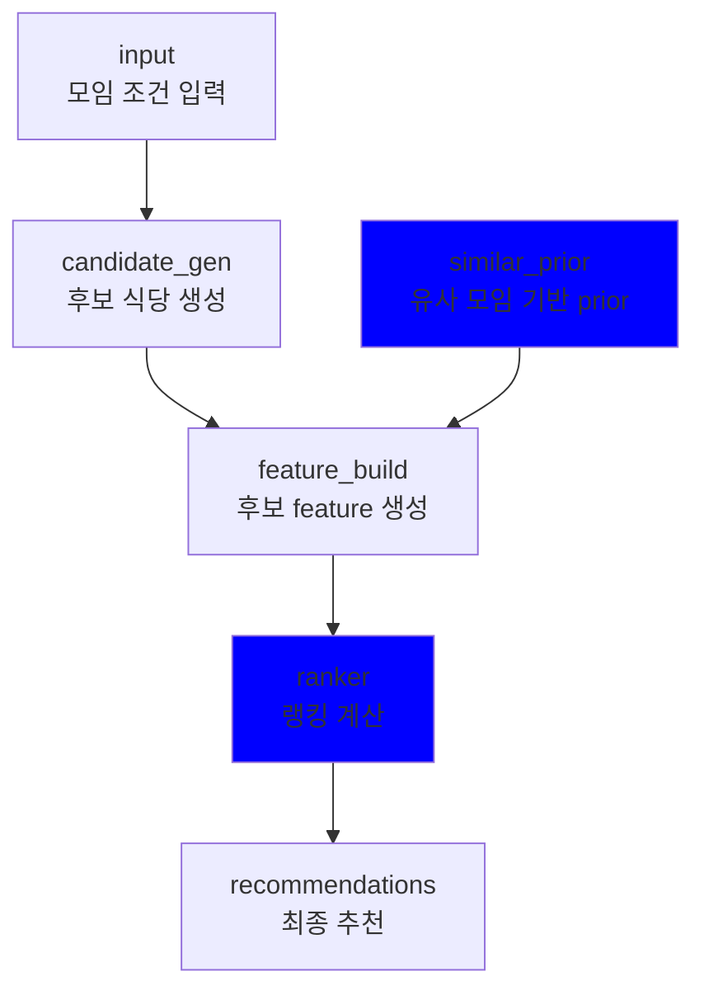
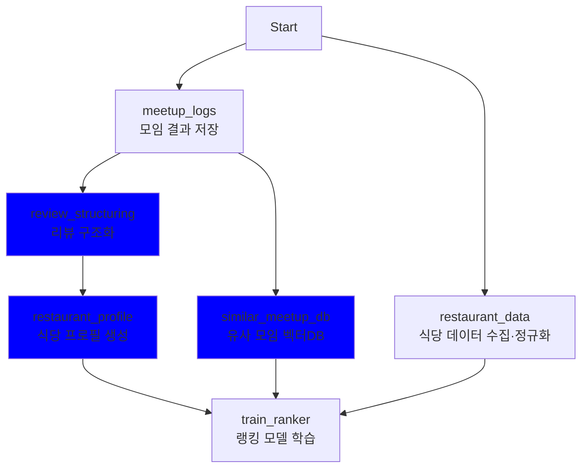
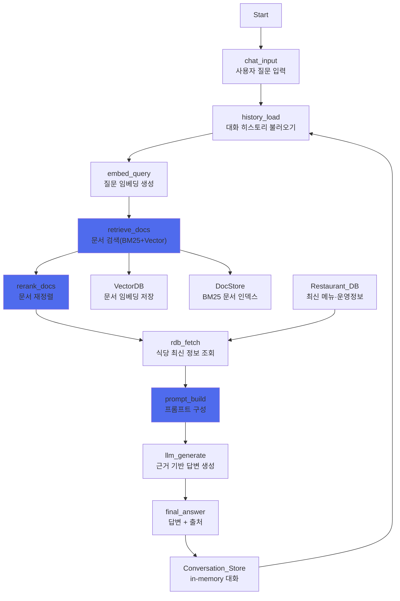

# 파이프라인
## 🍽️ 음식점 추천 시스템
### 1. 목적

본 시스템은 단순한 거리·리뷰 수 기반 추천이 아니라,
**“비슷한 모임에서 실제로 만족도가 높았던 선택”**을 학습하여
모임 상황에 가장 적합한 음식점을 추천하는 것을 목표로 한다.


### 2. 전체 구조 요약

본 시스템은 두 단계로 구성된다.

- 오프라인 단계: 데이터를 정리하고 학습 가능한 형태로 저장, ranker 학습

- 온라인 단계: 현재 모임 조건에 맞춰 실시간 추천 생성


### 3. 온라인 파이프라인

### 1. 모임 조건 입력
사용자로부터 다음 정보를 받는다.

- 모임 위치 (위도, 경도)
- 탐색 반경 R
- 인원 수
- 시간대 (점심 / 저녁, 평일 / 주말)
- 카테고리 선호 / 비선호 투표

### 2. 후보 식당 생성
전체 식당 중에서 이 모임에 적합할 가능성이 있는 식당 후보를 고른다.

수행 내용
1. 반경 R 이내 식당만 필터링
2. 선호 카테고리 상위 그룹 선택
3. 거리별 샘플링 (너무 가까운/먼 곳에 쏠리는 것 방지)
4. 프랜차이즈 중복 제거

→ 약 50개 내외의 후보 식당 목록을 만든다.

### 3. 유사 모임 기반 보정
현재 모임과 비슷한 과거 모임을 VectorDB에서 검색한다.

수행 내용

1. 현재 모임을 벡터로 변환
2. 과거 모임 중 유사한 모임을 KNN으로 검색
3. 해당 모임들이 실제로 선택하고 만족했던 카테고리(세부 카테고리), 메뉴, 편의시설, 분위기를 확률 분포로 계산

→ “이런 상황에서는 해당 모임들이 이런 스타일을 선호했다”라는 prior를 생성한다.

### 4. 후보 Feature 생성
각 후보에 대해 랭킹 모델이 사용할 수 있는 Feature 만든다.
포함되는 정보

- 거리
- 리뷰 수
- 평균 별점
- 현재 모임이 카테고리 선호와의 일치도
- 유사 모임에서 선호했던 패턴과의 일치도
- 리뷰 텍스트 기반 분위기/서비스/리스크(안좋은 리뷰) 정보

-> 각 식당을 하나의 숫자 벡터로 표현한다.

### 5. 랭킹 모델
LightGBM Ranker가 모든 후보 식당을 평가해 이번 모임에서 가장 만족할 확률이 높은 순서로 정렬한다.

단순 인기 순이 아닌
- 거리
- 평점
- 모임 취향
- 유사 모임 경험
- 리뷰 내용

을 모두 종합해 판단한다. 

<br>


### 4. 오프라인 파이프라인


### 1. 주기적 배치 (주 1회)

### 2. restaurant_data
- 식당 데이터 수집 · 정규화
[ 입력 ] 
- 크롤링/외부 API 기반 식당 데이터
- 상호명, 카테고리, 위치, 메뉴, 가격, 운영 정보 등
[ 처리 ]. 
- 중복 제거
- 필드 표준화 (가격 범위, 카테고리 매핑 등)
- 결측치 보정
[ 출력 ]
- 정형화된 restaurant 기본 데이터


### 3. meetup_logs
- 모임 결과 로그 저장
[ 입력 ]
- 사용자가 생성한 모임 id
- 최종 선택한 식당 id
- 모임 조건 (인원, 목적, 예산, 분위기 등)
[ 의미 ] 
- 정답(label)에 가장 가까운 데이터


### 4. review_structuring
리뷰 구조화
[ 입력 ] 
- 원본 텍스트 리뷰
- 리뷰 수,리뷰 타입(방문자/블로그)
[ 처리 ] 
- LLM 또는 규칙 기반으로:
 - 맛 / 분위기 / 서비스 / 가격 / 양 등 토픽 분리
- 감성 스코어 정규화
 - 키워드/태그 추출
[ 출력 ] 
- 구조화된 리뷰 피처
- 텍스트 → 학습 가능한 숫자/벡터 형태로 변환


### 5. restaurant_profile 
식당 프로필 생성
[ 입력 ] 
- 식당 기본 정보 
- 구조화된 리뷰 
[ 처리 ]
- 식당 단위로 정보 통합
- 대표 특성 요약
 - 분위기 키워드
 - 가격대 요약
 - 강점/약점 시그널
[ 출력 ]
- restaurant_profile
- 랭킹 모델의 핵심 아이템 피처


### 6. similar_meetup_db
유사 모임 벡터 DB 생성
[ 입력 ] 
- meetup_logs (모임 조건 + 선택 결과)
[ 처리 ] 
- 모임 조건 + 최종 선택 식당 정보를 결합
- 임베딩 생성
- 벡터 DB에 저장
[ 역할 ]
- 과거에 비슷한 모임들은 어떤 선택을 했는가?
- Prior(사전 분포) 역할
[ 출력 ]
- 유사 모임 검색용 벡터 인덱스


### 7. train_ranker 
랭킹 모델 학습
[ 입력 피처 ]
- restaurant_data (기본 정보)
- restaurant_profile (정제된 식당 특성)
- similar_meetup_db (유사 모임 prior)
- meetup_logs (label)
[ 학습 목표 ]
- 주어진 모임 조건에서
- 여러 후보 식당 중
- 실제 선택된 식당의 점수가 가장 높도록
[ 출력 ]
- 랭킹 모델 (LightGBM Ranker)
- 모델 버전 및 메타데이터


<br>

## 챗봇
### 1. 파이프라인
Langchain 기반으로 사용자 질문에 문서 기반으로 신뢰도 높은 응답을 제공합니다.


### 2. 사용된 도구나 외부 리소스
본 서비스는 사용자 질문에 대한 문서 기반 응답을 생성합니다.
모델의 성능과 비용 등을 고려해 아래와 같이 선택하였습니다.

<br>


| 분류 | 도구 | 
|------------------|------|
| 문서 검색기  | `EnsembleRetriever`(`BM25Retriever` + `VectorRetriever`) |
| LLM | `Qwen/Qwen3-4B-Instruct-2507` |  
| 임베딩 모델 | `BAAI/bge-m3` |  
| Reranker | `BAAI/bge-reranker-v2-m3` | 
| 벡터DB | Qdrant |  
| 문서 포맷 | Markdown 기반 구조화 chunk 문서 | 


<br><br>


### 임베딩 모델 
1. 기능 소개
- 사용자 질문과 음식점 문서(메뉴/리뷰/옵션/시간)를 의미 벡터로 변환해 유사도 기반 검색을 수행한다.
- 짧은 키워드 질의부터 문장형 질의까지 폭넓게 대응하는 검색용 임베딩을 제공한다.
2. 사용 이유
- 음식점 도메인은 “가성비”, “분위기”, “혼밥”, “회식”처럼 의미 중심 질의가 많아 임베딩 품질이 핵심이다.
- bge-m3는 한국어 포함 다국어 환경에서 검색 성능이 안정적이라 데이터 편차(리뷰/메뉴 표현)에 강하다.
- 하이브리드 검색(BM25+Vector)에서 벡터 검색의 재현율을 높여 답변 근거 누락을 줄일 수 있다.


### LLM 모델 
1. 기능 소개
- 검색된 문서(chunk)를 근거로 사용자의 질문에 대한 최종 자연어 답변을 생성한다.
- 요청 조건(예: 만원 이하, 조용한 분위기, 주차 가능)을 충족하는 근거를 요약·정리해 설명형 응답을 만든다.
2. 사용 이유
- 4B 규모에서도 한국어 문장 안정성이 높다.
- 지연시간, GPU 메모리 사용량이 낮아 실시간 챗봇 서비스에서 비용 효율적이다.
- 규칙 기반 보정/컨텍스트 강화와 결합 시 더 높은 수준의 응답 품질을 기대할 수 있다.

### 벡터 DB `Qdrant`
1. 기능 소개
- 임베딩된 음식점 문서들을 저장하고 벡터 유사도 검색을 수행한다.
- 벡터 검색과 함께 필터(거리, 카테고리, 가격대 등)를 동시에 처리할 수 있다.
2. 사용 이유
- 음식점 추천에서는 “2km 이내 + 한식 + 만원 이하” 같은 조건 검색이 필수다.
- Qdrant는 벡터 유사도와 구조 필터를 함께 처리할 수 있어 실무 서비스에 매우 적합하다.


### 문서 포맷
1. 기능 소개
- 한 식당 정보를 한 덩어리로 저장하지 않고 목적별 chunk(메뉴/리뷰/옵션/시간)로 나눠 인덱싱한다.
- 질문 유형에 맞는 chunk만 정확히 검색되어 답변 근거의 밀도를 높인다.
2. 사용 이유
- “메뉴 뭐 있어?” “분위기 어때?” “주차 돼?” 같은 질문은 필요한 근거가 서로 완전히 다르다.
- 분리하지 않으면 임베딩이 평균화되어 정확한 근거 chunk가 상위에 안 뜰 확률이 커진다.
- chunk 분리는 검색 정확도·근거성(groundedness)·응답 속도(짧은 컨텍스트) 모두에 유리하다.

### BM25 Retriever + Ensemble Retriever
1. 기능 소개
- BM25로 키워드가 정확히 일치하는 문서를 찾고, 벡터 검색으로 의미적으로 유사한 문서를 함께 검색한다.
- 두 결과를 결합해 질문에 가장 적합한 음식점 정보 chunk 후보를 만든다.

2. 사용 이유
- 음식점 검색은 “제육정식”, “주차”, “브레이크타임”처럼 정확한 단어 검색과 “가성비 좋은”, “조용한” 같은 의미 검색이 동시에 필요하다.
- BM25 단독이나 벡터 단독보다, 하이브리드 방식이 검색 누락과 오답을 가장 적게 만든다.


<br>

## OCR

## 1. 멀티스텝 파이프라인 다이어그램


## 1). Client

**역할**

- 사용자가 영수증 이미지를 업로드하고 OCR 요청을 전송
- 인증 토큰(JWT)을 포함하여 Backend API 호출
- 처리 결과(JSON) 또는 상태를 조회

**설계 의도**

- OCR 연산은 클라이언트에서 수행하지 않고 서버에서 처리
- 사용자는 업로드/조회만 수행하며, 도메인 로직은 서버에서 일관되게 관리

---

## 2). Backend API (Orchestrator)

**역할**

- 외부 요청의 **인증/인가 처리**
    - JWT 검증 및 사용자 식별
- 이미지 업로드를 받아 **Object Storage 저장**
- 영수증 메타/상태를 **RDBMS에 저장**
- OCR Service AI에 **직접 요청**하여 결과(JSON)를 수신
- 수신한 결과를 검증 후 **RDBMS에 저장**
- Client에 **JSON 응답 또는 상태**를 반환

**설계 의도**

- 별도의 Auth Gateway 없이 Backend API에서 인증을 책임져 구조 단순화
- 추후 트래픽 증가 시 Queue/Worker/Kafka로 확장 가능한 구조로 설계

---

## 3). Object Storage

**역할**

- 영수증 이미지 원본 저장
- Backend가 저장한 이미지에 대해 `image_url`(또는 key)을 제공

**설계 의도**

- 이미지 원본은 DB에 넣지 않고 Storage에 분리하여 비용/성능/관리 효율 확보
- 재처리(재요청) 및 추적을 위해 원본을 일정 기간 보관 가능

---

## 4). OCR Service (AI Service)

**역할**

- 실제 OCR 및 구조화(JSON) 생성을 수행하는 AI 서비스
- Backend로부터 전달받은 이미지(또는 이미지 URL 기반으로 준비된 입력)를 처리하여 JSON 반환

### OCR Service 내부 처리 단계

1. 이미지 전처리(리사이즈/노이즈 제거/기울기 보정 등)
2. 레이아웃/영역 분리(문서 영역/테이블 구조)
3. 텍스트 인식 및 추출
4. 결과 정제(숫자/통화/공백 정리)
5. LLM 기반 구조화(메뉴·수량·단가·금액·총액)
6. 결과 검증(스키마/산술 일관성)

**설계 의도**

- 모델/추론 엔진을 Backend와 분리하여 **교체/튜닝/롤백 용이**
- AI 연산(GPU) 환경을 별도로 운영하여 **장애 격리** 및 운영 유연성 확보

---

## 5). Database (RDBMS)

**역할**

- 영수증 처리 상태 관리(`PENDING/DONE/FAILED`)
- OCR 결과(라인아이템/총액 등) 저장
- Backend가 결과 조회/응답에 사용

**설계 의도**

- RDBMS에는 결과와 메타데이터만 저장하여 정산 도메인의 무결성을 유지
- 원본 이미지는 Storage에 보관하여 DB 부하 최소화

## 2. 사용한 모델·도구·프레임워크 목록, 선택 이유와 기대 효과

## 1) 이미지 전처리 / 레이아웃 처리

**도구**

- OpenCV
- PIL (Pillow)

**선택 이유**

- 촬영 환경에 따른 기울어짐/노이즈/해상도 차이가 큼
- 입력 품질 정규화를 통해 OCR/구조화 단계의 오류를 감소시키기 위함

**기대 효과**

- 문자 인식 정확도 향상(CER/WER 개선)
- 난이도 높은 케이스에서 성능 변동폭(p95/p99) 감소
- 후속 단계(구조화) 오류 전파 감소

---

## 2) 텍스트 인식 및 구조화 모델

**모델**

- Qwen3-VL 4B
- JSON Schema 기반 응답 유도

**선택 이유**

- 영수증은 “텍스트 + 숫자 + 표 구조”가 결합된 입력
- 단순 OCR을 넘어 메뉴–수량–금액 관계를 구조화(JSON)해야 함
- 동일 모델로 “추출+구조화”까지 처리 가능하여 파이프라인 단순화

**기대 효과**

- 다양한 영수증 포맷에 대한 유연한 처리
- 정산 도메인에서 바로 사용 가능한 구조화 결과 생성

---

## 3) 결과 정제 및 검증(Validator)

**도구**

- Python 정규식/룰 로직
- Custom schema validation module

**선택 이유**

- 영수증 도메인에는 강한 제약이 존재(수량×단가=금액, 합계 일치)
- 모델 출력만으로 정산 데이터로 저장하기엔 위험

**기대 효과**

- JSON 스키마 일관성 확보
- 산술 검증으로 신뢰도 상승
- 재시도/보정 로직을 위한 실패 감지 근거 제공

---

## 4) 서빙/인프라

**프레임워크**

- FastAPI (OCR Service)
- Backend API
- Docker 기반 분리 배포

**선택 이유**

- 초기 단계에서는 큐/워커 없이도 “직결 호출”로 구조 단순화 가능

**기대 효과**

- 구성 요소가 줄어 운영/디버깅 부담 감소
- 작은 팀/PoC에서 빠른 반복 개발에 유리

## 3. 의사코드

```
POST /api/v2/receipt/ocr
  1) JWT 검증 → user_id 식별
  2) 이미지 업로드 → Object Storage 저장 → image_url 생성
  3) DB 업데이트 (meeting_settlements)
     -id = settlement_id
     - receipt_image_url = image_url
     - settlement_status ="PROCESSING"
  4) OCR Service 호출 (HTTP)
     - headers: X-Internal-Token
     - form-data: user_id, request_id, image(or image_url)
  5) 응답 JSON 검증 (schema + 산술)
  6) DB 저장
     - meeting_settlement_items insert
     - meeting_settlements update:
         total_amount, settlement_status="DONE"
  7) Client에 결과 JSON 반환
```

## 4. 멀티스텝 구조 도입 배경 및 기대 효과

## 1) 서비스 요구사항과의 관련성

본 서비스의 영수증 OCR 기능은 단순 텍스트 추출이 아니라, **정산 도메인의 핵심 데이터를 생성**하는 연산 비용이 큰 처리 과정이다.

- GPU 추론 지연
- 결과 파싱 실패 가능성
- 이미지 품질/레이아웃에 따른 성능 변동(p95/p99)

이러한 특성 때문에, **이미지 저장 → 메타 관리 → OCR 호출 → 결과 검증/저장**의 단계를 명확히 분리한 멀티스텝 파이프라인으로 설계했다.

## 2) 멀티스텝 구조로 기대되는 이점

### (1) 구조 단순화 및 개발 속도

- 큐/워커를 제거하고 Backend–OCR Service 직결로 구성하여
    - 구성 요소를 최소화
    - 배포/운영 부담을 낮춤
    - 빠른 실험 및 반복 개선이 가능

### (2) 데이터 무결성 확보

- 결과 저장 전 Validator로 스키마/산술 검증을 수행하여
    - 잘못된 결과가 정산 데이터로 저장되는 것을 방지
    - 운영 리스크 감소

### (3) 장애 격리 및 운영 유연성

- AI 서비스(OCR Service)를 Backend와 분리 운영하여
    - 모델 교체/튜닝/롤백이 쉬움
    - AI 장애가 Backend 전체 장애로 확산되는 것을 완화

### (4) 확장 가능성(향후 큐 기반으로 확장)

- 초기에는 직결 구조로 시작하되,
- 트래픽 증가 또는 p95 지연 악화가 발생하면
    - Redis/Kafka 기반 Queue + Worker를 추가하여
    - 비동기 처리/재시도/처리량 제어로 확장 가능