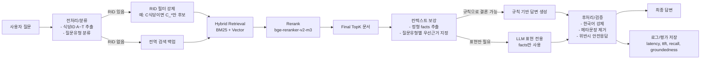

# RAG 데이터/컨텍스트 보강 설계

## 목적 & 범위
### 목적
- 사용자가 특정 식당에 대해 묻는 질문에 대해 문서 근거 기반으로만 답변한다.
- 식당 필터 강제(질문에 포함된 식당문서만 검색)로 오인용/오답 줄인다.
- 4B 모델에서도 안정적으로 답하도록 컨텍스트 보강 + 규칙 기반 보정을 적용한다.

### 범위
- 텍스트 기반 Q&A (메뉴/가격/시간/시설/분위기/리뷰)
- 출력은 한국어, 메타 설명('문서에서 확인') 금지

 

## 전체 데이터 흐름

  

## 데이터/지식 소스 설계

### 1. Info 문서 : `{rid}_info`
- 주소/전화/영업시간/브레이크/휴무/편의시설(주차,예약,단체,포장)/분위기 키워드

### 2. Menu 문서 : `{rid}_menu`
- 메뉴명/가격, 가격 범위,만원이하 가능 여부 요약 문장
- 선택 이유
 - 가격/만원 이하 여부는 숫자 근거가 핵심

### 3. Review 문서 `{rid}_review`
- 맛/양/서비스/분위기/가격 등의 토픽 요약 + 리뷰 수
- 선택 이유
 - 서비스/분위기 같은 질문에서 자연어 근거 제공에 유리

 

## Chunking 전략
- `info` : 1~2 chunk 유지
 - `영업시간, `옵션`, `분위기 키워드`는 라인 단위로 강하게 매칭됨
- `menu` : 2 chunk
 - 메뉴 목록 chunk + 가격 요약(가격 범위/만원이하) chunk로 2개 
- `review` : 기본 1 chunk
 - 토픽 요약이 길면 토픽별로 분리 (분위기/서비스 등)

 

## 검색/임베딩/인덱싱 구현
### 질의 전처리
- **식당 ID 파싱(A~T)
- 질문 유형 분류 (룰 기반/간단 키워드) : 
 - menu : 메뉴/가격/만원 이하/대표/인기
 - time : 영업일/영업시간/브레이크타임/주말/휴무
 - facility : 주차/예약/단체/포장
 - mood : 분위기/데이트/직장인/붐빔/회전/조용/시끄
 - review : 맛/서비스/웨이팅/평판/가성비

### RID 필터 강제
- RID가 있으면 후보는 `rid_*`로 제한

-> 검색은 제대로 하는데 잘못 인용하는 확률 줄어듦

### Hybrid Retrieval
- BM25 : 키워드/숫자에 강함
- Vector : 표현 다양성에 강함
- 결합 후 rerank로 top N 정밀화

### Reranker
- `BAAI/bge-reranker-v2-m3`
- 비용/지연 크면 대안책 : 
 - 경량 cross-encoder로 교체

 

## 컨텍스트 보강 설계
> 문서 원문을 그대로 던지지 않고 정형 facts로 재구성해 LLM이 헷갈리지 않도록 한다.

- time:
 - weekend_open(토/일 영업 여부), close_time, break_time, closed_days
 - 특히 “주말에도 해?”는 문장 생성이 아니라 규칙으로 결론을 확정하는 게 중요.
- mood(키워드 질문 포함):
 - info의 분위기 키워드를 1순위 근거로 사용
 - review의 분위기 문장은 2순위(보조)로 사용
- menu/price:
 - menu_items, price_range, under_10k
- facility:
 - options :  주차/예약/단체/포장 여부
 - 각 fact에 source doc_id를 붙인다(내부용)

 

## 후처리/검증
### 1) 한국어 강제 + CJK 누수 방지 (중국어로 생성하는 문제)
- 1회 soft -> strong 재시도 
- CJK 문자 제거
- 제거 후 의미 훼손이 큰 경우 : '정보가 없어요' 템플릿으로 fallback

### 2) 메타 설명 제거
- '문서에서 확인', '근거 문서' 등 금지 표현 패턴 제거
- 최종 답변 : 사용자에게 말하듯 자연스럽게

 

## 컨텍스트 보강 도입 전후 효과
### 도입 전 문제
- time/weekend에서 오답(4B에서 특히 빈번)
- “인기 메뉴”를 근거 없이 단정
- 메타문장/중국어 혼입
- (RID 필터 미적용 시) 다른 식당 근거 혼입

### 도입 후 기대 효과
- 4B 안정성 크게 향상: 결론을 코드가 확정 → LLM은 표현만
- groundedness 상승(숫자/시간 환각 감소)
- time/weekend 오답률 감소(규칙 기반)
- 메타문장/언어 혼입률 감소(후처리+강한 제약)

 

## 검증 계획
### 기존 지표 유지
- Recall@K (final top3)
- Groundedness : 숫자/시간 포함 여부 기반
- Relevance : 질문-답변 임베딩 유사도
- Latency : retrieval/rerank/TTFT/gen_latency/e2e

