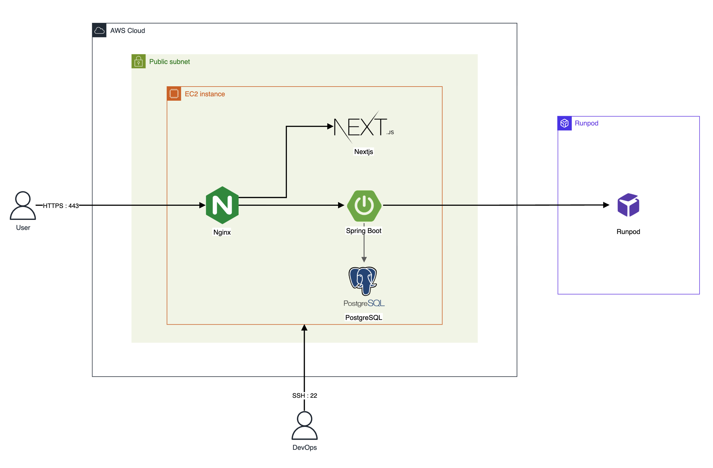
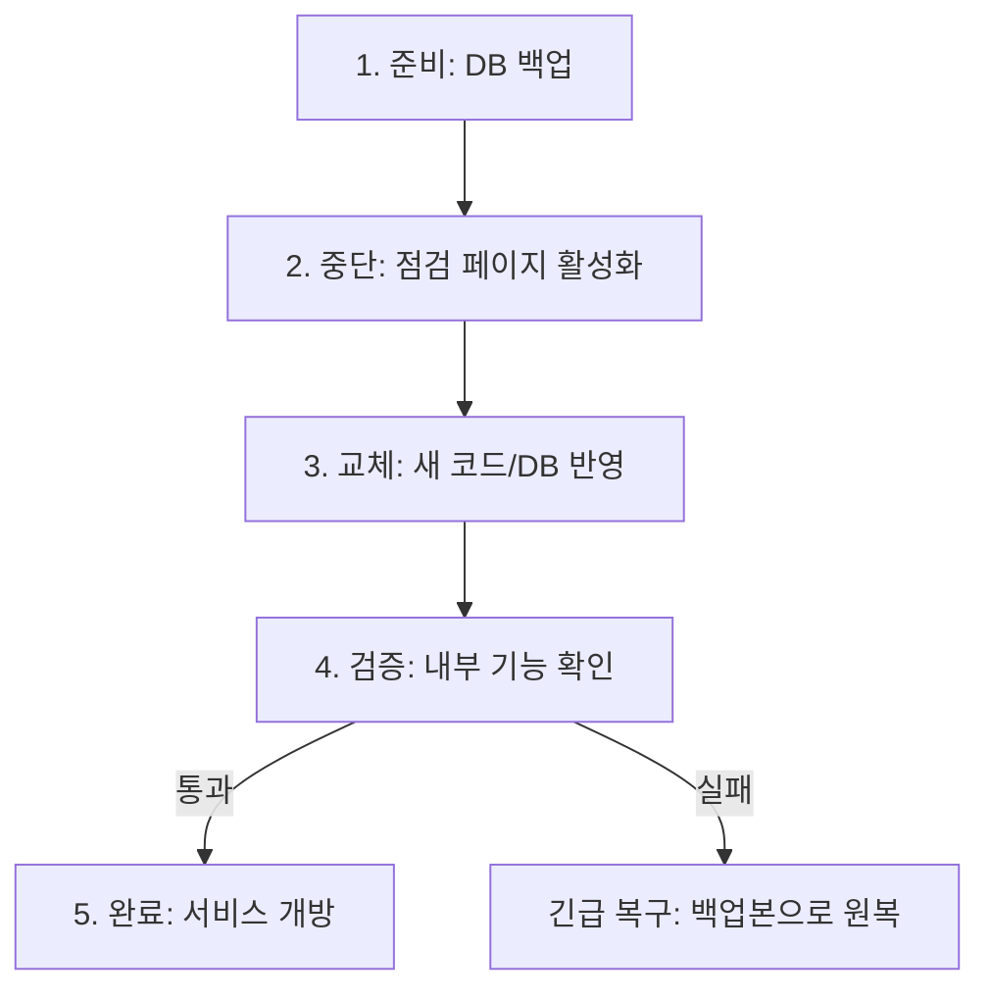

# Big Bang 방식 수작업 배포 설계

> **결론**: AWS EC2(t3.small) 단일 인스턴스 위에 NGINX·Backend·Frontend·DB를 함께 올린 구성을 SSH로 직접 들어가 일괄 배포한다. 다운타임 약 8분 발생.

## 목차

- [도입 배경](#도입-배경)
- [아키텍처 / 배포 흐름 다이어그램](#아키텍처--배포-흐름-다이어그램)
- [의사결정](#의사결정)
- [배포 절차](#배포-절차)
- [한계](#한계)
- [관련 문서](#관련-문서)

## 도입 배경

**현행 배포 방식 정의:**
본 서비스는 초기 단계에서 가장 단순한 형태의 수작업(Big Bang) 배포 방식을 채택한다.

- 단일 EC2 인스턴스에 Spring + Front + DB(PostgreSQL + pgvector)를 함께 배포
- GPU가 필요한 AI 기능은 별도의 GPU 서버(vLLM)로 분리
- 배포는 자동화 파이프라인 없이 직접 접속 후 수작업으로 일괄 반영
- 무중단 배포를 보장하지 않으며, 배포 시 일시적 서비스 중단을 허용

**서비스 현황 (초기 단계 가정):**
| 항목 | 가정치 | 비고 |
|------|--------|------|
| DAU | ~60명 | 출시 직후 예상 |
| 동시접속 | 3~6명 | 피크 시간 기준 |
| 일평균 트래픽 | ~600 requests/day | 저트래픽 구간 |
| 배포 빈도 | 주 1회 이하 | 주요 기능 안정화 후 |
| 개발 팀 규모 | 6명 | 풀스택 2 + 클라우드 2 + AI 2 |

**선택 이유:**

1. **우선 출시 전략**

   - CI/CD 파이프라인 구축보다 서비스 출시가 우선
   - 인프라 자동화는 초기 안정화 후 순차적으로 전환 예정

2. **초기 단계의 비용 효율성**

   - CI/CD 파이프라인 구축에 필요한 시간과 인력을 서비스 배포에 집중
   - EC2 1대로 비용 최소화, GPU는 RunPod Active로 임시 운영 (추후 전환 예정)

3. **배포 빈도가 낮음**

   - 현재 주 1회 이하 배포로 수작업 배포 소요 시간이 길어도 허용 가능
   - 배포 자동화 ROI가 낮은 단계

4. **시스템 구조의 단순성**

   - 단일 서버 구조로 복잡한 오케스트레이션 불필요
   - 문제 파악 속도가 빠름 (컴포넌트가 한 곳에 있어 트러블슈팅이 단순)

5. **빠른 실험/검증 가능**
   - 서비스 기능(모임 생성/투표/채팅/정산 등)을 빠르게 검증 가능
   - 아키텍처 변경, 기술 스택 변경, 서버 스펙 변경이 빈번한 초기 단계에 적합

## 아키텍처 / 배포 흐름 다이어그램

### 아키텍처 다이어그램



### 배포 흐름 다이어그램



## 의사결정

각 항목의 상세 근거는 하위 문서 참고.

- **CSP**: AWS — 67일 크레딧 커버 + 즉시 실행 가능성 기준 5개 CSP 점수화 1위. ([자세히 보기](./docs/CSP-선정/README.md))
- **프록시 / 웹서버**: NGINX — 7개 프록시를 5개 안정성 기준으로 비교 후 선정. ([자세히 보기](./docs/프록시-웹서버-선정/README.md))
- **인스턴스 사양**: EC2 t3.small — 후보 4종 부하 테스트로 "Swap 없이 피크 처리 가능한 최소 사양" 검증. ([자세히 보기](./docs/인스턴스-사양-선정/README.md))

## 배포 절차

### 상세 배포 절차

| 단계 | 작업 내용                  | 담당자    | 사용 도구/명령어                                                      | 예상 소요 시간 | 비고               |
| ---- | -------------------------- | --------- | --------------------------------------------------------------------- | -------------- | ------------------ |
| 1    | 서비스 공지 및 사용자 알림 | 운영팀    | 공지사항 게시                                                         | 5분            | 배포 10분 전 실시  |
| 2    | 데이터베이스 백업          | DevOps    | `pg_dump -U postgres -d {db_name} > backup_YYYYMMDD.sql`              | 3분            | 롤백용 데이터 백업 |
| 3    | Backend 로컬 빌드          | BE 개발자 | `./gradlew clean build -x test`                                       | 5분            | 로컬에서 실행      |
| 4    | Frontend 로컬 빌드         | FE 개발자 | `npm install && npm run build`                                        | 3분            | 로컬에서 실행      |
| 5    | Backend 서비스 중단        | DevOps    | `sudo systemctl stop spring-boot`                                     | 1분            | **다운타임 시작**  |
| 6    | Frontend 서비스 중단       | DevOps    | `pm2 stop nextjs`                                                     | 1분            |                    |
| 7    | Backend jar 전송           | BE 개발자 | `scp build/libs/app.jar user@server:/app/backend/`                    | 2분            |                    |
| 8    | Frontend 빌드 결과 전송    | FE 개발자 | `scp -r .next user@server:/app/frontend/`                             | 2분            |                    |
| 9    | DB 스키마 변경             | DevOps    | 수동 SQL 실행 (필요 시)                                               | 2분            | 스키마 변경 시     |
| 10   | Backend 서비스 시작        | DevOps    | `sudo systemctl start spring-boot`                                    | 1분            |                    |
| 11   | Frontend 서비스 시작       | DevOps    | `pm2 start nextjs`                                                    | 1분            | **다운타임 종료**  |
| 12   | Health Check 확인          | DevOps    | `curl http://localhost:8080/health` <br> `curl http://localhost:3000` | 2분            | 정상 응답 확인     |
| 13   | 로그 모니터링              | DevOps    | `tail -f /app/backend/logs/app.log` <br> `pm2 logs nextjs`            | 10분           | 초기 안정화 확인   |
| 14   | 서비스 정상화 공지         | 운영팀    | 공지사항 업데이트                                                     | 2분            |                    |

**예상 총 소요 시간:** 약 38분
**예상 서비스 중단 시간 (다운타임):** 약 8분 (5단계~11단계)

### 배포 체크리스트

**배포 전**

- 배포할 Git 브랜치/커밋 해시 확인
- Backend 로컬 빌드 성공 (`./gradlew clean build -x test`)
- Frontend 로컬 빌드 성공 (`npm install && npm run build`)
- DB 스키마 변경 여부 확인 (변경 시 마이그레이션 SQL 준비)
- 서비스 공지 작성 완료

**배포 중**

- 데이터베이스 백업 완료
- 기존 파일 백업 완료 (`app.jar.bak`, `.next.bak`)
- Backend/Frontend 서비스 중단 확인
- 파일 전송 완료
- DB 스키마 변경 적용 (해당 시)
- Backend/Frontend 서비스 시작 확인

**배포 후**

- Health Check 통과 (Backend: 200 OK, Frontend: 200 OK)
- 주요 기능 동작 확인 (로그인, 메인 페이지)
- 에러 로그 없음 확인
- 서비스 정상화 공지 완료

### 배포 스크립트

수작업 절차를 자동화한 4종 스크립트로 구성된다. 환경 변수(`SERVER_HOST`, `SERVER_KEY`, `DB_NAME` 등)는 각 스크립트 상단을 환경에 맞게 수정한다.

| 스크립트 | 역할 | 절차 단계 |
|---|---|---|
| [`backup.sh`](./scripts/backup.sh) | DB·Backend jar·Frontend 빌드 결과 백업 | 2단계 |
| [`local-deploy.sh`](./scripts/local-deploy.sh) | 로컬 빌드 + SCP 전송 | 3·4·7·8단계 |
| [`deploy.sh`](./scripts/deploy.sh) | 서비스 재시작 + Health Check | 10·11·12단계 |
| [`rollback.sh`](./scripts/rollback.sh) | 백업본 복원 + 재시작 | 장애 대응 시 |

**사전 설정 필요**

> 배포 스크립트 실행 전, 서버에 systemd 서비스와 pm2 설정이 완료되어 있어야 합니다.
> 상세 설정 방법은 [배포 상세 절차 - E. 프로세스 관리 설정](./docs/배포-상세-절차/README.md#e-프로세스-관리-설정)을 참고하세요.

**사용 흐름**

```bash
# 실행 권한 부여 (최초 1회)
chmod +x scripts/*.sh

# 1. (서버) 백업 실행
ssh user@server './backup.sh'

# 2. (로컬) 빌드 및 전송
./scripts/local-deploy.sh

# 3. (서버) 배포 실행
ssh user@server './deploy.sh'

# 문제 발생 시 (서버)
ssh user@server './rollback.sh'
```

---

## 한계

### 정량적 분석

| 항목                 | 현재 상태 | 문제점                                   |
| -------------------- | --------- | ---------------------------------------- |
| **배포 소요 시간**   | 약 38분   | 담당자의 수작업 의존으로 시간 변동 폭 큼 |
| **서비스 중단 시간** | 약 8분    | 사용자 경험 저하, 트래픽 손실            |
| **배포 실패율**      | 편차 큼   | 수작업으로 인한 Human Error 가능성       |
| **롤백 소요 시간**   | 약 11분   | 장애 지속 시간 증가 위험                 |
| **배포 가능 인원**   | 2명       | 담당자 부재 시 배포 불가 (단일 장애점)   |

### 관점별 한계 분석

**1) 네트워크/보안 관점**
| 문제 | 설명 |
|------|------|
| 퍼블릭 서브넷 DB 존재 | 인바운드 규칙 실수 시 즉시 공격 대상 노출 |
| 키/시크릿 관리 | .env 방식의 느슨한 관리로 유출 리스크, 휴먼 에러 가능성 |
| 보안 경계가 얇음 | 애플리케이션 계층에서만 방어, 네트워크 레벨 방어 약함 |
| TLS/인증서/도메인 운영 | 직접 인증서 갱신/리다이렉트 처리 시 실수 여지 |
| AI 서버 공격면 | 퍼블릭 노출 시 비용형 공격에 취약 → 비용 폭발 위험 |

> "기능 개발 속도는 빠르지만, 보안 사고는 한 번이면 서비스 신뢰가 끝날 수 있음"

**2) 가용성/장애 격리 관점**
| 문제 | 설명 |
|------|------|
| 단일 장애 지점 | EC2 한 대 장애 시 Back/Front/DB 동시 다운 |
| 연쇄 장애 | DB I/O 상승 → API 지연 → 벡터 검색 타임아웃 → 전체 장애 |
| 복구 시간 | 수동 대응으로 MTTR이 운에 좌우됨 |

> 문제 파악은 빠르지만, **장애 영향 범위가 전체**

**3) 성능/리소스 경쟁 관점**
| 문제 | 설명 |
|------|------|
| CPU/메모리/디스크/IO 경쟁 | DB(디스크+벡터 검색) + Spring(CPU) + Front 빌드가 한 머신에서 경쟁 |
| 벡터 검색 성능 | pgvector HNSW 인덱스 메모리 사용량 증가 시 일반 쿼리와 경쟁 |
| 간헐적 지연 | 가끔 5~10초 같은 디버깅 어려운 증상 증가 |

<!-- | 커넥션/파일 디스크립터 한계 | WebSocket/동시 접속 증가 시 OS 튜닝 없이는 한계 | -->

**4) 확장성 관점**
| 문제 | 설명 |
|------|------|
| 수평 확장 시 구조 변경 필요 | DB가 로컬이면 확장 전 분리 필요 (그대로 확장 시 비효율적 구조) |
| 무중단 배포 시 리소스 부담 | 단일 인스턴스에서 Blue-Green 시 2배 리소스 필요 (현재 스펙에서 부담) |

> 트래픽이 조금 늘 때는 버티지만, **확장은 구조 변경을 요구**

**5) 배포/운영(DevOps) 관점**
| 문제 | 설명 |
|------|------|
| 인적 오류 리스크 | 순서 실수, 환경변수 누락, 롤백 미흡 |
| 롤백 어려움 | 한 덩어리로 배포하면 일부만 되돌리기 어려움 |
| 관측 한계 | 트래픽 증가 시 요청 단위 병목(핸들러/DB/외부호출)을 빠르게 특정하기 어려움 |

> 초기엔 단순함이 장점이지만, **배포 빈도가 올라가면 곧 리스크가 됨**

**6) 데이터/백업/복구 관점**
| 문제 | 설명 |
|------|------|
| 백업/복구 | 자동 백업 없으면 사고 시 복구가 느림 |
| 데이터 손실 리스크 | 인스턴스 디스크 장애, 삭제 실수 시 치명적 |

**7) 비용 관점**
| 문제 | 설명 |
|------|------|
| 초기엔 저렴 | 인스턴스 1~2대로 종료 |
| 장애/공격 시 비용 폭발 | 퍼블릭 노출 + AI 추론 엔드포인트 = 요청 폭탄 → 비용 폭발 |
| 스케일업 단가 상승 | 어느 순간 큰 인스턴스로 점프 필요 |

<!-- **8) 컴플라이언스/신뢰 관점**

- 사용자 데이터/결제/정산이 들어가면 퍼블릭 DB는 설명이 어려움
- 보안 감사/평가에서 감점 포인트

> 기술이 문제가 아니라 **신뢰 문제** -->

## 관련 문서

**의사결정**
- [CSP 선정](./docs/CSP-선정/README.md)
- [프록시 / 웹서버 선정](./docs/프록시-웹서버-선정/README.md)
- [인스턴스 사양 선정](./docs/인스턴스-사양-선정/README.md)

**배포**
- [배포 상세 절차](./docs/배포-상세-절차/README.md)
- [수작업 vs 자동화 배포 비교](./docs/배포-방식-비교/README.md)

**참고**
- [클라우드 선택 (참고)](./docs/클라우드-선택-참고/README.md)
- [대조군 비교 (참고)](./docs/대조군-비교-참고/README.md)
- [개선 계획](./docs/개선-계획/README.md)
- [RunPod 배포 방식](./docs/RunPod-배포-방식/README.md)
- [벡터DB 비교](./docs/벡터DB-비교/README.md)
