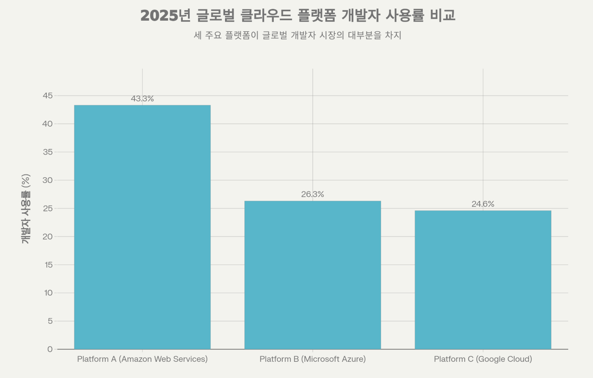

# CSP 선정

## 의사결정 목적

초기 검증 단계의 서비스로 빠른 배포 · 단순한 운영 · 제한된 예산 내 실험을 최우선 목표로 한다.

따라서 단일 인스턴스 기반 Big Bang 배포를 전제로 클라우드 Provider를 선정한다.

## 전제 조건

- 단일 인스턴스
  - 고가용성·자동 확장보다 배포 속도와 운영 단순성이 중요
- 제한된 예산
  - 투입 가능한 예산이 제한적
- Cloud Provider 사용 기간
  - 2026.01.19 ~ 2026.03.26 (약 67일)

## 비용 분석 표

| Provider    | 크레딧(가용 돈)    | 유효기간           | 2vCPU/4GiB 단가(시간)   | 1대 24/7 최대(유효기간 반영) | 2026-01-19 시작 시 |
| ----------- | ------------------ | ------------------ | ----------------------- | ---------------------------- | ------------------ |
| AWS         | $700 (≈₩1,013,845) | ~ 2026-03-26       | $0.052/h (≈₩75.3/h)     | 67일                         | 2026-03-26         |
| Azure       | $200 (≈₩289,670)   | 30일               | $0.0478/h (≈₩69.2/h)    | 30일                         | 2026-02-18         |
| GCP         | $300 (≈₩434,505)   | 91일               | $0.0429829/h (≈₩62.3/h) | 91일                         | 2026-04-20         |
| OCI         | $300 (≈₩434,505)   | 30일               | $0.031/h (≈₩44.9/h)     | 30일                         | 2026-02-18         |
| Naver Cloud | ₩100,000           | 발급일로부터 3개월 | ₩94.5/h                 | 44일                         | 2026-03-04         |
| KT Cloud    | ₩500,000           | 90일               | ₩111.0/h                | 90일                         | 2026-04-19         |
| NHN Cloud   | ₩200,000           | 지급일로부터 1년   | ₩93.0/h                 | 89일                         | 2026-04-18         |

### 비용 분석 전제(표 해석)

#### 1) 비용 단가 표의 의미

- 시간당 단가 표는 버스터블 클래스를 포함
- 선정 이후 실제 운영 투입 전, 버스터블 클래스부터 먼저 검증하여 "피크 트래픽 대응 적합성"을 확인함
- AMD64만 비교
  - 이유: 초기 의사결정 단계에서는 "가격/크레딧 커버/운영 난이도"가 핵심이고, ARM까지 동시에 비교하면 변수가 늘어 의사결정 속도가 느려짐

#### 2) 버스터블을 비교하는 이유

우리 서비스는 트래픽 피크가 점심/저녁으로 명확함

버스터블 인스턴스는 평시에는 크레딧을 축적하고, 피크에는 축적된 크레딧을 사용해 순간 성능을 끌어올릴 수 있는 구조이므로, "피크가 짧고 패턴이 뚜렷한 서비스"에 잘 맞을 가능성이 높음

따라서 "최종 스펙 확정"이 아니라 초기 검증(최우선 테스트) 대상으로 버스터블을 선택함

#### 3) 2 vCPU / 4 GiB를 기준으로 잡은 이유

단일 인스턴스 Big Bang는 한 머신에 웹/API/배치/프록시/DB 등 주요 컴포넌트가 함께 탑재될 수 있어 너무 작은 인스턴스는 다음 리스크가 빠르게 발생함

- 메모리 부족(OOM)로 서비스 불안정 (특히 JVM/Node/DB 동시 구동 시)
- 배포/빌드/마이그레이션 순간 부하에서 실패 확률 증가

그래서 2 vCPU / 4 GiB는 "최적화된 최소"라기보다, 초기 검증을 안정적으로 시작하기 위한 베이스라인으로 사용

또한 이 기준은 "충분함"을 전제하지 않는다.

- 충분하면: 비용 효율적으로 67일 운영
- 부족하면: 즉시 스케일업(예: 4vCPU/8GiB 등) 을 고려해야 함
  → 따라서 Provider 선택 시 크레딧 여유(버퍼) 가 중요하다.

## 팀 익숙함(즉시 실행 가능성) = 프로비저닝 + SSH 리드타임(팀 실측 기반)

### 1) 왜 '운영/장애 대응 경험' 대신 이 지표를 쓰는가

운영 장애 대응 경험(실전 장애 대응, 운영 히스토리)은 현재 단계에서 정량화가 어렵다.

반면 Big Bang 배포에서 팀이 당장 할 수 있는 검증은 다음뿐이다.

- 인스턴스 프로비저닝
- SSH로 접속

그리고 SSH 이후 내부는 대부분 동일한 Linux 환경이므로, Provider 간 차이는 리눅스 자체가 아니라

"서버를 띄우고 처음 작업을 시작하기까지의 마찰(온보딩 난이도)" 에서 발생한다.

따라서 본 단계에서는 팀 익숙함을 추상적으로 주장하는 대신, 프로비저닝+SSH 리드타임을 "즉시 실행 가능성"의 대리 지표로 사용한다.

### 2) 측정 방법(팀내 통일)

- 조건: **2 vCPU / 4 GiB** 수준의 인스턴스 1대
- 목표: **SSH 로그인 성공(웹 콘솔 접속 허용)** 까지
- 측정 구간: 인스턴스 생성 시작 → SSH 로그인 성공

### 3) 측정 결과(팀내 실측)

| Provider    | 리드타임(팀 실측) |
| ----------- | ----------------- |
| AWS         | 2분               |
| GCP         | 8분               |
| Naver Cloud | 38분              |
| Azure       | 미측정            |
| OCI         | 미측정            |
| KT Cloud    | 미측정            |
| NHN Cloud   | 미측정            |

### 4) Naver Cloud에서 시간이 길어진 원인(팀 관찰)

- 콘솔 반영 지연으로 새로고침 반복
- 인스턴스 유형 탐색 난이도(버스터블/표준/하이CPU 구분)
- PEM 기반 SSH 이후 추가 로그인/비밀번호 확인 과정에서 지연

### 참고) 레퍼런스 접근성

프로비저닝 이후 실제 운영에서는 보안그룹 설정, 포트 오픈, 서비스 배포 등
다양한 설정 작업이 필요하다.

이 과정에서 팀원들이 문제를 마주쳤을 때
가장 먼저 하는 행동은 검색이다.

- 출처: StackOverflow Developer Survey Results 2025 Overview

AWS/GCP/Azure는 대부분의 문제에 대해 검색 결과가 존재하지만,
Naver Cloud는 공식 문서 외에 참고할 자료가 제한적이다.

이는 팀의 트러블슈팅 시간에 영향을 줄 수 있는 요소로 고려하였다.

## 최종 가중치(100점)

1. 프로젝트 기간 67일 커버 가능 여부(Compute 기준): 60점
2. 프로젝트 기간 내 크레딧 여유(추가비용/스케일업 버퍼): 20점
3. 버스터블 지원 여부(테스트 우선 대상 가능성): 5점
4. 팀 즉시 실행 가능성(프로비저닝+SSH 리드타임): 10점
5. 한국 리전 유무: 5점

### 1) 점수화 규칙

1. 67일 커버 가능 여부 (60점)

   - 표의 시간당 단가를 `P`(원/시간 또는 $/시간), 크레딧을 `C`(원 또는 $)로 둔다.
   - 67일 24/7 필요 총비용: `Cost67 = P × 24 × 67`

   **커버 점수(0~60점)** :
   `CoverScore = min(C / Cost67, 1) × 60`

2. 프로젝트 기간 내 크레딧 여유 (20점)

   - 총 크레딧(C)에서 67일 기본 운영 비용(Cost67)을 뺀 여유 크레딧
   - 프로젝트 기간 내 스케일업, 추가 서비스 도입 등에 활용 가능한 버퍼
   - 여유 비율 = (C - Cost67) / Cost67

   **여유 점수(0~20점)** :
   `BufferScore = min(여유비율 × 5, 20)` (단, 67일 커버 불가 시 0)

3. 버스터블 지원 여부 (5점)

   - 버스터블 클래스 공식 지원: 5점
   - 미지원: 0점

4. 팀 즉시 실행 가능성 (10점)

   - 팀 실측 프로비저닝+SSH 리드타임 기반
   - 2분 이하: 10점
   - 10분 이하: 3점
   - 30분 이하: 1점
   - 미측정: 0점

5. 한국 리전 유무 (5점)

   - 한국 리전 지원: 5점
   - 미지원: 0점

### 점수표(계산 결과)

D(커버일수): 비용 분석 표의 "1대 24/7 최대(유효기간 반영)" 사용

| Provider        | D(커버일수) | 커버 (60) | 여유 (20) | 버스터블 (5) | 즉시실행 (10) | 한국 리전 (5) | 총점(100) |
| --------------- | ----------- | --------- | --------- | ------------ | ------------- | ------------- | --------- |
| **AWS**         | 67          | 60        | 20        | 5            | 10            | 5             | **100.0** |
| **GCP**         | 91          | 60        | 17        | 5            | 3             | 5             | **90.0**  |
| **KT Cloud**    | 90          | 60        | 9         | 0            | 0             | 5             | **74.0**  |
| **NHN Cloud**   | 89          | 60        | 2         | 0            | 0             | 5             | **67.0**  |
| **Naver Cloud** | 44          | 39        | 0         | 0            | 1             | 5             | **45.0**  |
| **Azure**       | 30          | 27        | 0         | 5            | 0             | 5             | **37.0**  |
| **OCI**         | 30          | 27        | 0         | 0            | 0             | 5             | **32.0**  |

### 여유 크레딧 상세

| Provider    | 크레딧   | Cost67   | 여유 크레딧 | 여유 비율 | 여유 점수 |
| ----------- | -------- | -------- | ----------- | --------- | --------- |
| AWS         | $700     | $83.6    | $616.4      | 737%      | 20        |
| GCP         | $300     | $69.1    | $230.9      | 334%      | 17        |
| KT Cloud    | ₩500,000 | ₩178,488 | ₩321,512    | 180%      | 9         |
| NHN Cloud   | ₩200,000 | ₩149,544 | ₩50,456     | 34%       | 2         |
| Naver Cloud | ₩100,000 | ₩151,956 | -           | 커버 불가 | 0         |
| Azure       | $200     | $76.9    | -           | 커버 불가 | 0         |
| OCI         | $300     | $49.9    | -           | 커버 불가 | 0         |

## 최종 선정

### 결론: AWS

총점 **100점**으로 1위. 다음 이유로 AWS를 최종 선정한다.

1. **프로젝트 기간 완전 커버**: 크레딧 $700으로 67일(2026-01-19 ~ 2026-03-26) 운영 가능
2. **크레딧 여유 최대**: 67일 기본 비용 $83.6 대비 $616.4 여유 (737%)
3. **버스터블 지원**: t3 시리즈로 피크 트래픽 대응 가능
4. **팀 즉시 실행 가능**: 프로비저닝+SSH 2분으로 가장 빠름
5. **한국 리전 지원**: ap-northeast-2 (서울)

### 차순위 고려

| 순위 | Provider  | 총점 | 비고                                  |
| ---- | --------- | ---- | ------------------------------------- |
| 2    | GCP       | 90.0 | 프로비저닝 리드타임 8분               |
| 3    | KT Cloud  | 74.0 | 버스터블 미지원, 팀 미측정            |
| 4    | NHN Cloud | 67.0 | 버스터블 미지원, 팀 미측정, 여유 적음 |
