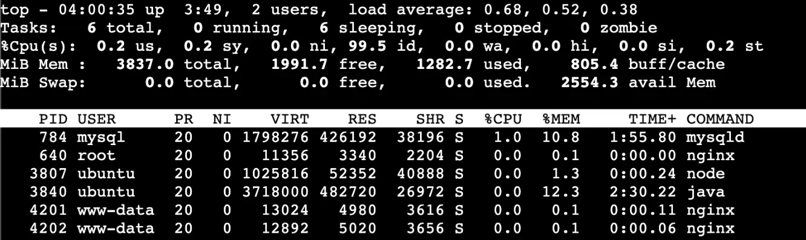
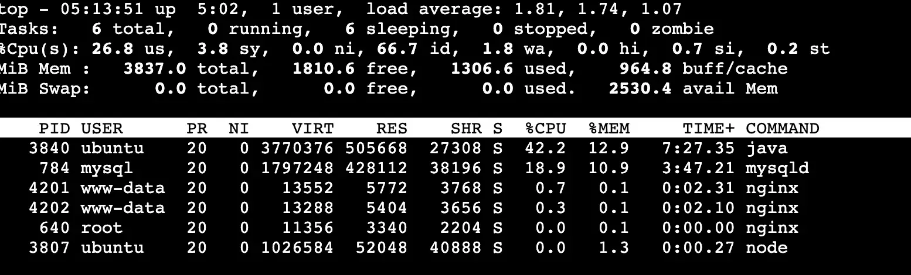
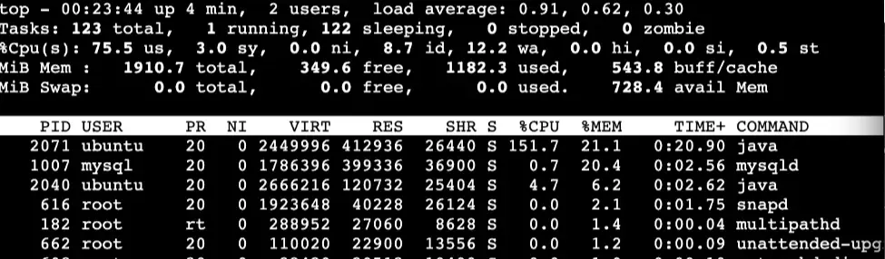
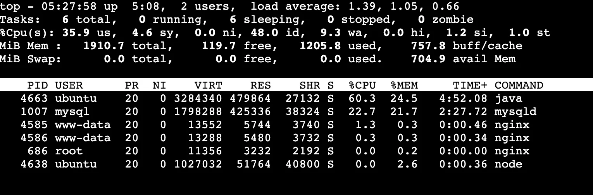

# 인스턴스 사양 선정

## 트래픽 기준

- 유저 플로우 (일일 요청량, 사용자당 평균 10 req/day, 10 \* 60(DAU) → 600 req/day)
  1. GET - 목록 조회
  2. POST - 모임 생성
  3. GET - 초대 코드
  4. GET - 모임 상세
  5. GET - 참여자 확인
  6. GET - 식당 목록
  7. POST - 투표 제출
  8. GET - 결과 조회
  9. POST - 최종 확정
  10. GET - 확정 후 상세 재조회

## 테스트

### 가설: T-series 적합

- 우리 트래픽은 상시 고부하가 아니라 피크가 짧게 오는 패턴
- T-series는 Burstable(크레딧 기반)이라 idle 시간에 크레딧을 쌓고 피크에 Burst로 대응 가능
- 따라서 비용을 최소화하면서 피크를 버틸 수 있음

### 인스턴스 후보 선정

- 후보 : t3.micro / t3.small / t3.medium / t3.large
- 목적 : "최소 스펙"을 찾기 위해 한 단계씩 올리며 한계점을 확인
- t3.micro
  
- t3.small
  
- t3.medium
  
- t3.large
  

### 부하 테스트

- t3.micro
  
- t3.small
  
- t3.medium
  
- t3.large
  

---

## 인스턴스 선정 (EC2 t3.small)

본 프로젝트는 단일 인스턴스 기반 Big Bang 배포를 전제로 하며, 초기 검증 단계에서 "피크 타임을 Swap 없이 안정적으로 버티는 최소 사양"을 목표로 인스턴스를 선정하였다. 그 결과 EC2 t3.small(2 vCPU, 2 GiB)을 최종 선택하였다.

## 인스턴스 선정 근거

### 1) 트래픽 기준

#### 1-1. 일일 트래픽(총량) 가정

| 항목                 | 예상치       |
| -------------------- | ------------ |
| MAU                  | 100명        |
| DAU                  | 60명         |
| 사용자당 평균 요청량 | 10 req/day   |
| 일일 요청량          | ~600 req/day |

- 부트캠프 수강생 약 100명을 1차 사용자 풀로 가정
- 과제·협업 맥락에서 약 60%가 일 1회 이상 사용한다고 가정하여 DAU 60명으로 산정
- 사용자당 평균 10 req/day를 가정하여 일일 요청량은 60 × 10 = 600 req/day로 추정

#### 1-2. 피크 타임(점심) 가정

- 서비스 특성상 점심·저녁에 사용이 몰릴 것으로 예상(특히 점심)
- 피크 구간은 12:00 ~ 13:00으로 가정
- DAU의 80%(48명)가 점심에 접속한다고 보고, 최악 케이스로 **40명이 동시에 사용(40 VU)** 하는 상황을 부하 조건으로 설정

### 2) 테스트 대상(대체 서비스) 및 대표성 근거

현재 본 서비스는 개발 진행 중으로 실제 API/데이터셋이 완성되지 않아, 최소 사양을 빠르게 검증하기 위해 기존 개인 프로젝트 서비스를 대체 테스트 대상으로 사용하였다.

#### 2-1. 대체 서비스 구성

- **Nginx**
- **Node.js(Express)**: HTML/JS/CSS 서빙
- **Spring**
- **MySQL**

#### 2-2. 본 서비스와의 유사성(대표성)

- 둘 다 웹 API 기반이며, 피크 시점에 조회 중심 요청이 반복되는 구조
- 본 서비스의 핵심(모임 리스트/추천 리스트 조회) 역시 **리스트 조회 GET 요청**이 주요 트래픽이 될 것으로 예상
- 인증이 **세션 기반**이며 로그인 시 비밀번호 해시(단방향) 연산이 포함됨

#### 2-3. 한계 및 활용 범위

- 엔드포인트/쿼리/데이터 크기/인덱스 구성이 완전히 동일하지 않으므로 본 결과는 정확한 TPS 보장이 아니라 "후보 사양을 좁히는 근거(실측)"로 사용한다.

### 3) 테스트 방법(관측 지표)

- Idle 상태에서 `total/free/used/available` 메모리 여유 확인
- 피크 부하(40 VU) 조건에서 CPU/메모리 변화량 확인
- 부하 시나리오는 VU당 "로그인 1회(세션 생성, 비밀번호 해시 포함) + 게시글 리스트(10개) 조회 GET 3회"로 구성하였다.
- 측정 도구는 EC2에서 `top` 기반으로 관측하였고, 주요 구간을 캡처로 기록하였다. (첨부 이미지 참조)

### 4) 후보별 결과 및 판단

#### 4-1. t3.medium (2 vCPU / 4 GiB)

- application build
  
  - build
    - cpu 사용량: 약 99.3% (96.3 us + 3.0 sy)
    - mem total(MiB) : 3837.0
    - mem free(MiB) : 1728.8
    - mem used(MiB) : 1385.4
    - mem buff/cache(MiB) : 968.0
    - mem avail(MiB) : 2451.5
- idle
  
  - idle
    - cpu 사용량: 약 0.4% (0.2 us + 0.2 sy)
    - mem total(MiB) : 3837.0
    - mem free(MiB) : 1993.9
    - mem used(MiB) : 1282.8
    - mem buff/cache(MiB) : 803.0
    - mem avail(MiB) : 2554.1
- 빌드/기동 및 피크 부하 테스트 정상 수행
  
  - test
    - cpu 사용량: 약 31.6% (26.8 us + 3.8 sy)
    - mem total(MiB) : 3837.0
    - mem free(MiB) : 1810.6
    - mem used(MiB) : 1306.6
    - mem buff/cache(MiB) : 964.8
    - mem avail(MiB) : 2530.4
- 관측 결과 **메모리 여유** 확인
  - mem avail 여유율: `2530.4 / 3837.0 ≈ 0.6595` → 약 66.0%
    → "현재 트래픽 가정에서 과투자 가능성"이 있어 하향 테스트 진행

#### 4-2. t3.small (2 vCPU / 2 GiB) 최종 선택

- application build
  
  - build
    - cpu 사용량: 약 78.5% (75.5 us + 3.0 sy)
    - mem total(MiB) : 1910.7
    - mem free(MiB) : 349.6
    - mem used(MiB) : 1182.3
    - mem buff/cache(MiB) : 543.8
    - mem avail(MiB) : 728.4
- idle
  
  - idle
    - cpu 사용량: 약 0.4% (0.2 us + 0.2 sy)
    - mem total(MiB) : 1910.7
    - mem free(MiB) : 204.9
    - mem used(MiB) : 1174.8
    - mem buff/cache(MiB) : 702.8
    - mem avail(MiB) : 736.0
- 빌드/기동 및 피크 부하 테스트 정상 수행
  
  - test
    - cpu 사용량: 약 40.5% (35.9 us + 4.6 sy)
    - mem total(MiB) : 1910.7
    - mem free(MiB) : 119.7
    - mem used(MiB) : 1205.8
    - mem buff/cache(MiB) : 757.8
    - mem avail(MiB) : 704.9
- 관측 결과 **메모리 여유** 확인
  - mem avail 여유율: `704.9 / 1910.7 ≈ 0.3689` → 약 36.9% (≈ 705MiB)
    → "현재 트래픽 가정에서 과투자 가능성"이 있어 하향 테스트 진행

#### 4-3. t3.micro (2 vCPU / 1 GiB) 제외

- 빌드 단계에서 실패
  
  
- 단순 성능 이슈가 아니라 "배포/운영 자체가 불가능"한 상태
  → 후보에서 제외

### 5) Swap을 사용하지 않기로 한 이유

- Swap은 OOM을 늦추는 효과는 있지만, 피크 구간에서 대기시간이 급격히 증가할 수 있다.
- 본 서비스는 점심/저녁처럼 사용 시간이 짧고 피크가 명확한 형태로 예상된다.
- 따라서 피크 시간에 "억지로 유지"하는 것보다, 피크 타임을 Swap 없이 처리 가능한 사양이 더 중요하다고 판단하였다.
  → 피크를 못 버티면 체감 품질 저하가 곧바로 이탈로 이어질 가능성이 큼

### 6) 관측된 특이점: 메모리보다 CPU가 더 상승한 이유

테스트에서 메모리보다 CPU 사용률이 더 크게 상승하는 구간이 있었으며, 이는 로그인 과정과 강하게 연관된 패턴을 보였다.

- 로그인 시점에 CPU가 상승
- 로그인 후 세션이 잡힌 상태에서 게시글 조회 등 일반 요청에서는 CPU가 감소/안정

### 7) 최종 결론

- t3.medium: 안정적이나 메모리 여유가 커 비용 대비 과투자 가능
- t3.micro: 빌드 실패로 운영 불가
- t3.small: 빌드 성공 + 피크(40 VU) 시나리오를 Swap 없이 정상 처리 + 로그인(해시) CPU 상승도 테스트 범위 내 안정적

메모리 기준 최대 동시 접속(단순 계산)
- idle MemAvailable: 736.0MiB
- 40VU 피크 MemAvailable: 704.9MiB
- 40VU에서 감소량: 31.1MiB → VU 1명당 감소 ≈ 0.78MiB/VU
- "최소 안정선"을 MemAvailable ≥ 20%로 잡으면 20% = 1910.7 × 0.2 ≈ 382.1MiB
- 피크 시점에서 추가로 쓸 수 있는 여유: 704.9 − 382.1 = 322.8MiB
- 추가 가능 VU: 322.8 / 0.78 ≈ 415VU
- 최대 동시 접속(메모리 기준) ≈ 40 + 415 = 약 455명

따라서 본 프로젝트의 가정 트래픽과 운영 전제(Big Bang 단일 인스턴스) 하에서 EC2 t3.small(2 vCPU, 2 GiB) 을 최소 적정 사양으로 선정한다.
