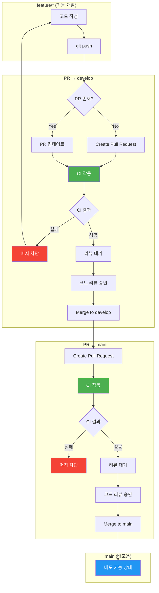

# CI 파이프라인 구체화

## 브랜치 전략 연계 CI 정책

여러 개발자가 동시에 작업해도 코드 통합 문제는 PR 생성/업데이트 시 CI 검증으로 해결할 수 있습니다.

단, Branch Protection 설정을 통해 검증 통과 전 머지를 차단해야 합니다.

Push 트리거는 PR 검증과 중복되어 피드백 속도와 리소스 효율을 저하시키므로 제외했습니다.

## 트리거 정책

| 이벤트 | 대상 브랜치 | CI 실행 범위 | 목적 |
| --- | --- | --- | --- |
| **PR 생성/업데이트** | → develop | Stage 1: Lint (ESLint, Checkstyle) → 빠른 스타일 검사
Stage 2: Build → 컴파일
Stage 3: Analysis (SpotBugs) → 바이트코드 분석
Stage 4: Test → 단위테스트 + 통합테스트 + 커버리지
Stage 5: Artifact → 산출물 저장 | 통합 전 검증 |
| **PR 생성/업데이트** | → main | Stage 1: Lint (ESLint, Checkstyle) → 빠른 스타일 검사
Stage 2: Build → 컴파일
Stage 3: Analysis (SpotBugs) → 바이트코드 분석
Stage 4: Test → 단위테스트 + 통합테스트 + 커버리지
Stage 5: E2E Test → 전체 시스템 검증 (FE 레포 한정)
Stage 6: Artifact → 산출물 저장 | 배포 전 최종 검증 |
| **Merge** | develop | 전체 | 머지된 코드 이중 검증 |
| **Merge** | main | 전체 | 배포 가능 상태 확인 |
| **Push** | feature/* | 빌드만 | 빠른 피드백 (생략 가능) |

## Branch Protection 설정

| 조건 | 설정 |
| --- | --- |
| CI 통과 필수 | 활성화 |
| 코드 리뷰 승인 | 최소 1명 |
| 브랜치 최신 상태 | 대상 브랜치와 동기화 필수 |
| 직접 Push 금지 | develop, main 브랜치 |

| 설정 항목 | 하위 옵션 | 활성화 | 설명 |
| --- | --- | --- | --- |
| **Branch name pattern** | - | `develop`,`main` | 보호할 브랜치 이름 |
| **Require a pull request before merging** | - | O | PR 없이 직접 push 금지 |
|  | Require approvals | O (1명) | 최소 1명 코드 리뷰 승인 필요 |
|  | Dismiss stale pull request approvals when new commits are pushed | O | 새 커밋 시 기존 승인 무효화 |
| **Require status checks to pass before merging** | - | O | CI 통과해야 머지 가능 |
|  | Require branches to be up to date before merging | O | 대상 브랜치 최신 상태 강제 |
|  | Status checks (검색해서 추가) | O | `build`, `test` 등 CI job 선택 |
| **Do not allow bypassing the above settings** | - | O | 관리자도 규칙 우회 불가 |

### 비활성화 유지 항목

| 설정 항목 | 활성화 | 이유 |
| --- | --- | --- |
| Allow force pushes | X | 히스토리 변조 방지 |
| Allow deletions | X | 브랜치 삭제 방지 |

### 브랜치별 적용

| 브랜치 | 규칙 생성 | 비고 |
| --- | --- | --- |
| `develop` | O | 통합 브랜치 보호 |
| `main` | O | 배포 브랜치 보호 |
| `feature/*` | X | 개인 작업 브랜치, 보호 불필요 |
