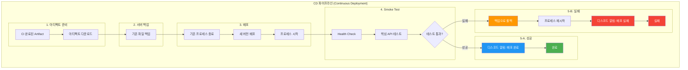

# 3단계 — CD(지속적 배포) 파이프라인 구축 설계

> **결론**: GitHub Actions 기반 CD 파이프라인 구축. main 머지 시 Frontend / Backend / AI 자동 배포(In-place 중단 배포), Smoke Test로 자동 검증, 실패 시 서버 로컬 백업으로 자동 롤백, Discord 알림.

## 목차

- [도입 배경](#도입-배경)
- [도입 효과](#도입-효과)
- [의사결정](#의사결정)
- [파이프라인 구성](#파이프라인-구성)
- [관련 문서](#관련-문서)

## 도입 배경

### 프로젝트 맥락

| 항목 | 내용 |
| --- | --- |
| 서비스 | 음식점 추천 웹서비스 |
| 트래픽 | 점심/저녁 피크, DAU 60명 |
| 인프라 | 초기 단계, 단일 서버 예상 |
| 핵심 고려사항 | 배포 실패 대비, 장애 전파 방지, 롤백 가능성 |

## 도입 효과

### Before (CD 도입 전)

```
개발자 로컬에서 빌드
	↓
운영 서버 접속 (SSH)
	↓
JAR/정적 파일 직접 복사 (SCP)
	↓
수동으로 프로세스 종료/재시작
	↓
수동으로 동작 확인(브라우저 접속/간단 호출)
```

문제점

- **배포 표준이 사람에게 의존**
  - 배포 순서/명령/경로가 사람마다 달라질 수 있음
  - 실수(파일 누락, 권한 미설정, 재시작 누락)가 곧 장애로 연결
- **롤백이 "정의된 절차"가 아니라 "그때그때 대응"**
  - 실패 시 어떤 버전으로 어떻게 되돌릴지 매번 판단이 필요
  - 복구 시간이 사람의 숙련도/상황에 따라 흔들림
- **배포 이력/감사 추적이 약함**
  - 누가/언제/어떤 커밋을 배포했는지 기록이 분산됨
  - 장애 시 원인 추적과 복구 커뮤니케이션이 느려짐
- **품질 게이트가 강제되지 않음**
  - "CI가 통과한 산출물"과 "운영에 반영된 산출물"이 분리될 수 있음

### After (CD 도입 후, Continuous Deployment)

```
CI 통과
	↓
main 머지
	↓
자동 배포
	↓
스모크 테스트
	↓
성공 알림 / 실패 자동 롤백
```

| 항목         | CD 도입 전       | CD 도입 후                     |
| ------------ | ---------------- | ------------------------------ |
| 배포 트리거  | 사람이 직접 실행 | `main` 머지 = 자동 실행        |
| 배포 절차    | 사람마다 편차    | 워크플로우로 절차 고정(표준화) |
| 배포 품질    | 수동 확인 중심   | Smoke Test로 자동 검증         |
| 실패 대응    | 대응/판단 필요   | 실패 시 자동 롤백 내장         |
| 배포 이력    | 기록 분산        | GitHub Actions 로그로 일원화   |
| 커뮤니케이션 | 수동 공유        | Discord 자동 알림              |

## 의사결정

| 결정 항목 | 결정 | 자세히 |
| --- | --- | --- |
| CD 도구 선정 | GitHub 운영 흐름 유지 + 멀티타깃(RunPod) 일관성 → **GitHub Actions** | [CD 도구 선정](./docs/CD-도구-선정/) |
| 배포 전략 | 승인 단계가 병목이 됨 → **Continuous Deployment** (자동 배포 + 자동 검증 + 자동 롤백) | [배포 전략 선택](./docs/배포-전략-선택/) |
| 배포 방식 | 단일 EC2 리소스 한계 + 새벽 배포로 다운타임 통제 → **In-place 중단 배포** | [배포 방식 선택](./docs/배포-방식-선택/) |

## 파이프라인 구성

### CD 파이프라인 흐름도



### Stage 표

| 단계 | 역할 | 실패 시 동작 |
| --- | --- | --- |
| Stage 1: 아티팩트 준비 | CI에서 생성된 빌드 결과물 다운로드 (BE: JAR, FE: dist, AI: 소스 체크아웃) | 후속 단계 중단 |
| Stage 2: 서버 백업 | 현재 실행 중인 파일을 서버 로컬 경로로 백업 | 후속 단계 중단 |
| Stage 3: 파일 전송 및 배포 | SCP/rsync로 새 버전 전송, 기존 프로세스 종료 후 재시작 | Smoke Test에서 감지 |
| Stage 4: Smoke Test | Health Check + 핵심 API 검증 (10회 재시도) | 자동 롤백 트리거 |
| Stage 5: 알림 발송 | Discord Webhook으로 성공/실패 알림 | - |

자세한 단계별 내용은 [단계별 상세](./docs/단계별-상세/), 설정값은 [설정 명세](./docs/설정-명세/) 참고.

### 팀 운영 규칙

| 규칙 | 설명 |
| --- | --- |
| 배포 시간 | main 머지는 새벽 시간대에만 (00:00 ~ 06:00) |
| 긴급 핫픽스 | 트래픽 적은 시간에 진행 |
| 피크 타임 | 점심/저녁 시간대 배포 금지 |

### 워크플로우 파일

| 파일 | 대상 | 트리거 |
| --- | --- | --- |
| [`be-cd.yml`](./workflows/be-cd.yml) | Backend (Spring Boot) → EC2 | main push |
| [`fe-cd.yml`](./workflows/fe-cd.yml) | Frontend (React + Vite + Nginx) → EC2 | main push |
| [`ai-cd.yml`](./workflows/ai-cd.yml) | AI (FastAPI) → RunPod | main push |

### 수동 롤백 스크립트

| 파일 | 서버 배치 경로 | 용도 |
| --- | --- | --- |
| [`be-rollback.sh`](./scripts/be-rollback.sh) | `/home/ubuntu/app/rollback.sh` | BE 수동 롤백 |
| [`fe-rollback.sh`](./scripts/fe-rollback.sh) | `/var/www/rollback.sh` | FE 수동 롤백 |
| [`ai-rollback.sh`](./scripts/ai-rollback.sh) | `/home/runpod/rollback.sh` | AI 수동 롤백 |

## 관련 문서

### 의사결정

- [CD 도구 선정](./docs/CD-도구-선정/)
- [배포 전략 선택](./docs/배포-전략-선택/)
- [배포 방식 선택](./docs/배포-방식-선택/)

### 단계별 상세 / 설정

- [단계별 상세](./docs/단계별-상세/) — Stage 1~5 + 롤백 명세 + 알림
- [설정 명세](./docs/설정-명세/) — 환경 변수, GitHub Secrets, 디렉토리 구조, Smoke Test 설정, 체크리스트

### 워크플로우 파일

- [`be-cd.yml`](./workflows/be-cd.yml)
- [`fe-cd.yml`](./workflows/fe-cd.yml)
- [`ai-cd.yml`](./workflows/ai-cd.yml)

### 수동 롤백 스크립트

- [`be-rollback.sh`](./scripts/be-rollback.sh)
- [`fe-rollback.sh`](./scripts/fe-rollback.sh)
- [`ai-rollback.sh`](./scripts/ai-rollback.sh)
