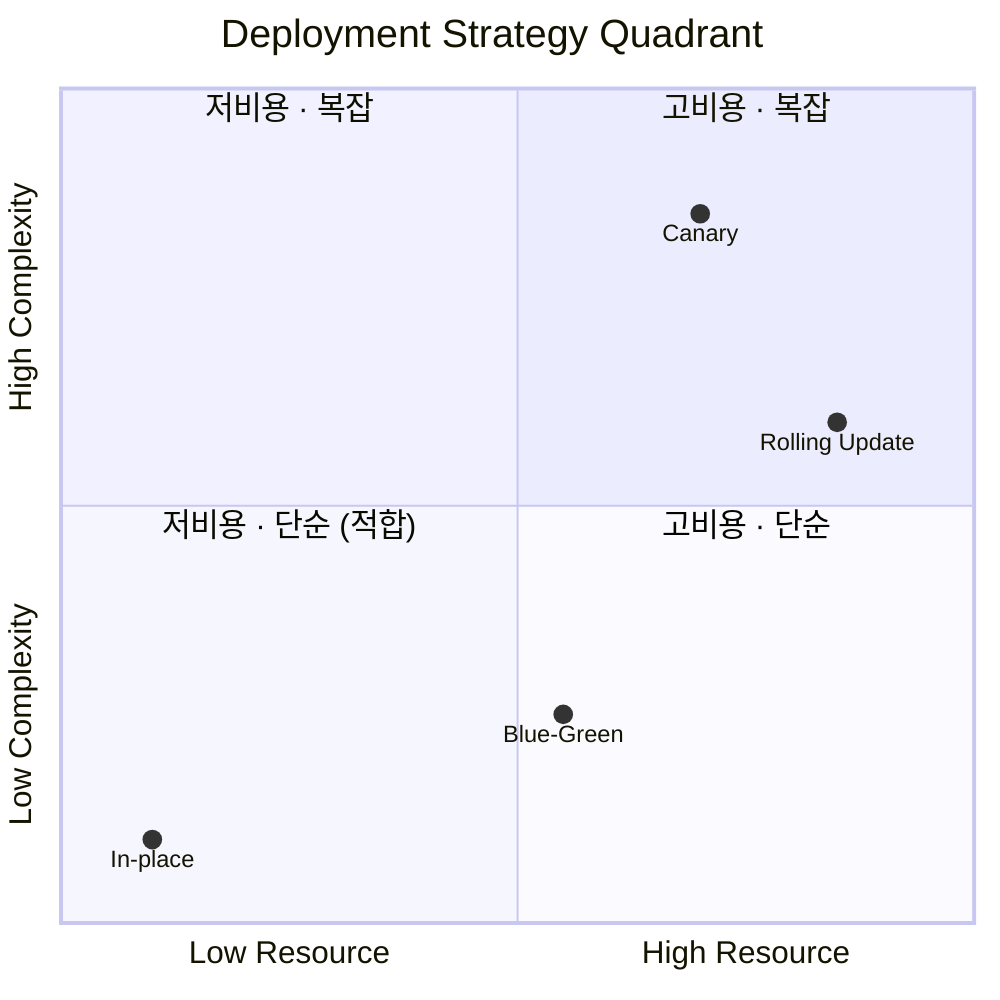

# 배포 방식 선택

## 1) 결정 사항

### 선택한 전략

- **Backend(Spring): In-place 배포**
- **Frontend(React Vite + Nginx): 무중단 요구 없음**
- **AI Service: 항상-on 아님 / 중단 배포 허용**

**중단 배포를 전제로 하되, 빠른 롤백·재배포로 리스크를 관리**한다.

## 2) 왜 In-place인가

현재 인프라는 애플리케이션 2개까지는 안정적(여유 메모리 ~400MB)이지만, 3개부터는 사실상 포화에 가까워진다.

Blue-Green / Canary / Rolling은 모두 **배포 중 두 버전 공존**을 요구하며, 특히 Canary와 Rolling은 그 공존 시간이 길어 **리소스 압박과 운영 복잡도**가 커진다.

또한 우리의 주요 장애 시나리오(OOM, 서버 크래시)는 "배포 중 무중단"으로 해결되지 않는 유형이다.

이 환경에서는 무중단 자체보다 빠른 수정 → 재배포 → 복구가 더 효과적이다.

## 3) 운영 현실을 기준으로 한 판단

### (1) 용량 제약이 크다

- Spring 2개: 가능 (여유 ~400MB)
- Spring 3개: 가능은 하나 운영상 매우 불편
- Canary / Rolling:
    - 두 버전 공존 시간이 길거나
    - 상시 2개 이상 유지 필요
    - → 지금 인프라에 부담 큼
- In-place:
    - 단일 버전만 존재
    - 리소스 예측이 쉽고 안전

### (2) 다운타임 비용은 통제 가능하다

- 정기 릴리스는 심야 배포
- 서비스 특성상 피크 시간 예측 가능
- 따라서
    - "무중단을 위한 추가 리소스·복잡도"보다
    - 배포 타이밍 관리가 더 합리적이라고 판단

### (3) 핫픽스에서 무중단의 실효성은 낮다

- 서버 크래시(OOM):
    - 이미 전체 다운 → 무중단 배포로 해결 불가
- 기능 장애:
    - 코어 기능 → 사용자 체감은 사실상 서비스 불가
    - 비코어 기능 → 무중단보다 빠른 복구가 중요

이 상황들에서 핵심은 무중단 배포가 아니라 빠른 수정 + 재배포 + 롤백이다.

### (4) Canary / Rolling의 비용 대비 가치가 낮다

- LB 설정, 트래픽 분할, 운영 절차 증가
- API 호환성 부담 증가 (장시간 혼재)
- 리소스 실패(OOM)는 점진 노출로도 근본 해결 불가

운영 비용은 크고, 얻는 이점은 제한적

### (5) Blue-Green도 지금은 과하다

- 장점: 배포 중 다운타임 제거
- 현실:
    - 우리는 심야 배포로 다운타임 비용을 낮출 수 있음
    - 주요 장애 시 무중단이 결정적 해결책이 아님

이득보다 트레이드오프가 큼

## 4) 비교 다이어그램

- X축 (Resource)

    → 동시 인스턴스 수 / 메모리 점유 / 공존 시간

    → 오른쪽일수록 리소스 많이 듦

- Y축 (Complexity)

    → 운영 절차, 판단 포인트, 실수 가능성

    → 위로 갈수록 복잡

## 5) 최종 결론

- 지금 단계에서 무중단 배포는 '필수 리스크 완화 수단'이 아니라 '비용이 큰 선택지'에 가깝다. 따라서 우리는 In-place 배포를 기본으로 하되, 빠른 롤백과 재배포로 운영 리스크를 통제하는 전략을 채택한다.
