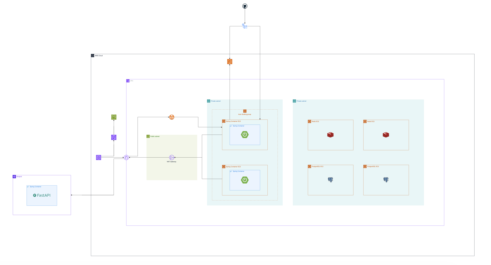

# 4단계 — Docker 컨테이너화 배포 설계

> **결론**: MAU 100만 / 피크 100 RPS 대응을 위해 Spring Boot · FastAPI 컨테이너화. PostgreSQL · Redis는 호스트 직접 설치, Frontend는 S3+CloudFront 정적 배포. ECR Private + 불변 SHA 태그(`sha-<gitsha>`) 기반 이미지 관리. 확장 60분 → 10초, 배포 6~11분 → 10~30초.

## 목차

- [도입 배경](#도입-배경)
- [도입 효과](#도입-효과)
- [의사결정](#의사결정)
- [시스템 구성](#시스템-구성)
- [관련 문서](#관련-문서)

## 도입 배경

### 서비스 개요 및 트래픽 가정

본 서비스는 유저의 취향을 분석하여 최적의 맛집을 제안하고, 실시간 투표를 통해 그룹 내 의사결정을 돕는 데이터 기반 음식점 추천 서비스입니다. 출시 이후 폭발적인 성장으로 MAU 100만을 달성하면서, 단일 인스턴스 구조로는 더 이상 트래픽을 감당할 수 없게 되었습니다.

| **항목** | **값** |
| --- | --- |
| **MAU** | 100만 명 |
| **DAU** | MAU의 30% = 30만 명 |
| **1인당 일일 평균 요청 수** | 10회 |
| **일일 총 요청 수** | 300만 건 |
| **평시 RPS** | ~35 RPS |
| **피크 평균 RPS** | ~100 RPS (평시 대비 약 3배) |
| **피크 최대 RPS** | 150~200 RPS |

- **피크 시간**: 점심(11:30 ~ 14:00), 저녁(17:30 ~ 20:00) → 총 5시간
- **피크 트래픽 비중**: 일일 트래픽의 약 60%

### Docker 도입 이유

| **도입 이유** | **컨테이너의 해결책** |
| --- | --- |
| **피크 타임 스케일 아웃** | 이식성 기반으로 어디서든 동일하게, 안정적으로 서버 복제 |
| **개발-배포 환경 일치** | 이미지로 환경 전체를 패키징, 어디서든 동일하게 실행 |
| **복잡한 의존성 관리** | CUDA/PyTorch 등 버전을 이미지에 고정 |

#### 1) 피크 타임 대응을 위한 스케일 아웃

피크 시간이 명확하게 예측 가능하고, 나머지 시간대는 트래픽이 낮습니다. 따라서 **피크 시간에만 서버를 늘리고, 평시에는 줄이는 스케일 아웃 전략**이 비용 효율적입니다.

| **방식** | **문제점** |
| --- | --- |
| 직접 수동 배포 | 명령어 실수, 포트 설정 오류 등 휴먼 에러 위험 |
| 쉘 스크립트 | 표준화되지 않음. 서버 환경에 따라 실패할 수 있음. 팀원마다 다르게 작성 가능 |
| **컨테이너** | 이식성과 표준화된 인터페이스로 해결 |

컨테이너 이미지는 **애플리케이션 + 실행 환경 전체**를 하나로 패키징하므로, 어디서든 동일하게 안정적으로 서버를 복제할 수 있습니다.

#### 2) 개발-배포 환경 일치

여러 개발자가 협업하는데, 각자의 로컬 환경(OS, 라이브러리 버전)이 달라서 "내 컴퓨터에서는 되는데요" 문제가 발생합니다. 특히 FastAPI 모델 서빙은 CUDA / cuDNN / PyTorch 버전 조합이 정확해야 하고, 네이티브 레벨 의존성이 있어 버전 호환성이 매우 중요합니다.

→ Dockerfile로 환경 전체를 패키징하면 **개발 환경 = 운영 환경**이 보장됩니다.

## 도입 효과

### 인프라 비용 (월 예상)

MAU 100만 서비스를 최소 비용으로 운영하면서, 피크 트래픽(100 RPS)을 안정적으로 처리하는 것이 목표였습니다.

| **항목** | **구성** | **월 예상 비용** |
| --- | --- | --- |
| **EC2 - PostgreSQL** | t4g.small × 2대 (Primary + Replica) | 약 43,000원 |
| **EC2 - Redis** | t4g.small × 2대 (Master + Replica) | 약 43,000원 |
| **EC2 - WAS 평시** | t4g.small × 2대 × 19h/일 | 약 34,000원 |
| **EC2 - WAS 피크** | t4g.small × 8대 × 5h/일 (Auto Scaling) | 약 36,000원 |
| **EBS (gp3)** | 30GB × 6대 | 약 27,000원 |
| **ALB** | 단일 AZ | 약 30,000원 |
| **NAT Gateway** | 1개 | 약 65,000원 |
| **S3 + CloudFront** | 프론트엔드 정적 파일 | 약 14,000원 |
| **데이터 전송** | 월 100GB 가정 | 약 17,000원 |
| **합계** |  | **약 309,000원** |

### Docker 도입으로 얻은 것 (비용 외)

| **항목** | **기존** | **Docker 적용** |
| --- | --- | --- |
| **확장 시간** | 60분 | 10초 |
| **배포 시간** | 6-11분 | 10-30초 |

### Trade-off: 무엇을 포기했는가

**Multi-AZ를 포기**하여 인프라 레벨 가용성은 낮지만, 애플리케이션 레벨에서 다중 인스턴스로 단일 인스턴스 장애는 대응 가능합니다.

- **AZ 장애 대응**: AZ 단위 장애는 재해 수준으로 간주하고 감수
- **데이터베이스**: RDS 대신 PostgreSQL 호스트 직접 운영 (운영 부담 증가)
- **캐시**: ElastiCache 대신 Redis 호스트 직접 운영 (운영 부담 증가)

### 핵심 의사결정 요약

| **목표** | **Docker 선택 이유** | **달성 결과** |
| --- | --- | --- |
| 예산 준수 | 관리형 서비스 대신 컨테이너 | 월 32만원 절감 |
| 피크 대응 | 10초 만에 컨테이너 확장 | 100 RPS 처리 가능 |
| 가용성 | Primary-Replica 이중화 | 99.5% 달성 |

## 의사결정

| 결정 항목 | 결정 | 자세히 |
| --- | --- | --- |
| 컨테이너화 범위 | 스케일 아웃 필요 + 복잡한 의존성 → **Spring / FastAPI만 컨테이너화**, PG / Redis / FE는 호스트·S3 | [컨테이너화 범위](./docs/컨테이너화-범위/) |
| 이미지 관리 | AWS 같은 리전 무료 전송 + IAM 보안 → **ECR Private** + 불변 SHA 태그 + 배포 기록 기반 롤백 | [이미지 관리](./docs/이미지-관리/) |
| 배포 절차 | 기존 수작업 6~11분 → **Docker 배포 10~30초**, ECR Pull 기반 | [배포 절차](./docs/배포-절차/) |

## 시스템 구성

### 컨테이너 구조 다이어그램

### 컨테이너별 기술 스택

| **항목** | **Spring Boot Backend** | **FastAPI AI** | **Frontend (React+Vite)** |
| --- | --- | --- | --- |
| **베이스 이미지** | eclipse-temurin:21-jre-alpine | python:3.11-slim | nginx:alpine |
| **빌드 도구** | Gradle | requirements.txt | npm (Vite) |
| **노출 포트** | 8080 | 8000 | 80 |
| **헬스체크** | /actuator/health | /health | nginx health |
| **실행 사용자** | appuser (non-root) | appuser (non-root) | nginx (non-root) |

자세한 기술 명세는 [기술 명세](./docs/기술-명세/) 참고.

### Dockerfile

| 파일 | 대상 |
| --- | --- |
| [`Dockerfile.spring-backend`](./dockerfiles/Dockerfile.spring-backend) | Spring Boot Backend |
| [`Dockerfile.fastapi-ai`](./dockerfiles/Dockerfile.fastapi-ai) | FastAPI AI |
| [`Dockerfile.frontend`](./dockerfiles/Dockerfile.frontend) | Frontend (React + Vite + Nginx) |

### Docker Compose

| 파일 | 환경 |
| --- | --- |
| [`docker-compose.dev.yml`](./compose/docker-compose.dev.yml) | 개발 — 로컬 빌드, PG/Redis 컨테이너 포함 |
| [`docker-compose.prod.yml`](./compose/docker-compose.prod.yml) | 운영 — ECR Pull, PG/Redis 호스트 외부 참조 |

## 관련 문서

### 의사결정

- [컨테이너화 범위](./docs/컨테이너화-범위/)
- [이미지 관리](./docs/이미지-관리/)
- [배포 절차](./docs/배포-절차/)

### 기술 명세

- [기술 명세](./docs/기술-명세/) — 컨테이너별 스택, Dockerfile Best Practices, .dockerignore, Compose 환경별 차이

### Dockerfile

- [`Dockerfile.spring-backend`](./dockerfiles/Dockerfile.spring-backend)
- [`Dockerfile.fastapi-ai`](./dockerfiles/Dockerfile.fastapi-ai)
- [`Dockerfile.frontend`](./dockerfiles/Dockerfile.frontend)

### Docker Compose

- [`docker-compose.dev.yml`](./compose/docker-compose.dev.yml)
- [`docker-compose.prod.yml`](./compose/docker-compose.prod.yml)
