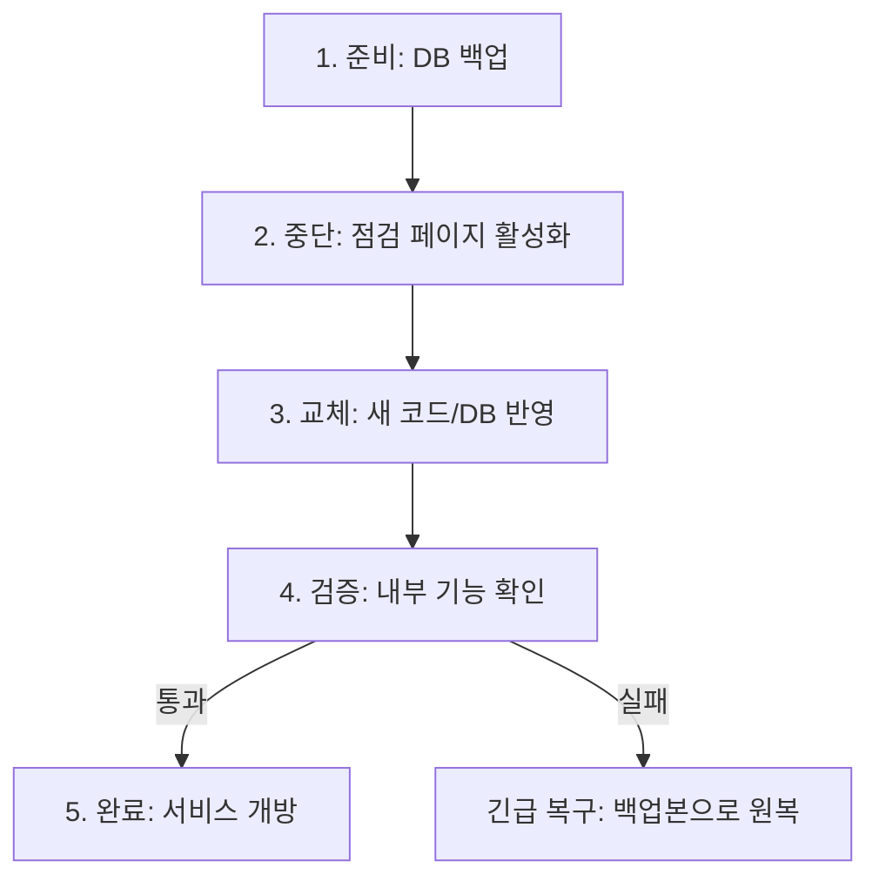
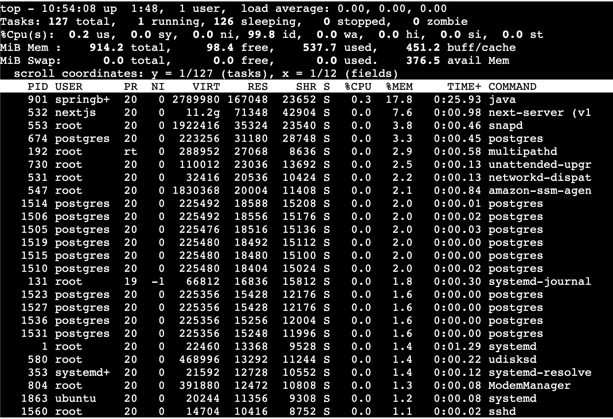
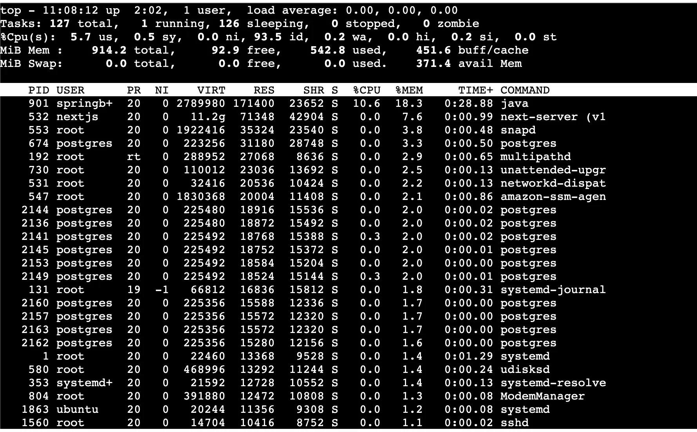
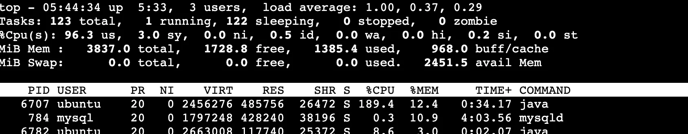
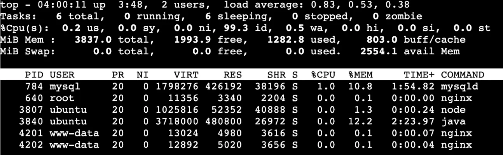
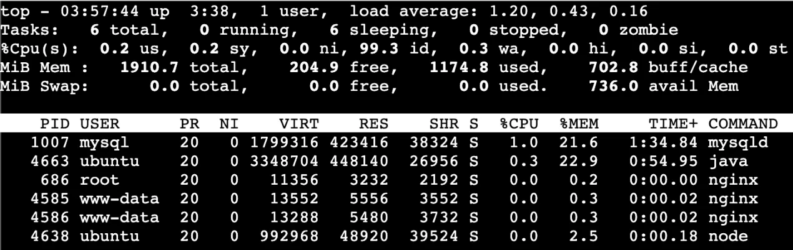
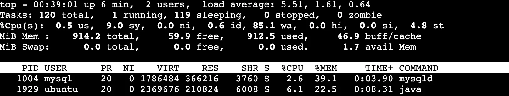

> 단계: 1단계  
> 범주: Big Bang 방식 수작업 배포 설계  
> 허브: [Cloud Wiki](../Cloud-Wiki.md)  
> 관련 문서: [인프라 의사결정 상세](#인프라-의사결정-상세), [인스턴스 선정 상세](#인스턴스-선정-상세)

# 1단계: Big Bang 방식 수작업 배포 설계

## 목차

  - [1. 수작업 배포 아키텍처 다이어그램](#1-수작업-배포-아키텍처-다이어그램)
  - [2. 배포 절차 설명서](#2-배포-절차-설명서)
  - [2.1 상세 배포 절차](#21-상세-배포-절차)
  - [2.2 배포 체크리스트](#22-배포-체크리스트)
  - [2.3 배포 스크립트](#23-배포-스크립트)
  - [3. 도입 배경 및 한계 분석](#3-도입-배경-및-한계-분석)
  - [3.1 Big Bang 수작업 배포 선택 배경](#31-big-bang-수작업-배포-선택-배경)
  - [3.2 수작업 배포의 한계 및 위험 요소](#32-수작업-배포의-한계-및-위험-요소)
  - [3.2.1 정량적 분석](#321-정량적-분석)
  - [3.2.2 관점별 한계 분석](#322-관점별-한계-분석)
  - [4. 추가 자료](#4-추가-자료)
  - [4.1 배포 프로세스 플로우차트](#41-배포-프로세스-플로우차트)
  - [4.2 수작업 배포 vs 자동화 배포 비교](#42-수작업-배포-vs-자동화-배포-비교)
  - [5. 참고 자료](#5-참고-자료)
- [인프라 의사결정 상세](#인프라-의사결정-상세)
  - [의사결정 목적](#의사결정-목적)
  - [전제 조건](#전제-조건)
  - [비용 분석 표](#비용-분석-표)
  - [비용 분석 전제(표 해석)](#비용-분석-전제표-해석)
  - [1) 비용 단가 표의 의미](#1-비용-단가-표의-의미)
  - [2) 버스터블을 비교하는 이유](#2-버스터블을-비교하는-이유)
  - [3) 2 vCPU / 4 GiB를 기준으로 잡은 이유](#3-2-vcpu-4-gib를-기준으로-잡은-이유)
  - [팀 익숙함(즉시 실행 가능성) = 프로비저닝 + SSH 리드타임(팀 실측 기반)](#팀-익숙함즉시-실행-가능성-프로비저닝-ssh-리드타임팀-실측-기반)
  - [1) 왜 ‘운영/장애 대응 경험’ 대신 이 지표를 쓰는가](#1-왜-운영장애-대응-경험-대신-이-지표를-쓰는가)
  - [2) 측정 방법(팀내 통일)](#2-측정-방법팀내-통일)
  - [3) 측정 결과(팀내 실측)](#3-측정-결과팀내-실측)
  - [4) Naver Cloud에서 시간이 길어진 원인(팀 관찰)](#4-naver-cloud에서-시간이-길어진-원인팀-관찰)
  - [참고) 레퍼런스 접근성](#참고-레퍼런스-접근성)
  - [최종 가중치(100점)](#최종-가중치100점)
  - [1) 점수화 규칙](#1-점수화-규칙)
  - [점수표(계산 결과)](#점수표계산-결과)
  - [여유 크레딧 상세](#여유-크레딧-상세)
  - [최종 선정](#최종-선정)
  - [결론: AWS](#결론-aws)
  - [차순위 고려](#차순위-고려)
  - [proxy 선정](#proxy-선정)
  - [평가 기준](#평가-기준)
  - [1. 설정 단순성과 실수 방지](#1-설정-단순성과-실수-방지)
  - [2. 설정 검증과 안전한 적용](#2-설정-검증과-안전한-적용)
  - [3. HTTPS 설정 안정성](#3-https-설정-안정성)
  - [4. 문제 발생 시 복구 속도](#4-문제-발생-시-복구-속도)
  - [5. 프록시 자체의 안정성](#5-프록시-자체의-안정성)
  - [종합 평가](#종합-평가)
- [인스턴스 선정 상세](#인스턴스-선정-상세)
  - [트래픽 기준](#트래픽-기준)
  - [테스트](#테스트)
  - [가설: T-series 적합](#가설-t-series-적합)
  - [인스턴스 후보 선정](#인스턴스-후보-선정)
  - [부하 테스트](#부하-테스트)
  - [인스턴스 선정 (EC2 t3.small)](#인스턴스-선정-ec2-t3small)
  - [인스턴스 선정 근거](#인스턴스-선정-근거)
  - [1) 트래픽 기준](#1-트래픽-기준)
  - [1-1. 일일 트래픽(총량) 가정](#1-1-일일-트래픽총량-가정)
  - [1-2. 피크 타임(점심) 가정](#1-2-피크-타임점심-가정)
  - [2) 테스트 대상(대체 서비스) 및 대표성 근거](#2-테스트-대상대체-서비스-및-대표성-근거)
  - [2-1. 대체 서비스 구성](#2-1-대체-서비스-구성)
  - [2-2. 본 서비스와의 유사성(대표성)](#2-2-본-서비스와의-유사성대표성)
  - [2-3. 한계 및 활용 범위](#2-3-한계-및-활용-범위)
  - [3) 테스트 방법(관측 지표)](#3-테스트-방법관측-지표)
  - [4) 후보별 결과 및 판단](#4-후보별-결과-및-판단)
  - [4-1. t3.medium (2 vCPU / 4 GiB)](#4-1-t3medium-2-vcpu-4-gib)
  - [4-2. t3.small (2 vCPU / 2 GiB) 최종 선택](#4-2-t3small-2-vcpu-2-gib-최종-선택)
  - [4-3. t3.micro (2 vCPU / 1 GiB) 제외](#4-3-t3micro-2-vcpu-1-gib-제외)
  - [5) Swap을 사용하지 않기로 한 이유](#5-swap을-사용하지-않기로-한-이유)
  - [6) 관측된 특이점: 메모리보다 CPU가 더 상승한 이유](#6-관측된-특이점-메모리보다-cpu가-더-상승한-이유)
  - [7) 최종 결론](#7-최종-결론)


### 1. 수작업 배포 아키텍처 다이어그램


---

### 2. 배포 절차 설명서

### 2.1 상세 배포 절차

| 단계 | 작업 내용                  | 담당자    | 사용 도구/명령어                                                      | 예상 소요 시간 | 비고               |
| ---- | -------------------------- | --------- | --------------------------------------------------------------------- | -------------- | ------------------ |
| 1    | 서비스 공지 및 사용자 알림 | 운영팀    | 공지사항 게시                                                         | 5분            | 배포 10분 전 실시  |
| 2    | 데이터베이스 백업          | DevOps    | `pg_dump -U postgres -d {db_name} > backup_YYYYMMDD.sql`              | 3분            | 롤백용 데이터 백업 |
| 3    | Backend 로컬 빌드          | BE 개발자 | `./gradlew clean build -x test`                                       | 5분            | 로컬에서 실행      |
| 4    | Frontend 로컬 빌드         | FE 개발자 | `npm install && npm run build`                                        | 3분            | 로컬에서 실행      |
| 5    | Backend 서비스 중단        | DevOps    | `sudo systemctl stop spring-boot`                                     | 1분            | **다운타임 시작**  |
| 6    | Frontend 서비스 중단       | DevOps    | `pm2 stop nextjs`                                                     | 1분            |                    |
| 7    | Backend jar 전송           | BE 개발자 | `scp build/libs/app.jar user@server:/app/backend/`                    | 2분            |                    |
| 8    | Frontend 빌드 결과 전송    | FE 개발자 | `scp -r .next user@server:/app/frontend/`                             | 2분            |                    |
| 9    | DB 스키마 변경             | DevOps    | 수동 SQL 실행 (필요 시)                                               | 2분            | 스키마 변경 시     |
| 10   | Backend 서비스 시작        | DevOps    | `sudo systemctl start spring-boot`                                    | 1분            |                    |
| 11   | Frontend 서비스 시작       | DevOps    | `pm2 start nextjs`                                                    | 1분            | **다운타임 종료**  |
| 12   | Health Check 확인          | DevOps    | `curl http://localhost:8080/health` <br> `curl http://localhost:3000` | 2분            | 정상 응답 확인     |
| 13   | 로그 모니터링              | DevOps    | `tail -f /app/backend/logs/app.log` <br> `pm2 logs nextjs`            | 10분           | 초기 안정화 확인   |
| 14   | 서비스 정상화 공지         | 운영팀    | 공지사항 업데이트                                                     | 2분            |                    |

**예상 총 소요 시간:** 약 38분
**예상 서비스 중단 시간 (다운타임):** 약 8분 (5단계~11단계)

### 2.2 배포 체크리스트

**배포 전**

- 배포할 Git 브랜치/커밋 해시 확인
- Backend 로컬 빌드 성공 (`./gradlew clean build -x test`)
- Frontend 로컬 빌드 성공 (`npm install && npm run build`)
- DB 스키마 변경 여부 확인 (변경 시 마이그레이션 SQL 준비)
- 서비스 공지 작성 완료

**배포 중**

- 데이터베이스 백업 완료
- 기존 파일 백업 완료 (`app.jar.bak`, `.next.bak`)
- Backend/Frontend 서비스 중단 확인
- 파일 전송 완료
- DB 스키마 변경 적용 (해당 시)
- Backend/Frontend 서비스 시작 확인

**배포 후**

- Health Check 통과 (Backend: 200 OK, Frontend: 200 OK)
- 주요 기능 동작 확인 (로그인, 메인 페이지)
- 에러 로그 없음 확인
- 서비스 정상화 공지 완료

### 2.3 배포 스크립트

**배포 전 백업 스크립트** (`backup.sh`)

```bash
#!/bin/bash
set -e

BACKUP_DIR="/app/backup"
TIMESTAMP=$(date +%Y%m%d_%H%M%S)
DB_NAME="your_db_name"

echo "===== 배포 전 백업 시작: $TIMESTAMP ====="

mkdir -p $BACKUP_DIR

# 1. 데이터베이스 백업
echo "[1/3] DB 백업 중..."
pg_dump -U postgres -d $DB_NAME > "$BACKUP_DIR/db_backup_$TIMESTAMP.sql"
echo "✓ DB 백업 완료"

# 2. Backend jar 백업
echo "[2/3] Backend 백업 중..."
[ -f /app/backend/app.jar ] && cp /app/backend/app.jar "$BACKUP_DIR/app.jar.bak"
echo "✓ Backend 백업 완료"

# 3. Frontend 빌드 결과 백업
echo "[3/3] Frontend 백업 중..."
[ -d /app/frontend/.next ] && cp -r /app/frontend/.next "$BACKUP_DIR/.next.bak"
echo "✓ Frontend 백업 완료"

echo "===== 백업 완료! ====="
```

**배포 실행 스크립트** (`deploy.sh`)

```bash
#!/bin/bash
set -e

echo "===== 배포 시작: $(date) ====="

# 1. 파일 확인
echo "[1/4] 배포 파일 확인 중..."
[ ! -f /app/backend/app.jar ] && echo "✗ Backend jar 없음!" && exit 1
[ ! -d /app/frontend/.next ] && echo "✗ Frontend .next 없음!" && exit 1
echo "✓ 배포 파일 확인 완료"

# 2. Backend 재시작 (systemd)
echo "[2/4] Backend 재시작 중..."
sudo systemctl restart spring-boot
echo "✓ Backend 재시작 완료 - 다운타임 시작"

# 3. Frontend 재시작 (pm2)
echo "[3/4] Frontend 재시작 중..."
pm2 restart nextjs
sleep 5
echo "✓ Frontend 재시작 완료 - 다운타임 종료"

# 4. Health Check
echo "[4/4] Health Check 중..."
sleep 10  # 애플리케이션 초기화 대기

BE_STATUS=$(curl -s -o /dev/null -w "%{http_code}" http://localhost:8080/health || echo "000")
FE_STATUS=$(curl -s -o /dev/null -w "%{http_code}" http://localhost:3000 || echo "000")

[ "$BE_STATUS" == "200" ] && echo "✓ Backend OK" || echo "✗ Backend 실패 ($BE_STATUS)"
[ "$FE_STATUS" == "200" ] && echo "✓ Frontend OK" || echo "✗ Frontend 실패 ($FE_STATUS)"

echo "===== 배포 완료: $(date) ====="
```

**롤백 스크립트** (`rollback.sh`)

```bash
#!/bin/bash
set -e

BACKUP_DIR="/app/backup"

echo "===== 롤백 시작: $(date) ====="

# 1. 서비스 중단
echo "[1/4] 서비스 중단 중..."
sudo systemctl stop spring-boot || true
pm2 stop nextjs || true

# 2. 백업본 복원
echo "[2/4] 백업본 복원 중..."
[ -f "$BACKUP_DIR/app.jar.bak" ] && cp "$BACKUP_DIR/app.jar.bak" /app/backend/app.jar
[ -d "$BACKUP_DIR/.next.bak" ] && rm -rf /app/frontend/.next && cp -r "$BACKUP_DIR/.next.bak" /app/frontend/.next
echo "✓ 복원 완료"

# 3. 서비스 재시작
echo "[3/4] 서비스 재시작 중..."
sudo systemctl restart spring-boot
pm2 restart nextjs
sleep 5

# 4. Health Check
echo "[4/4] Health Check 중..."
sleep 10  # 애플리케이션 초기화 대기

BE_STATUS=$(curl -s -o /dev/null -w "%{http_code}" http://localhost:8080/health || echo "000")
FE_STATUS=$(curl -s -o /dev/null -w "%{http_code}" http://localhost:3000 || echo "000")

[ "$BE_STATUS" == "200" ] && echo "✓ Backend OK" || echo "✗ Backend 실패 ($BE_STATUS)"
[ "$FE_STATUS" == "200" ] && echo "✓ Frontend OK" || echo "✗ Frontend 실패 ($FE_STATUS)"

echo "===== 롤백 완료: $(date) ====="
```

**로컬 빌드 및 전송 스크립트** (`local-deploy.sh`) - 로컬에서 실행

```bash
#!/bin/bash
set -e

# ===== 설정 (환경에 맞게 수정) =====
SERVER_USER="ubuntu"
SERVER_HOST="your-server-ip"
SERVER_KEY="~/.ssh/your-key.pem"

BACKEND_DIR="./backend"
FRONTEND_DIR="./frontend"
REMOTE_BACKEND="/app/backend"
REMOTE_FRONTEND="/app/frontend"
# ==================================

echo "===== 로컬 빌드 및 배포 시작: $(date) ====="

# 1. Backend 빌드
echo "[1/4] Backend 빌드 중..."
cd $BACKEND_DIR
./gradlew clean build -x test
cd ..
echo "✓ Backend 빌드 완료"

# 2. Frontend 빌드
echo "[2/4] Frontend 빌드 중..."
cd $FRONTEND_DIR
npm install && npm run build
cd ..
echo "✓ Frontend 빌드 완료"

# 3. Backend jar 전송
echo "[3/4] Backend jar 전송 중..."
scp -i $SERVER_KEY $BACKEND_DIR/build/libs/*.jar \
    $SERVER_USER@$SERVER_HOST:$REMOTE_BACKEND/app.jar
echo "✓ Backend 전송 완료"

# 4. Frontend 빌드 결과 전송
echo "[4/4] Frontend 빌드 결과 전송 중..."
scp -i $SERVER_KEY -r $FRONTEND_DIR/.next \
    $SERVER_USER@$SERVER_HOST:$REMOTE_FRONTEND/
echo "✓ Frontend 전송 완료"

echo "===== 전송 완료! ====="
echo "서버에서 deploy.sh를 실행하세요."
```

**사전 설정 필요**

> 배포 스크립트 실행 전, 서버에 systemd 서비스와 pm2 설정이 완료되어 있어야 합니다.
> 상세 설정 방법은 [배포 상세 절차 - E. 프로세스 관리 설정](../reference-docs/step1/reference-deployment-details.md#e-프로세스-관리-설정)을 참고하세요.

**스크립트 사용법**

```bash
# 실행 권한 부여
chmod +x backup.sh deploy.sh rollback.sh local-deploy.sh

# 전체 배포 순서
# 1. (서버) 백업 실행
ssh user@server './backup.sh'

# 2. (로컬) 빌드 및 전송
./local-deploy.sh

# 3. (서버) 배포 실행
ssh user@server './deploy.sh'

# 문제 발생 시 (서버)
ssh user@server './rollback.sh'
```

---

### 3. 도입 배경 및 한계 분석

### 3.1 Big Bang 수작업 배포 선택 배경

**현행 배포 방식 정의:**
본 서비스는 초기 단계에서 가장 단순한 형태의 수작업(Big Bang) 배포 방식을 채택한다.

- 단일 EC2 인스턴스에 Spring + Front + DB(PostgreSQL + pgvector)를 함께 배포
- GPU가 필요한 AI 기능은 별도의 GPU 서버(vLLM)로 분리
- 배포는 자동화 파이프라인 없이 직접 접속 후 수작업으로 일괄 반영
- 무중단 배포를 보장하지 않으며, 배포 시 일시적 서비스 중단을 허용

**서비스 현황 (초기 단계 가정):**
| 항목 | 가정치 | 비고 |
|------|--------|------|
| DAU | ~60명 | 출시 직후 예상 |
| 동시접속 | 3~6명 | 피크 시간 기준 |
| 일평균 트래픽 | ~600 requests/day | 저트래픽 구간 |
| 배포 빈도 | 주 1회 이하 | 주요 기능 안정화 후 |
| 개발 팀 규모 | 6명 | 풀스택 2 + 클라우드 2 + AI 2 |

**선택 이유:**

1. **우선 출시 전략**

   - CI/CD 파이프라인 구축보다 서비스 출시가 우선
   - 인프라 자동화는 초기 안정화 후 순차적으로 전환 예정

2. **초기 단계의 비용 효율성**

   - CI/CD 파이프라인 구축에 필요한 시간과 인력을 서비스 배포에 집중
   - EC2 1대로 비용 최소화, GPU는 RunPod Active로 임시 운영 (추후 전환 예정)

3. **배포 빈도가 낮음**

   - 현재 주 1회 이하 배포로 수작업 배포 소요 시간이 길어도 허용 가능
   - 배포 자동화 ROI가 낮은 단계

4. **시스템 구조의 단순성**

   - 단일 서버 구조로 복잡한 오케스트레이션 불필요
   - 문제 파악 속도가 빠름 (컴포넌트가 한 곳에 있어 트러블슈팅이 단순)

5. **빠른 실험/검증 가능**
   - 서비스 기능(모임 생성/투표/채팅/정산 등)을 빠르게 검증 가능
   - 아키텍처 변경, 기술 스택 변경, 서버 스펙 변경이 빈번한 초기 단계에 적합

---

### 3.2 수작업 배포의 한계 및 위험 요소

### 3.2.1 정량적 분석

| 항목                 | 현재 상태 | 문제점                                   |
| -------------------- | --------- | ---------------------------------------- |
| **배포 소요 시간**   | 약 38분   | 담당자의 수작업 의존으로 시간 변동 폭 큼 |
| **서비스 중단 시간** | 약 8분    | 사용자 경험 저하, 트래픽 손실            |
| **배포 실패율**      | 편차 큼   | 수작업으로 인한 Human Error 가능성       |
| **롤백 소요 시간**   | 약 11분   | 장애 지속 시간 증가 위험                 |
| **배포 가능 인원**   | 2명       | 담당자 부재 시 배포 불가 (단일 장애점)   |

### 3.2.2 관점별 한계 분석

**1) 네트워크/보안 관점**
| 문제 | 설명 |
|------|------|
| 퍼블릭 서브넷 DB 존재 | 인바운드 규칙 실수 시 즉시 공격 대상 노출 |
| 키/시크릿 관리 | .env 방식의 느슨한 관리로 유출 리스크, 휴먼 에러 가능성 |
| 보안 경계가 얇음 | 애플리케이션 계층에서만 방어, 네트워크 레벨 방어 약함 |
| TLS/인증서/도메인 운영 | 직접 인증서 갱신/리다이렉트 처리 시 실수 여지 |
| AI 서버 공격면 | 퍼블릭 노출 시 비용형 공격에 취약 → 비용 폭발 위험 |

> "기능 개발 속도는 빠르지만, 보안 사고는 한 번이면 서비스 신뢰가 끝날 수 있음"

**2) 가용성/장애 격리 관점**
| 문제 | 설명 |
|------|------|
| 단일 장애 지점 | EC2 한 대 장애 시 Back/Front/DB 동시 다운 |
| 연쇄 장애 | DB I/O 상승 → API 지연 → 벡터 검색 타임아웃 → 전체 장애 |
| 복구 시간 | 수동 대응으로 MTTR이 운에 좌우됨 |

> 문제 파악은 빠르지만, **장애 영향 범위가 전체**

**3) 성능/리소스 경쟁 관점**
| 문제 | 설명 |
|------|------|
| CPU/메모리/디스크/IO 경쟁 | DB(디스크+벡터 검색) + Spring(CPU) + Front 빌드가 한 머신에서 경쟁 |
| 벡터 검색 성능 | pgvector HNSW 인덱스 메모리 사용량 증가 시 일반 쿼리와 경쟁 |
| 간헐적 지연 | 가끔 5~10초 같은 디버깅 어려운 증상 증가 |

<!-- | 커넥션/파일 디스크립터 한계 | WebSocket/동시 접속 증가 시 OS 튜닝 없이는 한계 | -->

**4) 확장성 관점**
| 문제 | 설명 |
|------|------|
| 수평 확장 시 구조 변경 필요 | DB가 로컬이면 확장 전 분리 필요 (그대로 확장 시 비효율적 구조) |
| 무중단 배포 시 리소스 부담 | 단일 인스턴스에서 Blue-Green 시 2배 리소스 필요 (현재 스펙에서 부담) |

> 트래픽이 조금 늘 때는 버티지만, **확장은 구조 변경을 요구**

**5) 배포/운영(DevOps) 관점**
| 문제 | 설명 |
|------|------|
| 인적 오류 리스크 | 순서 실수, 환경변수 누락, 롤백 미흡 |
| 롤백 어려움 | 한 덩어리로 배포하면 일부만 되돌리기 어려움 |
| 관측 한계 | 트래픽 증가 시 요청 단위 병목(핸들러/DB/외부호출)을 빠르게 특정하기 어려움 |

> 초기엔 단순함이 장점이지만, **배포 빈도가 올라가면 곧 리스크가 됨**

**6) 데이터/백업/복구 관점**
| 문제 | 설명 |
|------|------|
| 백업/복구 | 자동 백업 없으면 사고 시 복구가 느림 |
| 데이터 손실 리스크 | 인스턴스 디스크 장애, 삭제 실수 시 치명적 |

**7) 비용 관점**
| 문제 | 설명 |
|------|------|
| 초기엔 저렴 | 인스턴스 1~2대로 종료 |
| 장애/공격 시 비용 폭발 | 퍼블릭 노출 + AI 추론 엔드포인트 = 요청 폭탄 → 비용 폭발 |
| 스케일업 단가 상승 | 어느 순간 큰 인스턴스로 점프 필요 |

<!-- **8) 컴플라이언스/신뢰 관점**

- 사용자 데이터/결제/정산이 들어가면 퍼블릭 DB는 설명이 어려움
- 보안 감사/평가에서 감점 포인트

> 기술이 문제가 아니라 **신뢰 문제** -->

---

### 4. 추가 자료

### 4.1 배포 프로세스 플로우차트



### 4.2 수작업 배포 vs 자동화 배포 비교

| 비교 항목        | 수작업 배포 (현재) | 자동화 배포 (목표)    |
| ---------------- | ------------------ | --------------------- |
| 배포 소요 시간   | 약 38분            | 10분 이내             |
| 서비스 중단 시간 | 약 8분             | 0분 (무중단 배포)     |
| 인적 오류 가능성 | 높음               | 낮음                  |
| 담당자 의존도    | 높음 (2명)         | 낮음 (자동화)         |
| 초기 구축 비용   | 없음               | 구축 시간 필요        |
| 유지보수 비용    | 높음 (반복 작업)   | 낮음                  |
| 롤백 속도        | 약 11분            | 배포 전략에 따라 단축 |

---

### 5. 참고 자료

본문에서 다루지 않은 상세 내용과 의사결정 배경은 아래 섹션에서 확인할 수 있습니다.

| 문서                                                                                                     | 설명          |
| -------------------------------------------------------------------------------------------------------- | ------------- |
| [인프라 의사결정 상세](#인프라-의사결정-상세) | 인프라 분석   |
| [인스턴스 선정 상세](#인스턴스-선정-상세)   | 인스턴스 선정 |
| [2단계: CI(지속적 통합) 파이프라인 구축 설계](./stage-2-ci.md)   | 2단계: CI(지속적 통합) 파이프라인 구축 설계 |

---

## 인프라 의사결정 상세

### 의사결정 목적

초기 검증 단계의 서비스로 빠른 배포 · 단순한 운영 · 제한된 예산 내 실험을 최우선 목표로 한다.

따라서 단일 인스턴스 기반 Big Bang 배포를 전제로 클라우드 Provider를 선정한다.

### 전제 조건

- 단일 인스턴스
  - 고가용성·자동 확장보다 배포 속도와 운영 단순성이 중요
- 제한된 예산
  - 투입 가능한 예산이 제한적
- Cloud Provider 사용 기간
  - 2026.01.19 ~ 2026.03.26 (약 67일)

### 비용 분석 표

| Provider    | 크레딧(가용 돈)    | 유효기간           | 2vCPU/4GiB 단가(시간)   | 1대 24/7 최대(유효기간 반영) | 2026-01-19 시작 시 |
| ----------- | ------------------ | ------------------ | ----------------------- | ---------------------------- | ------------------ |
| AWS         | $700 (≈₩1,013,845) | ~ 2026-03-26       | $0.052/h (≈₩75.3/h)     | 67일                         | 2026-03-26         |
| Azure       | $200 (≈₩289,670)   | 30일               | $0.0478/h (≈₩69.2/h)    | 30일                         | 2026-02-18         |
| GCP         | $300 (≈₩434,505)   | 91일               | $0.0429829/h (≈₩62.3/h) | 91일                         | 2026-04-20         |
| OCI         | $300 (≈₩434,505)   | 30일               | $0.031/h (≈₩44.9/h)     | 30일                         | 2026-02-18         |
| Naver Cloud | ₩100,000           | 발급일로부터 3개월 | ₩94.5/h                 | 44일                         | 2026-03-04         |
| KT Cloud    | ₩500,000           | 90일               | ₩111.0/h                | 90일                         | 2026-04-19         |
| NHN Cloud   | ₩200,000           | 지급일로부터 1년   | ₩93.0/h                 | 89일                         | 2026-04-18         |

### 비용 분석 전제(표 해석)

### 1) 비용 단가 표의 의미

- 시간당 단가 표는 버스터블 클래스를 포함
- 선정 이후 실제 운영 투입 전, 버스터블 클래스부터 먼저 검증하여 “피크 트래픽 대응 적합성”을 확인함
- AMD64만 비교
  - 이유: 초기 의사결정 단계에서는 “가격/크레딧 커버/운영 난이도”가 핵심이고, ARM까지 동시에 비교하면 변수가 늘어 의사결정 속도가 느려짐

### 2) 버스터블을 비교하는 이유

우리 서비스는 트래픽 피크가 점심/저녁으로 명확함

버스터블 인스턴스는 평시에는 크레딧을 축적하고, 피크에는 축적된 크레딧을 사용해 순간 성능을 끌어올릴 수 있는 구조이므로, “피크가 짧고 패턴이 뚜렷한 서비스”에 잘 맞을 가능성이 높음

따라서 “최종 스펙 확정”이 아니라 초기 검증(최우선 테스트) 대상으로 버스터블을 선택함

### 3) 2 vCPU / 4 GiB를 기준으로 잡은 이유

단일 인스턴스 Big Bang는 한 머신에 웹/API/배치/프록시/DB 등 주요 컴포넌트가 함께 탑재될 수 있어 너무 작은 인스턴스는 다음 리스크가 빠르게 발생함

- 메모리 부족(OOM)로 서비스 불안정 (특히 JVM/Node/DB 동시 구동 시)
- 배포/빌드/마이그레이션 순간 부하에서 실패 확률 증가

그래서 2 vCPU / 4 GiB는 “최적화된 최소”라기보다, 초기 검증을 안정적으로 시작하기 위한 베이스라인으로 사용

또한 이 기준은 “충분함”을 전제하지 않는다.

- 충분하면: 비용 효율적으로 67일 운영
- 부족하면: 즉시 스케일업(예: 4vCPU/8GiB 등) 을 고려해야 함
  → 따라서 Provider 선택 시 크레딧 여유(버퍼) 가 중요하다.

### 팀 익숙함(즉시 실행 가능성) = 프로비저닝 + SSH 리드타임(팀 실측 기반)

### 1) 왜 ‘운영/장애 대응 경험’ 대신 이 지표를 쓰는가

운영 장애 대응 경험(실전 장애 대응, 운영 히스토리)은 현재 단계에서 정량화가 어렵다.

반면 Big Bang 배포에서 팀이 당장 할 수 있는 검증은 다음뿐이다.

- 인스턴스 프로비저닝
- SSH로 접속

그리고 SSH 이후 내부는 대부분 동일한 Linux 환경이므로, Provider 간 차이는 리눅스 자체가 아니라

“서버를 띄우고 처음 작업을 시작하기까지의 마찰(온보딩 난이도)” 에서 발생한다.

따라서 본 단계에서는 팀 익숙함을 추상적으로 주장하는 대신, 프로비저닝+SSH 리드타임을 “즉시 실행 가능성”의 대리 지표로 사용한다.

### 2) 측정 방법(팀내 통일)

- 조건: **2 vCPU / 4 GiB** 수준의 인스턴스 1대
- 목표: **SSH 로그인 성공(웹 콘솔 접속 허용)** 까지
- 측정 구간: 인스턴스 생성 시작 → SSH 로그인 성공

### 3) 측정 결과(팀내 실측)

| Provider    | 리드타임(팀 실측) |
| ----------- | ----------------- |
| AWS         | 2분               |
| GCP         | 8분               |
| Naver Cloud | 38분              |
| Azure       | 미측정            |
| OCI         | 미측정            |
| KT Cloud    | 미측정            |
| NHN Cloud   | 미측정            |

### 4) Naver Cloud에서 시간이 길어진 원인(팀 관찰)

- 콘솔 반영 지연으로 새로고침 반복
- 인스턴스 유형 탐색 난이도(버스터블/표준/하이CPU 구분)
- PEM 기반 SSH 이후 추가 로그인/비밀번호 확인 과정에서 지연

### 참고) 레퍼런스 접근성

프로비저닝 이후 실제 운영에서는 보안그룹 설정, 포트 오픈, 서비스 배포 등
다양한 설정 작업이 필요하다.

이 과정에서 팀원들이 문제를 마주쳤을 때
가장 먼저 하는 행동은 검색이다.


- 출처: StackOverflow Developer Survey Results 2025 Overview

AWS/GCP/Azure는 대부분의 문제에 대해 검색 결과가 존재하지만,
Naver Cloud는 공식 문서 외에 참고할 자료가 제한적이다.

이는 팀의 트러블슈팅 시간에 영향을 줄 수 있는 요소로 고려하였다.

### 최종 가중치(100점)

1. 프로젝트 기간 67일 커버 가능 여부(Compute 기준): 60점
2. 프로젝트 기간 내 크레딧 여유(추가비용/스케일업 버퍼): 20점
3. 버스터블 지원 여부(테스트 우선 대상 가능성): 5점
4. 팀 즉시 실행 가능성(프로비저닝+SSH 리드타임): 10점
5. 한국 리전 유무: 5점

### 1) 점수화 규칙

1. 67일 커버 가능 여부 (60점)

   - 표의 시간당 단가를 `P`(원/시간 또는 $/시간), 크레딧을 `C`(원 또는 $)로 둔다.
   - 67일 24/7 필요 총비용: `Cost67 = P × 24 × 67`

   **커버 점수(0~60점)** :
   `CoverScore = min(C / Cost67, 1) × 60`

2. 프로젝트 기간 내 크레딧 여유 (20점)

   - 총 크레딧(C)에서 67일 기본 운영 비용(Cost67)을 뺀 여유 크레딧
   - 프로젝트 기간 내 스케일업, 추가 서비스 도입 등에 활용 가능한 버퍼
   - 여유 비율 = (C - Cost67) / Cost67

   **여유 점수(0~20점)** :
   `BufferScore = min(여유비율 × 5, 20)` (단, 67일 커버 불가 시 0)

3. 버스터블 지원 여부 (5점)

   - 버스터블 클래스 공식 지원: 5점
   - 미지원: 0점

4. 팀 즉시 실행 가능성 (10점)

   - 팀 실측 프로비저닝+SSH 리드타임 기반
   - 2분 이하: 10점
   - 10분 이하: 3점
   - 30분 이하: 1점
   - 미측정: 0점

5. 한국 리전 유무 (5점)

   - 한국 리전 지원: 5점
   - 미지원: 0점

### 점수표(계산 결과)

D(커버일수): 비용 분석 표의 "1대 24/7 최대(유효기간 반영)" 사용

| Provider        | D(커버일수) | 커버 (60) | 여유 (20) | 버스터블 (5) | 즉시실행 (10) | 한국 리전 (5) | 총점(100) |
| --------------- | ----------- | --------- | --------- | ------------ | ------------- | ------------- | --------- |
| **AWS**         | 67          | 60        | 20        | 5            | 10            | 5             | **100.0** |
| **GCP**         | 91          | 60        | 17        | 5            | 3             | 5             | **90.0**  |
| **KT Cloud**    | 90          | 60        | 9         | 0            | 0             | 5             | **74.0**  |
| **NHN Cloud**   | 89          | 60        | 2         | 0            | 0             | 5             | **67.0**  |
| **Naver Cloud** | 44          | 39        | 0         | 0            | 1             | 5             | **45.0**  |
| **Azure**       | 30          | 27        | 0         | 5            | 0             | 5             | **37.0**  |
| **OCI**         | 30          | 27        | 0         | 0            | 0             | 5             | **32.0**  |

### 여유 크레딧 상세

| Provider    | 크레딧   | Cost67   | 여유 크레딧 | 여유 비율 | 여유 점수 |
| ----------- | -------- | -------- | ----------- | --------- | --------- |
| AWS         | $700     | $83.6    | $616.4      | 737%      | 20        |
| GCP         | $300     | $69.1    | $230.9      | 334%      | 17        |
| KT Cloud    | ₩500,000 | ₩178,488 | ₩321,512    | 180%      | 9         |
| NHN Cloud   | ₩200,000 | ₩149,544 | ₩50,456     | 34%       | 2         |
| Naver Cloud | ₩100,000 | ₩151,956 | -           | 커버 불가 | 0         |
| Azure       | $200     | $76.9    | -           | 커버 불가 | 0         |
| OCI         | $300     | $49.9    | -           | 커버 불가 | 0         |

### 최종 선정

### 결론: AWS

총점 **100점**으로 1위. 다음 이유로 AWS를 최종 선정한다.

1. **프로젝트 기간 완전 커버**: 크레딧 $700으로 67일(2026-01-19 ~ 2026-03-26) 운영 가능
2. **크레딧 여유 최대**: 67일 기본 비용 $83.6 대비 $616.4 여유 (737%)
3. **버스터블 지원**: t3 시리즈로 피크 트래픽 대응 가능
4. **팀 즉시 실행 가능**: 프로비저닝+SSH 2분으로 가장 빠름
5. **한국 리전 지원**: ap-northeast-2 (서울)

### 차순위 고려

| 순위 | Provider  | 총점 | 비고                                  |
| ---- | --------- | ---- | ------------------------------------- |
| 2    | GCP       | 90.0 | 프로비저닝 리드타임 8분               |
| 3    | KT Cloud  | 74.0 | 버스터블 미지원, 팀 미측정            |
| 4    | NHN Cloud | 67.0 | 버스터블 미지원, 팀 미측정, 여유 적음 |

<br><br>

### proxy 선정

빅뱅 배포(Big Bang Deployment)는 시스템 전체를 한 번에 업데이트하는 방식이기에 문제가 발생하면 모든 사용자가 영향을 받는다는 특징이 있습니다.

따라서 다음의 안정성을 기준으로 프록시를 비교분석 하였습니다.

### 평가 기준

단일 인스턴스 환경에 맞게 기준을 설정하였습니다.

| 기준                        | 왜 중요한가                                                    |
| --------------------------- | -------------------------------------------------------------- |
| **설정 단순성과 실수 방지** | 설정 오류 = 전체 장애. 복잡할수록 실수 확률 증가               |
| **설정 검증과 안전한 적용** | 배포 전 오류 감지, 무중단 reload, 실패 시 기존 설정 유지       |
| **HTTPS 설정 안정성**       | TLS 설정 실수는 흔한 장애 원인. 인증서 만료도 서비스 중단 유발 |
| **문제 발생 시 복구 속도**  | 단일 인스턴스라 장애 시 대안 없음. 빠른 원인 파악이 생존 결정  |
| **프록시 자체의 안정성**    | 프록시 크래시, 메모리 릭 등이 서비스 중단으로 직결             |

---

### 1. 설정 단순성과 실수 방지

| 프록시      | 기본 리버스 프록시 설정                              | 실수 유발 요소                                                                                    | 평가                  |
| ----------- | ---------------------------------------------------- | ------------------------------------------------------------------------------------------------- | --------------------- |
| **Caddy**   | 도메인과 백엔드 주소만 지정하면 끝. 2-3줄로 완성     | 옵션이 적어서 잘못 건드릴 게 거의 없음. 기본값이 안전하게 설계됨                                  | 가장 낮은 실수 가능성 |
| **Nginx**   | server, location, proxy_pass 블록 구조. 10-15줄 정도 | TLS 직접 설정 필요. ssl_protocols, ssl_ciphers 조합 실수 가능. upstream 오타 시 장애              | 낮은 편               |
| **Traefik** | YAML/TOML로 라우터, 서비스 정의. 20-30줄             | 라우터-서비스 매핑 실수, 미들웨어 체인 순서 오류. 들여쓰기 실수로 파싱 에러                       | 중간                  |
| **HAProxy** | frontend, backend 블록. 15-20줄                      | frontend/backend 참조 오타, mode 지정 누락, bind 주소 실수. 옵션이 많아 불필요한 설정 건드릴 위험 | 중간                  |
| **Apache**  | VirtualHost, ProxyPass 지시자. 15-25줄               | 모듈 로드 순서, 지시자 위치에 따라 동작 달라짐. 어떤 모듈이 필요한지 파악 어려움                  | 높음                  |
| **Envoy**   | 리스너, 클러스터, 라우트 정의. 50-100줄              | YAML 구조 복잡. 오타 하나로 전체 설정 무효화. 개념 이해 없이 설정 어려움                          | 가장 높음             |
| **H2O**     | YAML 기반. 20-30줄                                   | 문서 부족으로 옵션 의미 파악 어려움. 예상과 다른 동작 발생 가능                                   | 높음 (불확실성)       |

---

### 2. 설정 검증과 안전한 적용

| 프록시      | 검증 명령어                                                                  | 무중단 reload                                  | 검증 실패 시 동작                                         | 평가        |
| ----------- | ---------------------------------------------------------------------------- | ---------------------------------------------- | --------------------------------------------------------- | ----------- |
| **Nginx**   | `nginx -t`로 문법 및 파일 참조 검증. 1초 내 완료                             | `nginx -s reload`로 기존 연결 유지하며 적용    | reload 거부, 기존 설정으로 계속 동작                      | 가장 안전   |
| **Caddy**   | `caddy validate`로 검증                                                      | `caddy reload`로 무중단 적용                   | reload 거부, 기존 설정 유지                               | 안전        |
| **HAProxy** | `haproxy -c -f config.cfg`로 검증                                            | `systemctl reload haproxy`로 무중단 적용       | reload 거부, 기존 설정 유지                               | 안전        |
| **Traefik** | 별도 검증 명령어 없음. 파일 변경 시 자동 감지 후 적용                        | 자동 reload                                    | 해당 라우터만 비활성화. 전체 장애는 아니나 부분 장애 가능 | 부분 위험   |
| **Apache**  | `apachectl configtest`로 검증. 모듈 간 상호작용 문제는 감지 못하는 경우 있음 | `apachectl graceful`로 무중단 재시작           | 재시작 거부, 기존 설정 유지                               | 보통        |
| **Envoy**   | `envoy --mode validate`로 검증                                               | 정적 설정은 재시작 필요. xDS 사용 시 동적 적용 | 검증 실패 시 시작 안 됨                                   | 보통 (복잡) |
| **H2O**     | 별도 검증 명령어 없음                                                        | 지원하나 문서 부족                             | 시작 실패 시 그때 확인                                    | 위험        |

---

### 3. HTTPS 설정 안정성

| 프록시      | 인증서 설정 방식                                                                          | 자동 갱신                       | 설정 실수 가능성                                       | 평가             |
| ----------- | ----------------------------------------------------------------------------------------- | ------------------------------- | ------------------------------------------------------ | ---------------- |
| **Caddy**   | 도메인만 지정하면 Let's Encrypt 인증서 자동 발급 및 갱신. 수동 설정도 가능                | 기본 내장. 만료 전 자동 갱신    | TLS 설정 자체를 건드릴 일이 없음. 실수 원천 차단       | 가장 안전        |
| **Traefik** | Let's Encrypt 연동 내장. YAML로 설정                                                      | 기본 내장                       | 설정 항목이 Caddy보다 많아 실수 여지 있음              | 안전한 편        |
| **Nginx**   | ssl_certificate, ssl_certificate_key 경로 직접 지정. ssl_protocols, ssl_ciphers 수동 설정 | 없음. certbot 등 외부 도구 필요 | 경로 오타, 권한 문제, 프로토콜/암호화 스위트 조합 실수 | 실수 가능성 있음 |
| **HAProxy** | bind 라인에 인증서 경로 지정. ssl-default-bind-options 등 수동 설정                       | 없음. 외부 도구 필요            | Nginx와 유사한 실수 가능성. 인증서 포맷(PEM 결합) 요구 | 실수 가능성 있음 |
| **Apache**  | SSLCertificateFile, SSLCertificateKeyFile 지시자. SSLProtocol 등 수동                     | 없음. 외부 도구 필요            | 지시자 많고 모듈 설정 복잡                             | 실수 가능성 높음 |
| **Envoy**   | TLS 컨텍스트에서 인증서 경로, 프로토콜 버전 등 상세 설정                                  | 없음. 외부 도구 또는 SDS 필요   | 설정 항목 많고 YAML 구조 복잡                          | 실수 가능성 높음 |
| **H2O**     | 경로 지정 방식. 설정 문서 부족                                                            | 없음                            | 옵션 의미 파악 어려움                                  | 실수 가능성 높음 |

---

### 4. 문제 발생 시 복구 속도

| 프록시      | 에러 메시지 명확성                    | 검색 시 해결책 찾을 확률                      | 로그 가독성                                    | 평가      |
| ----------- | ------------------------------------- | --------------------------------------------- | ---------------------------------------------- | --------- |
| **Nginx**   | 명확. 파일명, 줄 번호, 원인 직접 표시 | 95% 이상. 거의 모든 에러에 대한 해결책 존재   | 직관적. 대부분의 개발자가 바로 읽을 수 있음    | 가장 빠름 |
| **Caddy**   | 명확. JSON 구조화 로그                | 70% 정도. 흔한 문제는 있으나 엣지 케이스 부족 | 구조화되어 파싱 쉬움. 사람이 읽기도 괜찮음     | 빠른 편   |
| **HAProxy** | 명확하나 HAProxy 특유의 용어 사용     | 80% 정도. 커뮤니티 활발하나 Nginx보단 적음    | 기본 포맷이 독특. 익숙해지면 상세 정보 많음    | 보통~빠름 |
| **Traefik** | JSON 로그. 구조화되어 있으나 장황     | 60% 정도. K8s 컨텍스트 자료 위주              | 파싱은 쉬우나 사람이 직접 읽기엔 불편          | 보통      |
| **Apache**  | 가독성 보통. 모듈별로 에러 형식 다름  | 자료 많으나 버전별 차이 큼. 오래된 정보 혼재  | 전통적 포맷. 익숙하나 상세 정보 부족할 때 있음 | 보통~느림 |
| **Envoy**   | 상세하나 정보 과다. 핵심 찾기 어려움  | 50% 정도. 단독 프록시 용도 자료 적음          | 구조화되어 있으나 개념 이해 필요               | 느림      |
| **H2O**     | 기본적 수준                           | 30% 이하. 영어 자료 부족                      | 제한적                                         | 가장 느림 |

---

### 5. 프록시 자체의 안정성

| 프록시      | 메모리 사용                   | 장기 운영 안정성                           | 크래시 사례   | 프로덕션 검증                                     | 평가      |
| ----------- | ----------------------------- | ------------------------------------------ | ------------- | ------------------------------------------------- | --------- |
| **Nginx**   | 낮음. 이벤트 기반으로 효율적  | 수년간 재시작 없이 운영하는 사례 다수      | 극히 드묾     | 전 세계 웹서버 점유율 1위. 모든 규모에서 검증     | 가장 안정 |
| **HAProxy** | 낮음. 효율적인 메모리 관리    | 금융권에서 수년간 무중단 운영 사례         | 극히 드묾     | L4/L7 로드밸런서 업계 표준                        | 가장 안정 |
| **Caddy**   | 중간. Go 런타임 오버헤드 있음 | 안정적이나 Nginx/HAProxy 대비 역사 짧음    | 드묾          | 중소규모 서비스에서 검증. 대규모 사례는 적음      | 안정      |
| **Traefik** | 중간. Go 런타임               | 안정적. K8s 환경에서 많이 사용             | 드묾          | K8s Ingress로 널리 검증. 단독 사용 사례는 적음    | 안정      |
| **Envoy**   | 중간~높음                     | 안정적. 서비스 메시 데이터 플레인으로 검증 | 드묾          | 대규모 서비스 메시에서 검증. 단독 프록시로는 과잉 | 안정      |
| **Apache**  | 높음. 프로세스/스레드 모델    | 안정적이나 메모리 릭 이슈 간헐적 보고      | 드물지만 있음 | 오래된 시스템에서 검증. 신규 구축에서는 비선호    | 안정한 편 |
| **H2O**     | 낮음                          | 검증 사례 부족                             | 알 수 없음    | 소규모 사례 위주. 프로덕션 레퍼런스 부족          | 불확실    |

---

### 종합 평가

설정 안정성에서 우수한 평가를 받았고 문제 발생 시 가장 빨리 해결 가능, 프록시 자체 안정성도 가장 우수한 Nginx를 선택하였습니다.

## 인스턴스 선정 상세

### 트래픽 기준

- 유저 플로우 (일일 요청량, 사용자당 평균 10 req/day, 10 \* 60(DAU) → 600 req/day)
  1. GET - 목록 조회
  2. POST - 모임 생성
  3. GET - 초대 코드
  4. GET - 모임 상세
  5. GET - 참여자 확인
  6. GET - 식당 목록
  7. POST - 투표 제출
  8. GET - 결과 조회
  9. POST - 최종 확정
  10. GET - 확정 후 상세 재조회

### 테스트

### 가설: T-series 적합

- 우리 트래픽은 상시 고부하가 아니라 피크가 짧게 오는 패턴
- T-series는 Burstable(크레딧 기반)이라 idle 시간에 크레딧을 쌓고 피크에 Burst로 대응 가능
- 따라서 비용을 최소화하면서 피크를 버틸 수 있음

### 인스턴스 후보 선정

- 후보 : t3.micro / t3.small / t3.medium / t3.large
- 목적 : “최소 스펙”을 찾기 위해 한 단계씩 올리며 한계점을 확인
- t3.micro
  
- t3.small
  
- t3.medium
  
- t3.large
  

### 부하 테스트

- t3.micro
  
- t3.small
  
- t3.medium
  
- t3.large
  

---

### 인스턴스 선정 (EC2 t3.small)

본 프로젝트는 단일 인스턴스 기반 Big Bang 배포를 전제로 하며, 초기 검증 단계에서 “피크 타임을 Swap 없이 안정적으로 버티는 최소 사양”을 목표로 인스턴스를 선정하였다. 그 결과 EC2 t3.small(2 vCPU, 2 GiB)을 최종 선택하였다.

### 인스턴스 선정 근거

### 1) 트래픽 기준

### 1-1. 일일 트래픽(총량) 가정

| 항목                 | 예상치       |
| -------------------- | ------------ |
| MAU                  | 100명        |
| DAU                  | 60명         |
| 사용자당 평균 요청량 | 10 req/day   |
| 일일 요청량          | ~600 req/day |

- 부트캠프 수강생 약 100명을 1차 사용자 풀로 가정
- 과제·협업 맥락에서 약 60%가 일 1회 이상 사용한다고 가정하여 DAU 60명으로 산정
- 사용자당 평균 10 req/day를 가정하여 일일 요청량은 60 × 10 = 600 req/day로 추정

### 1-2. 피크 타임(점심) 가정

- 서비스 특성상 점심·저녁에 사용이 몰릴 것으로 예상(특히 점심)
- 피크 구간은 12:00 ~ 13:00으로 가정
- DAU의 80%(48명)가 점심에 접속한다고 보고, 최악 케이스로 **40명이 동시에 사용(40 VU)** 하는 상황을 부하 조건으로 설정

### 2) 테스트 대상(대체 서비스) 및 대표성 근거

현재 본 서비스는 개발 진행 중으로 실제 API/데이터셋이 완성되지 않아, 최소 사양을 빠르게 검증하기 위해 기존 개인 프로젝트 서비스를 대체 테스트 대상으로 사용하였다.

### 2-1. 대체 서비스 구성

- **Nginx**
- **Node.js(Express)**: HTML/JS/CSS 서빙
- **Spring**
- **MySQL**

### 2-2. 본 서비스와의 유사성(대표성)

- 둘 다 웹 API 기반이며, 피크 시점에 조회 중심 요청이 반복되는 구조
- 본 서비스의 핵심(모임 리스트/추천 리스트 조회) 역시 **리스트 조회 GET 요청**이 주요 트래픽이 될 것으로 예상
- 인증이 **세션 기반**이며 로그인 시 비밀번호 해시(단방향) 연산이 포함됨

### 2-3. 한계 및 활용 범위

- 엔드포인트/쿼리/데이터 크기/인덱스 구성이 완전히 동일하지 않으므로 본 결과는 정확한 TPS 보장이 아니라 “후보 사양을 좁히는 근거(실측)”로 사용한다.

### 3) 테스트 방법(관측 지표)


- Idle 상태에서 `total/free/used/available` 메모리 여유 확인
- 피크 부하(40 VU) 조건에서 CPU/메모리 변화량 확인
- 부하 시나리오는 VU당 “로그인 1회(세션 생성, 비밀번호 해시 포함) + 게시글 리스트(10개) 조회 GET 3회”로 구성하였다.
- 측정 도구는 EC2에서 `top` 기반으로 관측하였고, 주요 구간을 캡처로 기록하였다. (첨부 이미지 참조)

### 4) 후보별 결과 및 판단

### 4-1. t3.medium (2 vCPU / 4 GiB)

- application build
  
  - build
    - cpu 사용량: 약 99.3% (96.3 us + 3.0 sy)
    - mem total(MiB) : 3837.0
    - mem free(MiB) : 1728.8
    - mem used(MiB) : 1385.4
    - mem buff/cache(MiB) : 968.0
    - mem avail(MiB) : 2451.5
- idle
  
  - idle
    - cpu 사용량: 약 0.4% (0.2 us + 0.2 sy)
    - mem total(MiB) : 3837.0
    - mem free(MiB) : 1993.9
    - mem used(MiB) : 1282.8
    - mem buff/cache(MiB) : 803.0
    - mem avail(MiB) : 2554.1
- 빌드/기동 및 피크 부하 테스트 정상 수행
  
  - test
    - cpu 사용량: 약 31.6% (26.8 us + 3.8 sy)
    - mem total(MiB) : 3837.0
    - mem free(MiB) : 1810.6
    - mem used(MiB) : 1306.6
    - mem buff/cache(MiB) : 964.8
    - mem avail(MiB) : 2530.4
- 관측 결과 **메모리 여유** 확인
  - mem avail 여유율: `2530.4 / 3837.0 ≈ 0.6595` → 약 66.0%
    → “현재 트래픽 가정에서 과투자 가능성”이 있어 하향 테스트 진행

### 4-2. t3.small (2 vCPU / 2 GiB) 최종 선택

- application build
  
  - build
    - cpu 사용량: 약 78.5% (75.5 us + 3.0 sy)
    - mem total(MiB) : 1910.7
    - mem free(MiB) : 349.6
    - mem used(MiB) : 1182.3
    - mem buff/cache(MiB) : 543.8
    - mem avail(MiB) : 728.4
- idle
  
  - idle
    - cpu 사용량: 약 0.4% (0.2 us + 0.2 sy)
    - mem total(MiB) : 1910.7
    - mem free(MiB) : 204.9
    - mem used(MiB) : 1174.8
    - mem buff/cache(MiB) : 702.8
    - mem avail(MiB) : 736.0
- 빌드/기동 및 피크 부하 테스트 정상 수행
  
  - test
    - cpu 사용량: 약 40.5% (35.9 us + 4.6 sy)
    - mem total(MiB) : 1910.7
    - mem free(MiB) : 119.7
    - mem used(MiB) : 1205.8
    - mem buff/cache(MiB) : 757.8
    - mem avail(MiB) : 704.9
- 관측 결과 **메모리 여유** 확인
  - mem avail 여유율: `704.9 / 1910.7 ≈ 0.3689` → 약 36.9% (≈ 705MiB)
    → “현재 트래픽 가정에서 과투자 가능성”이 있어 하향 테스트 진행

### 4-3. t3.micro (2 vCPU / 1 GiB) 제외

- 빌드 단계에서 실패
  
  
- 단순 성능 이슈가 아니라 “배포/운영 자체가 불가능”한 상태
  → 후보에서 제외

### 5) Swap을 사용하지 않기로 한 이유

- Swap은 OOM을 늦추는 효과는 있지만, 피크 구간에서 대기시간이 급격히 증가할 수 있다.
- 본 서비스는 점심/저녁처럼 사용 시간이 짧고 피크가 명확한 형태로 예상된다.
- 따라서 피크 시간에 “억지로 유지”하는 것보다, 피크 타임을 Swap 없이 처리 가능한 사양이 더 중요하다고 판단하였다.
  → 피크를 못 버티면 체감 품질 저하가 곧바로 이탈로 이어질 가능성이 큼

### 6) 관측된 특이점: 메모리보다 CPU가 더 상승한 이유

테스트에서 메모리보다 CPU 사용률이 더 크게 상승하는 구간이 있었으며, 이는 로그인 과정과 강하게 연관된 패턴을 보였다.

- 로그인 시점에 CPU가 상승
- 로그인 후 세션이 잡힌 상태에서 게시글 조회 등 일반 요청에서는 CPU가 감소/안정

### 7) 최종 결론

- t3.medium: 안정적이나 메모리 여유가 커 비용 대비 과투자 가능
- t3.micro: 빌드 실패로 운영 불가
- t3.small: 빌드 성공 + 피크(40 VU) 시나리오를 Swap 없이 정상 처리 + 로그인(해시) CPU 상승도 테스트 범위 내 안정적

메모리 기준 최대 동시 접속(단순 계산)
- idle MemAvailable: 736.0MiB
- 40VU 피크 MemAvailable: 704.9MiB
- 40VU에서 감소량: 31.1MiB → VU 1명당 감소 ≈ 0.78MiB/VU
- “최소 안정선”을 MemAvailable ≥ 20%로 잡으면 20% = 1910.7 × 0.2 ≈ 382.1MiB
- 피크 시점에서 추가로 쓸 수 있는 여유: 704.9 − 382.1 = 322.8MiB
- 추가 가능 VU: 322.8 / 0.78 ≈ 415VU
- 최대 동시 접속(메모리 기준) ≈ 40 + 415 = 약 455명

따라서 본 프로젝트의 가정 트래픽과 운영 전제(Big Bang 단일 인스턴스) 하에서 EC2 t3.small(2 vCPU, 2 GiB) 을 최소 적정 사양으로 선정한다.
