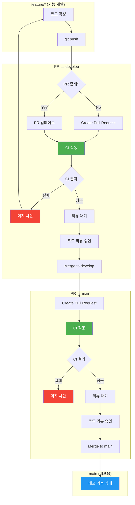

# **2단계: CI(지속적 통합) 파이프라인 구축 설계**

# 💡 CI 도구 비교분석

---

코드 통합 과정에서 발생하는 **빌드 실패 및 병합 오류를 근본적으로 해결**하기 위해 **'피드백 루프의 속도'를 중요한 전제 조건으로 설정**했습니다. 피드백 루프란 개발자가 코드를 푸시한 시점부터 그 결과를 확인하기까지의 '대기 시간'을 의미하며, 이 시간이 짧을수록 개발자의 작업 맥락(Context)이 온전히 보존되어 오류 수정 비용이 획기적으로 낮아집니다.

나아가 피드백 속도의 향상은 코드 통합 빈도를 높이는 트리거가 되고, 통합 빈도가 높아질수록 한 번에 발생하는 오류의 파급 범위와 크기는 작아져 해결 난이도가 낮아지는 선순환을 만듭니다. 특히 Spring Boot처럼 빌드 부하가 큰 환경에서는 이 루프를 5~10분 이내로 단축하는 것이 의존성 충돌과 기능 병합 오류를 기술적으로 제어하기 위한 필수 전제 조건입니다.

**현대의 주요 CI 도구들은 캐싱 기능을 통해 이 속도 조건을 충족**할 수 있으므로(CI 도구 자체가 속도에 미치는 영향은 제한적), 실제 도구 선정의 핵심 기준은 다음과 같습니다.

**1순위: 플랫폼 연동** - 사용 중인 플랫폼과의 네이티브 통합 여부
**2순위: 설정 편의성** - 빠른 구축과 낮은 유지보수 부담

## CI 도구별 특징 및 작업 환경 적합성

우리가 설정한 **플랫폼 연동성**과 **설정 편의성**은 결국 개발자가 도구 자체를 관리하는 데 쓰는 시간을 줄여, 본연의 업무인 코드 통합과 오류 수정에 집중하게 만드는 요소입니다.

| **도구** | **플랫폼 연동 방식 (Context 유지)** | **설정 및 유지보수 편의성** |
| --- | --- | --- |
| **GitHub Actions** | **완전한 네이티브 통합:** 코드 저장소(GitHub)와 CI 환경이 하나로 합쳐져 있습니다. PR 내에서 빌드 결과와 에러 로그를 즉시 확인하므로 **맥락 전환(Context Switching)이 발생하지 않습니다.** | 별도의 서버나 가입 없이 `.github/workflows` 폴더에 YAML 파일만 추가하면 즉시 구동됩니다. 인프라 관리 부담이 전혀 없습니다. |
| **CircleCI** | **외부 OAuth 연동:** 별도 서비스 가입 후 GitHub과 연결합니다. 빠른 빌드 속도를 제공하지만, 상세 로그 확인을 위해 외부 대시보드로 이동해야 하는 단계가 추가됩니다. | 클라우드 기반으로 YAML 설정 방식을 따르나, GitHub 외부에서 설정 및 권한 관리를 별도로 수행해야 합니다. |
| **Jenkins** | **플러그인 기반 수동 연동:** 서버를 직접 구축하고 웹훅(Webhook)을 연결해야 합니다. 저장소와의 실시간 연동을 위해 많은 수동 설정과 플러그인 관리가 동반됩니다. | 설치부터 보안 업데이트, 플러그인 호환성 관리까지 상당한 운영 리소스가 소모됩니다. 초기 구축 및 유지보수 비용이 가장 높습니다. |
| **GitLab CI / Bitbucket** | **특정 플랫폼 전용:** 각자의 저장소 서비스 내에서는 GitHub Actions와 유사한 네이티브 경험을 제공합니다. | GitHub 저장소와 연동할 경우 코드 미러링이나 복잡한 연동 브릿지를 구성해야 하므로 설정 효율이 급격히 떨어집니다. |

### GitHub Actions 선택 이유

저희는 **GitHub**을 저장소로 사용하므로, **외부 도구와 다른 속도를 확보**하기 위해 GitHub Actions를 선택했습니다. 예를 들어, 점심 피크 직전 긴급 버그 발생 시, 외부 CI로 탭을 전환하는 시간조차 낭비입니다. GitHub PR 화면 내에서 효과적으로 ****처리하여 CI 도구로 인한 대응 지연을 방지합니다.

# 💡 CI 도입 효과

---

## 코드 통합 문제 해결 관점

### 1. 빌드 실패 조기 감지

| 항목 | CI 도입 전 | CI 도입 후 |
| --- | --- | --- |
| 발견 시점 | 다른 개발자가 pull 받고 빌드할 때 | PR 생성 즉시 |
| 영향 범위 | 팀 전체 작업 중단 | PR 작성자만 수정 |
| 해결 시간 | 누가 깨뜨렸는지 추적 필요 | 원인 커밋 명확 |

**구체적 효과:**

- 컴파일 에러가 develop 브랜치에 유입되지 않음
- "내 로컬에서는 되는데" 문제 방지
- 빌드 깨진 상태로 팀이 작업하는 시간 제거

---

### 2. 의존성 충돌 방지

| 항목 | CI 도입 전 | CI 도입 후 |
| --- | --- | --- |
| 라이브러리 버전 충돌 | 배포 시점에 발견 | PR 단계에서 차단 |
| 환경 차이 문제 | 개발자 로컬 환경마다 다름 | 일관된 빌드 환경에서 검증 |
| Java 버전 호환성 | 운영 서버에서 장애 발생 후 인지 | Matrix 빌드로 다중 버전 사전 검증 |

**구체적 효과:**

- Gradle/Maven 의존성 변경 시 즉시 호환성 확인
- 새 라이브러리 추가가 기존 코드를 깨뜨리는지 자동 검증
- 운영 환경과 동일한 조건에서 빌드 테스트

---

### 3. 기능 병합 오류 검출

| 항목 | CI 도입 전 | CI 도입 후 |
| --- | --- | --- |
| 머지 충돌 | 머지 후 수동 테스트로 발견 | PR 브랜치 + 대상 브랜치 통합 상태에서 자동 테스트 |
| 기능 간섭 | QA 단계 또는 운영에서 발견 | 통합 테스트로 PR 단계에서 감지 |
| 리그레션 | 기존 기능 깨진 줄 모르고 배포 | 회귀 테스트 자동 실행 |

**구체적 효과:**

- A 기능 PR과 B 기능 PR이 각각 통과해도, 합쳤을 때 문제 발생 가능 → develop 브랜치 CI로 이중 검증
- 기존에 잘 되던 음식점 검색이 새 기능 추가로 깨지는 것 방지

---

## 테스트 자동화 관점

### 4. 수동 검증 제거

| 항목 | CI 도입 전 | CI 도입 후 |
| --- | --- | --- |
| 테스트 실행 | 개발자가 기억나면 실행 | 모든 PR에 강제 실행 |
| 테스트 범위 | 변경한 부분만 대충 확인 | 전체 테스트 스위트 실행 |
| 테스트 누락 | 바쁘면 생략 | 생략 불가능 (머지 차단) |

**구체적 효과:**

- "테스트 돌려봤어?" 질문 불필요
- 코드 리뷰 시 기능 동작 여부는 CI가 보장, 리뷰어는 설계/로직에 집중

---

### 5. 빠른 피드백 루프

| 항목 | CI 도입 전 | CI 도입 후 |
| --- | --- | --- |
| 피드백 시점 | QA 단계 (며칠 후) | PR 생성 후 수 분 내 |
| 버그 수정 비용 | 컨텍스트 잃어버린 상태에서 수정 | 방금 작성한 코드라 즉시 수정 |
| 반복 속도 | 느림 | 빠름 |

**구체적 효과:**

- 버그를 만든 직후 발견 → 수정 비용 최소화
- 개발자가 다른 작업으로 넘어가기 전에 문제 해결

---

## 품질 관리 관점

### 6. 코드 품질 기준 강제

| 항목 | CI 도입 전 | CI 도입 후 |
| --- | --- | --- |
| 코딩 컨벤션 | 리뷰어가 일일이 지적 | Checkstyle 자동 검사 |
| 테스트 커버리지 | 측정 안 함 | 커버리지 임계값 미달 시 머지 차단 |

**구체적 효과:**

- "이 변수명 컨벤션 안 맞아요" 같은 반복 피드백 제거
- 코드 리뷰에서 스타일 지적 대신 비즈니스 로직 논의에 집중
- 커버리지 70% 미만이면 머지 불가 같은 품질 게이트 설정 가능

---

### 7. 품질 트렌드 가시화

| 항목 | CI 도입 전 | CI 도입 후 |
| --- | --- | --- |
| 기술 부채 | 느낌으로 "코드가 더러워졌다" | 수치로 품질 변화 추적 |
| 테스트 건강 상태 | 모름 | Flaky 테스트, 느린 테스트 식별 |
| 개선 근거 | 없음 | 데이터 기반 의사결정 |

**구체적 효과:**

- "이번 스프린트에서 커버리지 65% → 72%로 개선" 같은 객관적 지표
- 기술 부채 해결 우선순위 판단 근거

---

## 팀 협업 관점

### 8. 코드 리뷰 효율화

| 항목 | CI 도입 전 | CI 도입 후 |
| --- | --- | --- |
| 리뷰어 부담 | 빌드 되는지, 테스트 통과하는지 직접 확인 | CI가 보장, 로직만 검토 |
| 리뷰 속도 | 체크아웃 받아서 실행해봐야 함 | PR 페이지에서 바로 리뷰 |
| 머지 기준 | 사람마다 다름 | CI 통과 = 머지 가능 (객관적 기준) |

**구체적 효과:**

- 리뷰어가 코드 내려받아서 테스트 돌려볼 필요 없음
- "이거 테스트 통과해?" 질문 대신 CI 상태만 확인

---

### 9. 안정적인 메인 브랜치 유지

| 항목 | CI 도입 전 | CI 도입 후 |
| --- | --- | --- |
| develop/main 상태 | 누군가 실수하면 깨짐 | 항상 빌드/테스트 통과 상태 |
| 새 팀원 온보딩 | "지금 develop 좀 깨져있어요" | 언제든 클론 받아서 바로 시작 |
| 핫픽스 대응 | 깨진 코드 위에서 작업 불가 | 안정된 베이스에서 즉시 분기 |

**구체적 효과:**

- "develop 브랜치 pull 받았는데 빌드가 안 돼요" 상황 제거
- 긴급 수정 필요할 때 항상 배포 가능한 상태 유지

---

# 💡 CI 파이프라인 구체화

---

## 브랜치 전략 연계 CI 정책



여러 개발자가 동시에 작업해도 코드 통합 문제는 PR 생성/업데이트 시 CI 검증으로 해결할 수 있습니다. 

단, Branch Protection 설정을 통해 검증 통과 전 머지를 차단해야 합니다. 

Push 트리거는 PR 검증과 중복되어 피드백 속도와 리소스 효율을 저하시키므로 제외했습니다.

## 트리거 정책

| 이벤트 | 대상 브랜치 | CI 실행 범위 | 목적 |
| --- | --- | --- | --- |
| **PR 생성/업데이트** | → develop | Stage 1: Lint (ESLint, Checkstyle) → 빠른 스타일 검사
Stage 2: Build → 컴파일
Stage 3: Analysis (SpotBugs) → 바이트코드 분석
Stage 4: Test → 단위테스트 + 통합테스트 + 커버리지
Stage 5: Artifact → 산출물 저장 | 통합 전 검증 |
| **PR 생성/업데이트** | → main | Stage 1: Lint (ESLint, Checkstyle) → 빠른 스타일 검사
Stage 2: Build → 컴파일
Stage 3: Analysis (SpotBugs) → 바이트코드 분석
Stage 4: Test → 단위테스트 + 통합테스트 + 커버리지
Stage 5: E2E Test → 전체 시스템 검증 (FE 레포 한정)
Stage 6: Artifact → 산출물 저장 | 배포 전 최종 검증 |
| **Merge** | develop | 전체 | 머지된 코드 이중 검증 |
| **Merge** | main | 전체 | 배포 가능 상태 확인 |
| **Push** | feature/* | 빌드만 | 빠른 피드백 (생략 가능) |

## Branch Protection 설정

| 조건 | 설정 |
| --- | --- |
| CI 통과 필수 | 활성화 |
| 코드 리뷰 승인 | 최소 1명 |
| 브랜치 최신 상태 | 대상 브랜치와 동기화 필수 |
| 직접 Push 금지 | develop, main 브랜치 |

| 설정 항목 | 하위 옵션 | 활성화 | 설명 |
| --- | --- | --- | --- |
| **Branch name pattern** | - | `develop`,`main` | 보호할 브랜치 이름 |
| **Require a pull request before merging** | - | O | PR 없이 직접 push 금지 |
|  | Require approvals | O (1명) | 최소 1명 코드 리뷰 승인 필요 |
|  | Dismiss stale pull request approvals when new commits are pushed | O | 새 커밋 시 기존 승인 무효화 |
| **Require status checks to pass before merging** | - | O | CI 통과해야 머지 가능 |
|  | Require branches to be up to date before merging | O | 대상 브랜치 최신 상태 강제 |
|  | Status checks (검색해서 추가) | O | `build`, `test` 등 CI job 선택 |
| **Do not allow bypassing the above settings** | - | O | 관리자도 규칙 우회 불가 |

### 비활성화 유지 항목

| 설정 항목 | 활성화 | 이유 |
| --- | --- | --- |
| Allow force pushes | X | 히스토리 변조 방지 |
| Allow deletions | X | 브랜치 삭제 방지 |

### 브랜치별 적용

| 브랜치 | 규칙 생성 | 비고 |
| --- | --- | --- |
| `develop` | O | 통합 브랜치 보호 |
| `main` | O | 배포 브랜치 보호 |
| `feature/*` | X | 개인 작업 브랜치, 보호 불필요 |

# 💡PR 생성/업데이트 시 CI 단계별 상세

---

## 트리거 조건

- PR 생성 시
- PR 업데이트 시 (새 커밋 푸시)

---

## Stage 1: Lint (코드 스타일 검사)

### 목적

빠른 피드백을 위해 코드 스타일 오류를 가장 먼저 검출합니다.

### 작업 내용

**Backend (Spring Boot)**

| 작업 | 도구 | 검사 내용 | 실패 시 의미 |
| --- | --- | --- | --- |
| 코드 스타일 | Checkstyle | 네이밍 규칙, 포맷팅, 코딩 컨벤션 | 스타일 가이드 위반 |

**Frontend (React + Vite + TS)**

| 작업 | 도구 | 검사 내용 | 실패 시 의미 |
| --- | --- | --- | --- |
| 코드 스타일 + 버그 | ESLint | 문법 오류, React 규칙, 접근성(a11y) | 코드 품질 위반 |

### 산출물

- Checkstyle 리포트
- ESLint 리포트

---

## Stage 2: Build (빌드 단계)

### 목적

코드가 정상적으로 컴파일되고, 의존성이 충돌 없이 해결되는지 검증하기 위함입니다.

### 작업 내용

| 작업 | 설명 | 실패 시 의미 |
| --- | --- | --- |
| 의존성 캐시 복원 | Gradle, npm 캐시로 빌드 속도 향상 | - |
| Backend 컴파일 | `./gradlew compileJava compileTestJava` | 문법 오류, import 누락, 의존성 충돌 |
| Frontend 빌드 | `npm run build` | TypeScript 오류, import 누락, 빌드 실패 |

### 산출물

- 컴파일된 클래스 파일
- Frontend 빌드 결과물

---

## Stage 3: Static Analysis (SpotBugs)

### 목적

바이트코드 기반 잠재적 버그를 사전에 탐지하기 위함입니다.

### CI 실패 기준으로 정한 SpotBugs 항목

### 1) 실행 중 바로 터질 수 있는 문제

- 예시:
    - null을 잘못 다뤄서 NPE가 날 수 있는 코드
    - 파일/DB 연결 등을 열어놓고 닫지 않는 코드(리소스 누수)
- 정책:
    - SpotBugs가 “심각도 높음(High)”로 표시하면, 빌드를 바로 실패 처리합니다.
- 이유:
    - 이런 문제는 실제 서비스에서 터지면 바로 장애로 이어지기 쉽기 때문에,
        
        “나중에 고치자”가 아니라 “애초에 서버에 못 올라가게 막는다”는 쪽에 무게를 둡니다.
        

### 2) 동시성 문제

- 예시:
    - 여러 스레드가 같은 변수를 엉겹결에 같이 수정하는 코드
    - 적절한 락/동기화 없이 공유 데이터를 쓰는 코드
- 정책:
    - 마찬가지로 SpotBugs가 “심각도 높음(High)”로 표시하면 **빌드 실패**입니다.
- 이유:
    - 동시성 버그는 재현도 어렵고, 한 번 터지면 원인 찾는 데 시간이 아주 많이 듭니다.
    - 그래서 “나중에 장애 나면 고치자”가 아니라, “CI 단계에서 일단 의심되는 건 다 막고 보고 보자”는 쪽으로 설계합니다.

### 3) 비효율 코드

- 예시:
    - 불필요하게 매번 새 객체를 만드는 코드
    - 스트림/컬렉션을 비효율적으로 사용하는 코드
- 정책(예시):
    - 심각도가 **중간(Medium) 이상인 항목이 많아지면** 빌드를 실패시킵니다.
    - 개수가 적으면 리포트만 남기고, 코드 리뷰에서 같이 보면서 점진적으로 개선합니다.
- 이유:
    - 성능 관련 문제는 당장 장애는 아니지만, 쌓이면 서버 비용 증가, 응답 시간 악화가 발생합니다.
    - 다만, 너무 예민하게 막으면 빌드가 자꾸 깨져서 개발 속도가 떨어지므로 “심각한 건 막고, 나머지는 리포트로 관리하며 점점 줄여 나간다” 쪽으로 균형을 잡았습니다.

### 언급된 SpotBugs 3가지 항목이 CI실패 기준으로 결정한이유

SpotBugs가 제공하는 많은 규칙 중에서도, “실제 장애로 직결되거나(안전성·동시성), 성능·비용을 장기적으로 악화시키는 경고”만 골라 CI의 Quality Gate로 사용합니다. 나머지 카테고리는 코드 리뷰나 별도 품질 활동으로도 충분히 관리 가능하고, 모두를 CI 실패 조건으로 삼으면 피드백 속도가 느려지거나 알림 피로만 늘어날 위험이 있기 때문에 핵심적인 항목들로 선택을 하였습니다.

---

## Stage 4: Test (핵심 로직 집중)

## 1) 목적

전체 코드의 형식을 맞추는 테스트가 아닌, 서비스 불능을 일으키는 핵심 도메인 로직의 결함을 빠르게 걸러내는 것을 목표로 합니다.

## 2) 작업 내용

| 작업 | 설명 | 도구 | 실패 시 의미 |
| --- | --- | --- | --- |
| 단위 테스트 | 개별 메서드/함수의 로직 검증 | JUnit 5, Vitest | 개별 로직 오류 |
| 통합 테스트 | 컴포넌트 간 연동 및 핵심 비즈니스 흐름 검증 | @SpringBootTest + H2, RTL | 컴포넌트 연동 오류 |
| 경량 모킹 | 외부 API(지도, 소셜 로그인)를 가짜로 대체하여 속도 최적화 | Mockito, `vi.mock` | 외부 의존성으로 인한 빌드 지연 방지 |
| 선택적 커버리지 | 핵심 패키지의 테스트 누락 여부 확인 (전체 측정 X) | JaCoCo, Vitest | 주요 로직의 안정성 검증 부족 |

## 3) 테스트 유형별 상세

### (1) 단위 테스트

| 구분 | Backend | Frontend |
| --- | --- | --- |
| 대상 | 개별 Service 메서드, Domain 로직 | 개별 함수, 커스텀 Hook |
| 예시 | 식단 필터링 알고리즘, 정산 계산 로직 | 검색 필터 로직, 상태 변환 함수 |
| 도구 | JUnit 5 + AssertJ + Mockito | Vitest + `vi.mock` |
| 특징 | 외부 의존성 모킹, 빠른 실행 | 브라우저 없이 실행, 즉각 피드백 |

### (2) 통합 테스트 (핵심 로직)

| 구분 | Backend | Frontend |
| --- | --- | --- |
| 대상 | Controller → Service → Repository 흐름 | 컴포넌트 → Hook → API 호출 흐름 |
| 예시 | 음식점 검색 API 전체 흐름, 예약 생성 흐름 | 검색 폼 제출 → 결과 렌더링 흐름 |
| 도구 | @SpringBootTest + H2 | Vitest + React Testing Library |
| 특징 | 실제 DB(H2) 사용, 전체 컨텍스트 로드 | 사용자 인터랙션 시뮬레이션 |

## 4) 핵심 전략

### (1) JaCoCo: "선택과 집중"

- **방식**: `service.filter.*`, `service.settlement.*` 등 버그 발생 시 치명적인 패키지만 80% 이상 측정합니다.
- **이유**: 무의미한 DTO나 설정 파일 테스트를 강제하지 않아 개발 속도를 유지하면서도, 핵심 알고리즘의 리팩토링 안전망은 확보합니다.

$Code\ Coverage\ (\%) = \frac{\text{테스트에 의해 실행된 코드 라인 수}}{\text{전체 소스 코드 라인 수}} \times 100$

### (2) 모킹: "외부 의존성 격리"

- **단위 테스트**: Mockito, `vi.mock`으로 외부 의존성을 완전히 격리하여 빠른 실행
- **통합 테스트**: H2 인메모리 DB로 실제 데이터 흐름 검증, 외부 API만 모킹

### (3) E2E 및 MSW 제외 근거

- **속도 중심**: 소규모 팀에서 E2E 유지보수 비용과 실행 시간은 빠른 피드백을 저해하는 가장 큰 장애물입니다.
- **효율성**: 단위 테스트 + 통합 테스트 조합만으로도 핵심 비즈니스 로직을 충분히 검증 가능합니다.

## 5) 환경 및 도구 요약

| 구분 | Backend (Spring Boot) | Frontend (React + Vite) |
| --- | --- | --- |
| 단위 테스트 | JUnit 5 + AssertJ | Vitest |
| 통합 테스트 | @SpringBootTest + H2 | Vitest + RTL |
| 모킹 도구 | Mockito | `vi.mock` |
| 커버리지 관리 | JaCoCo (핵심 패키지 전용) | Vitest (핵심 컴포넌트 전용) |

## 6) 산출물

- 단위 테스트 결과 리포트 (JUnit / Vitest)
- 통합 테스트 결과 리포트 (JUnit / Vitest)
- 핵심 패키지 커버리지 리포트 (JaCoCo / Vitest)

## 결론

느린 전체 검토보다 빠르고 정확한 핵심 검토를 선택했습니다. 단위 테스트로 개별 로직을, 통합 테스트로 핵심 비즈니스 흐름을 검증하여 개발자는 푸시 후 빠른 시간 내에 피드백을 받을 수 있습니다.

---

## Stage 5: Artifact 업로드

## 목적

빌드 및 검증 결과물 보관, 리뷰어 확인 및 추후 디버깅 용도로 사용하기 위함입니다.

## 저장소 비교

### Nexus Repository

빌드 아티팩트(JAR, npm 패키지 등)의 버전 관리 및 배포용 저장소로 사용됩니다. 장기 보관과 아티팩트 버전 관리에 강점이 있으나, 별도 서버 구축이 필요하고 설정 복잡도가 높다는 특징이 있습니다.

### AWS S3

범용 파일 저장소로 장기 보관이 필요한 경우 적합합니다. 보관 기간 제한이 없고 외부 공유가 용이하나, IAM 및 버킷 설정이 필요하고 사용량 기반 비용이 발생한다는 특징이 있습니다.

### GitHub Actions Artifact

CI 파이프라인 산출물의 임시 보관 용도로 설계되었습니다. 최대 90일 보관 제한이 있으나, GitHub Actions와 네이티브 통합되어 별도 설정 없이 사용이 가능합니다.

## 저장소 선택: GitHub Actions Artifact

CI 리포트(테스트, 커버리지, 정적 분석)는 단기 참조 목적이므로 장기 보관이 불필요합니다. GitHub 레포지토리와 GitHub Actions를 이미 사용 중이고, 동일 인프라 내에서 별도 연동 없이 즉시 사용 가능한 GitHub Actions Artifact를 선택하였습니다. PR 페이지에서 바로 다운로드 가능하여 리뷰어 접근성이 높고, Public 레포 기준 무료로 사용 가능하다는 특징도 있습니다.

## 작업 내용

| 작업 | 설명 |
| --- | --- |
| 테스트 리포트 업로드 | JUnit XML, Vitest 결과 |
| 커버리지 리포트 업로드 | JaCoCo HTML, Vitest Coverage |
| 정적 분석 리포트 업로드 | Checkstyle, ESLint 결과 |
| 빌드 산출물 업로드 | Spring Boot 실행 가능한 JAR 파일 (`.jar`) |

## 보관 정책

| 항목 | 설정값 |
| --- | --- |
| 보관 기간 | 30일 |
- 버전 주기(2주) 고려 시 최근 2개 버전까지 보관
- PR 머지 후 2주 이후 리포트 참조 빈도 낮음

## 산출물

- 테스트 결과 리포트
- 커버리지 리포트
- 정적 분석 리포트

---

# 💡 CI 설정 명세서

## 1. 워크플로우 트리거 설정

```yaml
name: CI Pipeline

on:
  pull_request:
    branches:
      - develop
      - main
    types:
      - opened
      - synchronize

```

| 항목 | 설정값 | 설명 |
| --- | --- | --- |
| 트리거 이벤트 | `pull_request` | PR 생성 및 업데이트 시 실행 |
| 대상 브랜치 | `develop`, `main` | 해당 브랜치로의 PR만 CI 실행 |
| 트리거 타입 | `opened`, `synchronize` | PR 생성 시, 새 커밋 푸시 시 |

---

## 2. Lint 설정 - stage 1

### Backend (Checkstyle)

```yaml
- name: Run Checkstyle
  run: ./gradlew checkstyleMain checkstyleTest

```

| 항목 | 설정값 | 설명 |
| --- | --- | --- |
| 실행 명령 | `./gradlew checkstyleMain checkstyleTest` | 메인/테스트 코드 스타일 검사 |
| 설정 파일 | `config/checkstyle/checkstyle.xml` | 팀 코딩 컨벤션 정의 |
| 실패 조건 | 스타일 위반 발견 시 | 빌드 실패 처리 |

### Frontend (ESLint)

```yaml
- name: Run ESLint
  run: npm run lint

```

| 항목 | 설정값 | 설명 |
| --- | --- | --- |
| 실행 명령 | `npm run lint` | ESLint 실행 |
| 설정 파일 | `eslint.config.js` | React, TypeScript 규칙 정의 |
| 실패 조건 | error 레벨 위반 시 | 빌드 실패 처리 |

---

## 3. Build 설정 - stage 2

### Backend

```yaml
- name: Setup Java
  uses: actions/setup-java@v4
  with:
    java-version: '17'
    distribution: 'temurin'

- name: Cache Gradle
  uses: actions/cache@v4
  with:
    path: |
      ~/.gradle/caches
      ~/.gradle/wrapper
    key: gradle-${{ hashFiles('**/*.gradle*', '**/gradle-wrapper.properties') }}

- name: Build Backend
  run: ./gradlew compileJava compileTestJava

```

| 항목 | 설정값 | 설명 |
| --- | --- | --- |
| Java 버전 | 17 | LTS 버전 사용 |
| 캐시 대상 | Gradle caches, wrapper | 빌드 속도 향상 |
| 실행 명령 | `./gradlew compileJava compileTestJava` | 메인/테스트 코드 컴파일 |

### Frontend

```yaml
- name: Setup Node
  uses: actions/setup-node@v4
  with:
    node-version: '20'
    cache: 'npm'

- name: Install Dependencies
  run: npm ci

- name: Build Frontend
  run: npm run build

```

| 항목 | 설정값 | 설명 |
| --- | --- | --- |
| Node 버전 | 20 | LTS 버전 사용 |
| 캐시 대상 | npm | 의존성 설치 속도 향상 |
| 실행 명령 | `npm run build` | TypeScript 컴파일 + Vite 빌드 |

---

## 4. Static Analysis (SpotBugs) 설정 - stage 3

```yaml
- name: Run SpotBugs
  run: ./gradlew spotbugsMain

```

### build.gradle 설정

```groovy
plugins {
    id 'com.github.spotbugs' version '6.0.0'
}

spotbugs {
    toolVersion = '4.8.0'
    excludeFilter = file('config/spotbugs/exclude.xml')
}

spotbugsMain {
    reports {
        html.required = true
        xml.required = true
    }
}

```

| 항목 | 설정값 | 설명 |
| --- | --- | --- |
| 실행 명령 | `./gradlew spotbugsMain` | 메인 코드 버그 패턴 분석 |
| 리포트 형식 | HTML, XML | 리뷰어 확인용, CI 파싱용 |
| 실패 조건 | High 심각도 발견 시 | 빌드 실패 처리 |

### SpotBugs 실패 기준

| 심각도 | 카테고리 | 처리 |
| --- | --- | --- |
| High | Null 참조, 리소스 누수 | 즉시 빌드 실패 |
| High | 동시성 문제 | 즉시 빌드 실패 |
| Medium | 비효율 코드 | 일정 개수 초과 시 빌드 실패 |

---

## 5. Test 설정 - stage 4

### Backend

```yaml
- name: Run Tests
  run: ./gradlew test

- name: Verify Coverage
  run: ./gradlew jacocoTestCoverageVerification

```

### build.gradle 커버리지 설정

```groovy
jacocoTestCoverageVerification {
    violationRules {
        rule {
            element = 'PACKAGE'

            includes = [
                'com.app.service.filter.*',
                'com.app.service.settlement.*',
                'com.app.domain.*'
            ]

            limit {
                counter = 'LINE'
                minimum = 0.80
            }
        }
    }
}

```

| 항목 | 설정값 | 설명 |
| --- | --- | --- |
| 테스트 명령 | `./gradlew test` | 단위 + 통합 테스트 실행 |
| 커버리지 검증 | `jacocoTestCoverageVerification` | 핵심 패키지 임계값 검증 |
| 측정 대상 | `service.filter`, `service.settlement`, `domain` | 핵심 비즈니스 로직 패키지 |
| 최소 커버리지 | 80% | 실패 시 타격이 큰 핵심 로직만 설정 |

### Frontend

```yaml
- name: Run Tests
  run: npm run test -- --coverage

```

### vitest.config.ts 설정

```tsx
export default defineConfig({
  test: {
    coverage: {
      provider: 'v8',
      include: [
        'src/hooks/**',
        'src/utils/**',
        'src/services/**'
      ],
      exclude: [
        'src/components/ui/**',
        'src/**/*.d.ts'
      ],
      thresholds: {
        'src/hooks/**': { lines: 80 },
        'src/services/**': { lines: 80 }
      }
    }
  }
})

```

| 항목 | 설정값 | 설명 |
| --- | --- | --- |
| 테스트 명령 | `npm run test -- --coverage` | 테스트 + 커버리지 측정 |
| 측정 대상 | `hooks`, `utils`, `services` | 핵심 로직 디렉토리 |
| 측정 제외 | `components/ui`, `.d.ts` | UI 컴포넌트, 타입 정의 제외 |
| 최소 커버리지 | 80% | 핵심 디렉토리만 높은 기준 적용 |

---

## 6. Artifact 설정 - stage 5

```yaml
- name: Upload Test Results
  uses: actions/upload-artifact@v4
  if: always()
  with:
    name: test-results
    path: |
      build/reports/tests/
      coverage/
    retention-days: 30

- name: Upload Coverage Report
  uses: actions/upload-artifact@v4
  if: always()
  with:
    name: coverage-report
    path: |
      build/reports/jacoco/
      coverage/lcov-report/
    retention-days: 30

- name: Upload Analysis Report
  uses: actions/upload-artifact@v4
  if: always()
  with:
    name: analysis-report
    path: |
      build/reports/checkstyle/
      build/reports/spotbugs/
    retention-days: 30
    
- name: Upload Build Artifact (JAR)
  uses: actions/upload-artifact@v4
  if: success() 
  with:
    name: executable-jar
    path: build/libs/*.jar
    retention-days: 30

```

| 항목 | 설정값 | 설명 |
| --- | --- | --- |
| 업로드 조건 | `if: always()` | 테스트 실패해도 리포트 업로드 |
| 보관 기간 | 30일 | 2개 버전 주기(4주) 내 참조 가능 |
| 저장소 | GitHub Actions Artifact | 별도 설정 없이 즉시 사용 |

---

## 7. 전체 워크플로우 구조

```yaml
jobs:
  lint:
    runs-on: ubuntu-latest
    steps:
      # Checkstyle, ESLint 실행

  build:
    needs: lint
    runs-on: ubuntu-latest
    steps:
      # Backend 컴파일, Frontend 빌드

  analysis:
    needs: build
    runs-on: ubuntu-latest
    steps:
      # SpotBugs 실행

  test:
    needs: build
    runs-on: ubuntu-latest
    steps:
      # 단위/통합 테스트, 커버리지 검증

  artifact:
    needs: [analysis, test]
    runs-on: ubuntu-latest
    if: always()
    steps:
      # 리포트 업로드

```

| 단계 | 의존 관계 | 실패 시 동작 |
| --- | --- | --- |
| Lint | 없음 | 후속 단계 중단 |
| Build | Lint 성공 | 후속 단계 중단 |
| Analysis | Build 성공 | Artifact 단계는 실행 |
| Test | Build 성공 | Artifact 단계는 실행 |
| Artifact | Analysis, Test 완료 | 항상 실행 (리포트 보존) |

---

## 8. 환경 변수 및 시크릿

### 환경 변수

워크플로우 내에서 직접 정의하는 값들입니다.

```yaml
env:
  JAVA_VERSION: '17'
  NODE_VERSION: '20'
  GRADLE_OPTS: '-Dorg.gradle.daemon=false -Xmx2g'

  # 애플리케이션 설정
  SPRING_PROFILES_ACTIVE: 'test'
  APP_PORT: '8080'

  # 테스트 DB 설정
  TEST_DB_URL: 'jdbc:h2:mem:testdb'
  TEST_DB_USERNAME: 'sa'

```

| 변수명 | 값 | 용도 |
| --- | --- | --- |
| `JAVA_VERSION` | 17 | Java 버전 지정 |
| `NODE_VERSION` | 20 | Node 버전 지정 |
| `GRADLE_OPTS` | `-Dorg.gradle.daemon=false -Xmx2g` | Gradle 메모리 설정 |
| `SPRING_PROFILES_ACTIVE` | test | 테스트 프로파일 활성화 |
| `APP_PORT` | 8080 | 애플리케이션 포트 |
| `TEST_DB_URL` | jdbc:h2:mem:testdb | 테스트용 H2 DB 주소 |
| `TEST_DB_USERNAME` | sa | 테스트용 DB 사용자 |

### 시크릿 관리도구 선택

**GitHub Secrets**는 GitHub에서 제공하는 암호화된 저장소입니다. GitHub Actions와 바로 연동되고 별도 설정 없이 사용할 수 있습니다. 무료이고 로그에 자동으로 마스킹돼서 보안도 괜찮습니다. GitHub에 의존적인 특징이 있습니다.

**AWS Secrets Manager**는 AWS에서 제공하는 관리형 비밀 저장소입니다. 버전 관리가 되고 비밀번호 자동 로테이션 기능이 있습니다. 사용량에 따라 비용이 발생하고 설정이 복잡하다는 특징이 있습니다.

**AWS Parameter Store**는 AWS에서 제공하는 파라미터 저장 서비스입니다. 무료 티어가 있어서 비용 부담을 줄일 수 있습니다. Secrets Manager보다 기능이 적고 자동 로테이션이 안 된다는 특징이 있습니다.

**HashiCorp Vault**는 오픈소스 비밀 관리 도구입니다. 보안이 강력하고 멀티클라우드 환경에서 쓸 수 있습니다. 직접 서버를 운영해야 해서 관리 부담의 특징이 있습니다.

**.env 파일**은 서버에 직접 파일로 저장하는 방식입니다. 가장 단순하지만 보안에 취약하고 여러 서버에서 관리하기 어렵다는 특징이 있습니다.

### *저희 팀은 GitHub를 사용하고 있으며 Github Actions와 바로 연동된다는 특성을 고려하여 Github Secrets를 사용했습니다.

### GitHub Secrets

GitHub Repository Settings → Secrets and variables → Actions에서 설정합니다.

```yaml
# 워크플로우에서 사용 시
env:
  DATABASE_PASSWORD: ${{ secrets.DATABASE_PASSWORD }}
  JWT_SECRET: ${{ secrets.JWT_SECRET }}
  OAUTH_CLIENT_SECRET: ${{ secrets.OAUTH_CLIENT_SECRET }}

```

| Secret명 | 용도 | 설정 위치 |
| --- | --- | --- |
| `DATABASE_PASSWORD` | 테스트 DB 비밀번호 (필요 시) | Repository Secrets |
| `JWT_SECRET` | JWT 토큰 서명 키 | Repository Secrets |
| `OAUTH_CLIENT_ID` | 소셜 로그인 Client ID | Repository Secrets |
| `OAUTH_CLIENT_SECRET` | 소셜 로그인 Client Secret | Repository Secrets |
| `KAKAO_MAP_API_KEY` | 카카오 지도 API 키 | Repository Secrets |
| `SLACK_WEBHOOK_URL` | CI 실패 알림용 Slack Webhook | Repository Secrets |

---

## 사용 예시

```yaml
jobs:
  test:
    runs-on: ubuntu-latest
    env:
      JAVA_VERSION: '17'
      SPRING_PROFILES_ACTIVE: 'test'
    steps:
      - name: Run Tests
        env:
          JWT_SECRET: ${{ secrets.JWT_SECRET }}
          OAUTH_CLIENT_SECRET: ${{ secrets.OAUTH_CLIENT_SECRET }}
        run: ./gradlew test

```

---

## 주의사항

| 구분 | 환경 변수 | GitHub Secrets |
| --- | --- | --- |
| 노출 여부 | 로그에 노출 가능 | 로그에 마스킹 처리 |
| 저장 대상 | 포트, 버전, 프로파일 등 | API 키, 비밀번호, 토큰 등 |
| 변경 방법 | 워크플로우 파일 수정 | GitHub 설정에서 변경 |

# 💡 ci.yml

---

## Backend SpringBoog CI

```yaml
name: BE PR CI Pipeline

on:
  pull_request:
    branches: [main, develop]
    types: [opened, synchronize, reopened]

jobs:
  ci:
    runs-on: ubuntu-latest

    steps:
      - name: Checkout
        uses: actions/checkout@v4

      - name: Set up JDK 17 (with Gradle cache)
        uses: actions/setup-java@v4
        with:
          java-version: "17"
          distribution: "temurin"
          cache: gradle

      - name: Lint & static analysis
        run: ./gradlew checkstyleMain checkstyleTest --no-daemon

      - name: Package
        run: ./gradlew bootJar --no-daemon

      - name: Static analysis (SpotBugs)
        run: ./gradlew spotbugsMain spotbugsTest --no-daemon

      - name: Run tests
        run: ./gradlew test --no-daemon

      - name: Verify coverage
        run: ./gradlew jacocoTestCoverageVerification --no-daemon

      - name: Upload test reports
        if: always()
        uses: actions/upload-artifact@v4
        with:
          name: test-report-${{ github.sha }}
          path: build/reports/tests/test/
          retention-days: 30

      - name: Upload coverage reports
        if: always()
        uses: actions/upload-artifact@v4
        with:
          name: coverage-report-${{ github.sha }}
          path: build/reports/jacoco/
          retention-days: 30

      - name: Upload build artifact (jar)
        if: success()
        uses: actions/upload-artifact@v4
        with:
          name: app-jar-${{ github.sha }}
          path: build/libs/*.jar
          retention-days: 30

      - name: Upload build artifact (jar) - latest
        if: success()
        uses: actions/upload-artifact@v4
        with:
          name: artifact-jar-latest
          path: build/libs/*.jar
          retention-days: 30
```

## Frontend CI Dev

```yaml
name: FE DEV PR CI Pipeline

on:
  pull_request:
    branches: [develop]
    types: [opened, synchronize, reopened]

jobs:
  ci:
    runs-on: ubuntu-latest

    steps:
      - name: Checkout
        uses: actions/checkout@v4

      - name: Set up Node.js
        uses: actions/setup-node@v4
        with:
          node-version: "20"
          cache: "npm"

      - name: Install dependencies
        run: npm ci

      - name: Lint
        run: npm run lint --if-present

      - name: Type check
        run: npm run typecheck --if-present

      - name: Build
        run: npm run build

      - name: Unit tests
        run: npm test --if-present

      - name: Upload lint/test reports
        if: always()
        uses: actions/upload-artifact@v4
        with:
          name: test-report-${{ github.sha }}
          path: |
            coverage/**
            test-results/**
            reports/**
            junit.xml
          if-no-files-found: ignore
          retention-days: 30

      - name: Upload build artifact - sha
        if: success()
        uses: actions/upload-artifact@v4
        with:
          name: dist-${{ github.sha }}
          path: dist/**
          if-no-files-found: error
          retention-days: 30

      - name: Upload build artifact - latest
        if: success()
        uses: actions/upload-artifact@v4
        with:
          name: dist-latest
          path: dist/**
          if-no-files-found: error
          retention-days: 30

```

## Frontend CI Main

```yaml
name: FE MAIN PR CI Pipeline

on:
  pull_request:
    branches: [main]
    types: [opened, synchronize, reopened]

jobs:
  ci:
    runs-on: ubuntu-latest

    steps:
      - name: Checkout
        uses: actions/checkout@v4

      - name: Set up Node.js
        uses: actions/setup-node@v4
        with:
          node-version: "20"
          cache: "npm"

      - name: Install dependencies
        run: npm ci

      - name: Lint
        run: npm run lint --if-present

      - name: Type check
        run: npm run typecheck --if-present

      - name: Build
        run: npm run build

      - name: Unit tests
        run: npm test --if-present

      - name: Install Playwright Browsers
        run: npx playwright install --with-deps chromium

      - name: Start server
        run: |
          npm run start &
          npx wait-on http://localhost:3000 --timeout 60000
        env:
          NODE_ENV: production

      - name: Run E2E tests
        run: npm run test:e2e --if-present

      - name: Upload lint/test reports
        if: always()
        uses: actions/upload-artifact@v4
        with:
          name: test-report-${{ github.sha }}
          path: |
            coverage/**
            test-results/**
            reports/**
            junit.xml
          if-no-files-found: ignore
          retention-days: 30

      - name: Upload build artifact - sha
        if: success()
        uses: actions/upload-artifact@v4
        with:
          name: build-${{ github.sha }}
          path: |
            public/**
            package.json
            package-lock.json
          retention-days: 30

      - name: Upload build artifact - latest
        if: success()
        uses: actions/upload-artifact@v4
        with:
          name: build-latest
          path: |
            public/**
            package.json
            package-lock.json
          retention-days: 30
```

## AI FastAPI CI

```yaml
name: AI PR CI Pipeline

on:
  pull_request:
    branches: [main, develop]
    types: [opened, synchronize, reopened]

jobs:
  ci:
    runs-on: ubuntu-latest

    steps:
      - name: Checkout
        uses: actions/checkout@v4

      - name: Set up Python 3.11
        uses: actions/setup-python@v5
        with:
          python-version: "3.11"
          cache: "pip"

      - name: Install dependencies
        run: |
          python -m pip install --upgrade pip
          pip install -r requirements.txt

      - name: Lint (ruff)
        run: ruff check .

      - name: Format check (ruff)
        run: ruff format --check .

      - name: Type check (mypy)
        run: mypy . --ignore-missing-imports

      - name: Build artifact (wheel) - sha
        if: success()
        run: |
          python -m pip install build
          python -m build

      - name: Run tests (pytest + coverage)
        run: |
          pytest -q --maxfail=1 --disable-warnings \
            --junitxml=pytest.xml \
            --cov=ai-app \
            --cov-report=term-missing \
            --cov-report=xml:coverage.xml \
            --cov-report=html:htmlcov

      - name: Upload reports (tests/coverage)
        if: always()
        uses: actions/upload-artifact@v4
        with:
          name: ai-ci-reports-${{ github.sha }}
          path: |
            pytest.xml
            htmlcov/**
            coverage.xml
            reports/**
            test-results/**
          if-no-files-found: ignore
          retention-days: 30

      - name: Upload build artifact (wheel/sdist) - sha
        if: success()
        uses: actions/upload-artifact@v4
        with:
          name: python-dist-${{ github.sha }}
          path: dist/**
          retention-days: 30

      - name: Upload build artifact (wheel/sdist) - latest
        if: success()
        uses: actions/upload-artifact@v4
        with:
          name: python-dist-latest
          path: dist/**
          retention-days: 30

```

### * 아티팩트 보존 기간을 **30일**로 설정한 이유는 14일 개발 주기(V1, V2, V3)를 고려할 때, **최소 2개 이상의 버전을 안전하게 교차 보존**하기 위함입니다.