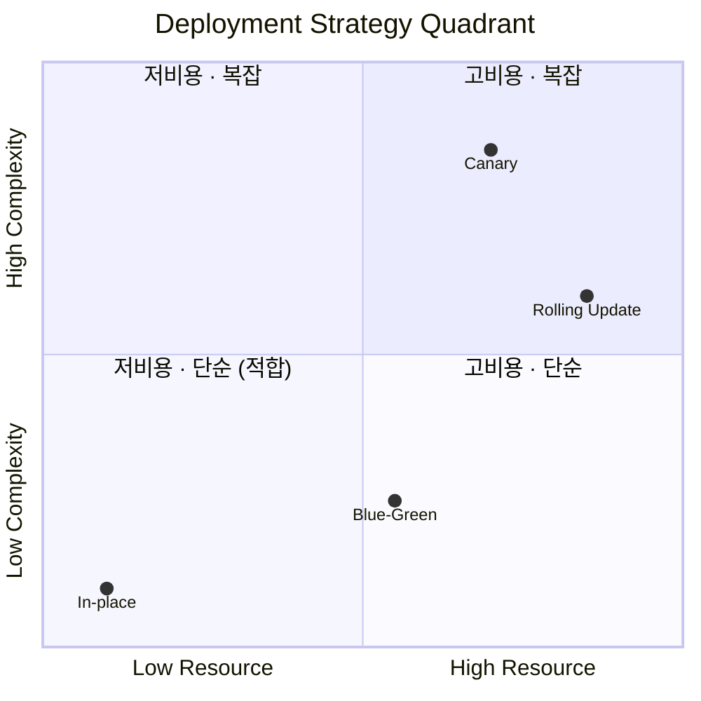

# CD(지속적 배포) 파이프라인 설계
## 프로젝트 맥락

| 항목 | 내용 |
| --- | --- |
| 서비스 | 음식점 추천 웹서비스 |
| 트래픽 | 점심/저녁 피크, DAU 60명 |
| 인프라 | 초기 단계, 단일 서버 예상 |
| 핵심 고려사항 | 배포 실패 대비, 장애 전파 방지, 롤백 가능성 |

---

# 1. CD 파이프라인 흐름도

```mermaid
flowchart TD
    subgraph CD["CD 파이프라인 (Continuous Deployment)"]
        
        subgraph prepare["1. 아티팩트 준비"]
            A[CI 완료된 Artifact] --> B[아티팩트 다운로드]
        end

        subgraph backup["2. 서버 백업"]
            B --> C[기존 파일 백업]
        end

        subgraph deploy["3. 배포"]
            C --> D[기존 프로세스 종료]
            D --> E[새 버전 배포]
            E --> F[프로세스 시작]
        end

        subgraph smoke["4. Smoke Test"]
            F --> G[Health Check]
            G --> H[핵심 API 테스트]
            H --> I{테스트 통과?}
        end

        subgraph success["5-A. 성공"]
            I -->|성공| J[📢 디스코드 알림: 배포 완료]
            J --> K[✅ 완료]
        end

        subgraph failure["5-B. 실패"]
            I -->|실패| L[🔄 백업으로 롤백]
            L --> M[프로세스 재시작]
            M --> N[📢 디스코드 알림: 배포 실패]
            N --> O[❌ 실패]
        end

    end

    style K fill:#4CAF50,color:#fff
    style J fill:#2196F3,color:#fff
    style L fill:#ff9800,color:#fff
    style N fill:#f44336,color:#fff
    style O fill:#f44336,color:#fff
```



---

# 2. CD 설계 설명서

## 2.0 CD 도구 선정

### 1) 결정 사항

선택한 전략

- CD 도구: GitHub Actions 기반 CD 채택
- 운영 원칙: 추가 인프라(별도 서버/클러스터) 없이, GitHub 중심 흐름을 유지
- 배포 운영: 새벽 04:00 중단 배포 유지(배포 타이밍 통제로 리스크 관리)
- 멀티클라우드 고려: AI는 RunPod(외부 클라우드) 사용 → CD가 특정 클라우드 기능에 강하게 종속되지 않도록 설계

---

### 2) 왜 GitHub Actions인가

현재 운영은 이미 GitHub에 결합되어 있다.

- 코드 저장소/PR/Secrets/Artifacts가 GitHub에 정착
- 단일 EC2(t3.small)에서 서비스 운영

이 상황에서 CD 도구가 늘려선 안 되는 것은 “기능 부족”이 아니라 운영 경로와 운영 대상이다.

GitHub Actions는

- 추가 서버 없이 CD를 구성할 수 있고
- GitHub 내부 흐름을 깨지 않고(PR/Artifacts/로그) 배포까지 연결 가능하며

### 3) 운영 현실을 기준으로 한 판단

### (1) “도구 운영”이 곧 리스크다

- 인프라가 단일 EC2 상태에서 CD를 위해 서버/에이전트/클러스터를 추가하면 운영 대상이 늘어난다.
- 이 환경에서 중요한 건 “기능이 풍부한 CD”가 아니라 운영 부담을 늘리지 않는 CD다.
- GitHub Actions는 별도 컨트롤 플레인 없이도 운영 가능해, 도구 운영 리스크를 최소화한다.

### (2) GitHub 흐름을 분리하면 운영 복잡도가 급증한다

- GitHub 기반 운영의 핵심: PR → Status Check → Secrets → Artifacts → 배포 로그
- 외부 CD 플랫폼을 붙이면 토큰/권한 관리, 상태 체크 분산, 로그/대시보드 이동 같은 운영 경로가 길어지는 문제가 생긴다.
- GitHub Actions는 이를 한 플랫폼 안에서 끝내므로 컨텍스트 전환과 관리 포인트를 최소화한다.

### (3) 플랜/사용자 제한은 “운영 제약”이 된다

- 우리 팀은 6명이며, CI/CD는 팀 전원이 접근·실행 가능해야 병목이 없다.
- 도구의 Free tier 사용자 제한/사용량 제한은 “언젠가 비용이 들 수 있음”이 아니라 운영 설계의 제약조건이 된다.
- GitHub Actions는 현재 운영 흐름과 가장 잘 맞고, 추가적인 팀 병목을 만들지 않는다.

### (4) 특정 클라우드 종속은 현재 구조와 충돌한다

- AI 서비스가 RunPod(외부 클라우드)에 존재하므로 CD가 특정 클라우드 전용 기능에 강하게 결합되면, 배포 파이프라인이 타깃별로 갈라진다.
- 우리는 “한 파이프라인으로 멀티 타깃을 일관되게 운영”하는 방향이 더 적합하다.
- 따라서 CD는 특정 클라우드 종속을 최소화하고, **배포 대상이 늘어나도 구조를 유지**할 수 있어야 한다.
- GitHub Actions는 특정 클라우드 서비스에 고정되지 않고 배포를 구성할 수 있어, **멀티 타깃 운영과 정합**하다.

### 4) 후보 비교

| 도구 | 이 도구가 원래 잘 푸는 문제 | 운영 전제(필요 조건) | 우리 단계에서의 결론 |
| --- | --- | --- | --- |
| **GitHub Actions (선택)** | GitHub 이벤트 기반 CI/CD 자동화(워크플로) | 추가 서버 없음(Hosted runner) | GitHub 운영 흐름 유지 + 최소 운영 부담 |
| Jenkins | 온프렘/사내 맞춤형 CI/CD, 플러그인 확장 | 컨트롤러/에이전트 운영, 패치/백업/플러그인 관리 | 툴 운영이 먼저 생겨 MVP에 과함 |
| Argo CD | K8s에서 GitOps로 클러스터 상태 동기화 | Kubernetes 클러스터 전제 | 지금은 CD가 아니라 K8s 전환 문제 |
| Flux CD | K8s GitOps 경량 동기화(툴킷형) | Kubernetes 클러스터 전제 | Argo와 동일: K8s 전제라 지금 제외 |
| CodeDeploy | AWS 내 EC2/ASG 배포 자동화 | AWS 구성요소(IAM 등) | 클라우드 결합/구성 증가, RunPod와 일관 운영 어려움 |
| Spinnaker | 대규모 배포 오케스트레이션(복잡한 전략/다수 타깃) | K8s 권장 + 높은 운영 복잡도 | 단일 EC2 MVP에 과도 |
| GitLab CI/CD | GitLab 플랫폼 내 올인원 CI/CD | GitLab 중심 운영이 유리 | GitHub 중심이면 운영 흐름 분산 + 플랜 제약 |
| CircleCI | SaaS CI/CD + 병렬/캐싱 최적화 | 외부 플랫폼 운영 + 플랜 제약 | 플랫폼 분리 + 5인 제한이 운영 제약 |

### 5) 최종 결론

현 단계에서 CD 도구의 핵심 가치는 “고급 배포 기능”이 아니라 운영 루프를 가볍게 만드는 것이다.

우리 서비스는 단일 EC2에서 새벽 04:00 중단 배포로 리스크를 통제하고, GitHub Actions/Artifacts 중심으로 운영하고 있으며, AI는 RunPod(외부 클라우드)를 사용해 특정 클라우드 종속을 피해야 한다.

따라서 우리는 GitHub Actions 기반 CD를 채택하여

- 추가 인프라 없이
- GitHub 운영 흐름을 유지하고
- 멀티 타깃(RunPod)까지 일관된 배포 구조를 유지하는 방향으로 운영한다.

## 2.1 배포 전략 선택: **Continuous Deployment 채택**

### 1) 결정 사항

### 선택한 전략

- 배포 전략: Continuous Deployment
- 트리거: main 머지 = 배포 파이프라인 자동 실행
- 운영 제어: 배포는 자동화하되, 피크타임 회피/리스크 통제는 “승인”이 아니라 “자동 검증 + 자동 롤백”으로 해결
- 배포 전제: 우리 배포는 중단 배포(In-place) 를 허용하며, 빠른 롤백·재배포로 복구한다

### 2) 왜 Continuous Deployment인가

우리 서비스가 CD에서 더 중요하게 보는 가치는 “승인 절차”가 아니라 피드백 루프 단축 + 운영 표준화다.

- CI에서 이미 빌드/테스트/정적분석을 통과한 산출물을 만들고 있다.
- CD에서 사람이 “승인 버튼”을 눌러도 추가로 검증되는 단계(스테이징/QA)가 없다면, 그 승인은 품질 향상이 아니라 대기 시간만 만든다.
- 우리는 MVP/소규모 팀에서 병목 없이 빠르게 배포 → 실패 시 즉시 롤백이 운영 리스크를 더 낮춘다고 판단한다.

즉, Continuous Delivery(수동 승인)는 “통제”를 주는 것처럼 보이지만, 지금 구조에서는 통제가 아니라 병목이 되기 쉽다.

### 3) 운영 현실을 기준으로 한 판단

### (1) 승인 단계는 “검증”이 아니라 “대기”가 된다

- 현재 파이프라인은 CI 통과 → 운영 배포 → 헬스체크/주요 API 검증 → 실패 시 롤백으로 설계되어 있고,
- 승인자가 실제로 확인할 별도의 단계가 없다면, 승인 단계는 결과적으로 배포 타이밍만 늦추는 버튼이 된다.

### (2) 팀 구조상 “승인자”는 병목을 만든다

- 팀 6명 구조에서 “승인 담당자”를 고정하면,
    - 승인자가 없을 때 배포가 멈추고
    - 승인자가 있더라도 결국 “버튼을 눌러주는 역할”이 되기 쉽다.
- 우리는 “승인자 의존”보다 파이프라인이 표준 절차를 강제하는 것이 더 일관된 운영이라고 본다.

### 4) 최종 결론

우리는 Continuous Deployment를 채택한다.

- 배포의 안정성은 “승인”이 아니라 자동 검증 + 자동 롤백으로 확보하며 중단 배포를 허용하는 현 구조에서 운영 병목을 만들지 않는 방식이기 때문이다.

---

## 2.2 배포 방식 선택

## 1) 결정 사항

### 선택한 전략

- **Backend(Spring): In-place 배포**
- **Frontend(React Vite + Nginx): 무중단 요구 없음**
- **AI Service: 항상-on 아님 / 중단 배포 허용**

**중단 배포를 전제로 하되, 빠른 롤백·재배포로 리스크를 관리**한다.

## 2) 왜 In-place인가

현재 인프라는 애플리케이션 2개까지는 안정적(여유 메모리 ~400MB)이지만, 3개부터는 사실상 포화에 가까워진다.

Blue-Green / Canary / Rolling은 모두 **배포 중 두 버전 공존**을 요구하며, 특히 Canary와 Rolling은 그 공존 시간이 길어 **리소스 압박과 운영 복잡도**가 커진다.

또한 우리의 주요 장애 시나리오(OOM, 서버 크래시)는 “배포 중 무중단”으로 해결되지 않는 유형이다.

이 환경에서는 무중단 자체보다 빠른 수정 → 재배포 → 복구가 더 효과적이다.

## 3) 운영 현실을 기준으로 한 판단

### (1) 용량 제약이 크다

- Spring 2개: 가능 (여유 ~400MB)
- Spring 3개: 가능은 하나 운영상 매우 불편
- Canary / Rolling:
    - 두 버전 공존 시간이 길거나
    - 상시 2개 이상 유지 필요
    - → 지금 인프라에 부담 큼
- In-place:
    - 단일 버전만 존재
    - 리소스 예측이 쉽고 안전

### (2) 다운타임 비용은 통제 가능하다

- 정기 릴리스는 심야 배포
- 서비스 특성상 피크 시간 예측 가능
- 따라서
    - “무중단을 위한 추가 리소스·복잡도”보다
    - 배포 타이밍 관리가 더 합리적이라고 판단

### (3) 핫픽스에서 무중단의 실효성은 낮다

- 서버 크래시(OOM):
    - 이미 전체 다운 → 무중단 배포로 해결 불가
- 기능 장애:
    - 코어 기능 → 사용자 체감은 사실상 서비스 불가
    - 비코어 기능 → 무중단보다 빠른 복구가 중요

이 상황들에서 핵심은 무중단 배포가 아니라 빠른 수정 + 재배포 + 롤백이다.

### (4) Canary / Rolling의 비용 대비 가치가 낮다

- LB 설정, 트래픽 분할, 운영 절차 증가
- API 호환성 부담 증가 (장시간 혼재)
- 리소스 실패(OOM)는 점진 노출로도 근본 해결 불가

운영 비용은 크고, 얻는 이점은 제한적

### (5) Blue-Green도 지금은 과하다

- 장점: 배포 중 다운타임 제거
- 현실:
    - 우리는 심야 배포로 다운타임 비용을 낮출 수 있음
    - 주요 장애 시 무중단이 결정적 해결책이 아님

이득보다 트레이드오프가 큼

## 4) 비교 다이어그램



- X축 (Resource)
    
    → 동시 인스턴스 수 / 메모리 점유 / 공존 시간
    
    → 오른쪽일수록 리소스 많이 듦
    
- Y축 (Complexity)
    
    → 운영 절차, 판단 포인트, 실수 가능성
    
    → 위로 갈수록 복잡
    

## 5) 최종 결론
- 지금 단계에서 무중단 배포는 ‘필수 리스크 완화 수단’이 아니라 ‘비용이 큰 선택지’에 가깝다. 따라서 우리는 In-place 배포를 기본으로 하되, 빠른 롤백과 재배포로 운영 리스크를 통제하는 전략을 채택한다.
---

## 2.3 배포 프로세스 변화

### Before (CD 도입 전)

### 흐름

```
개발자 로컬에서 빌드
	↓
운영 서버 접속 (SSH)
	↓
JAR/정적 파일 직접 복사 (SCP)
	↓
수동으로 프로세스 종료/재시작
	↓
수동으로 동작 확인(브라우저 접속/간단 호출)
```

### 문제점

- **배포 표준이 사람에게 의존**
  - 배포 순서/명령/경로가 사람마다 달라질 수 있음
  - 실수(파일 누락, 권한 미설정, 재시작 누락)가 곧 장애로 연결
- **롤백이 “정의된 절차”가 아니라 “그때그때 대응”**
  - 실패 시 어떤 버전으로 어떻게 되돌릴지 매번 판단이 필요
  - 복구 시간이 사람의 숙련도/상황에 따라 흔들림
- **배포 이력/감사 추적이 약함**
  - 누가/언제/어떤 커밋을 배포했는지 기록이 분산됨
  - 장애 시 원인 추적과 복구 커뮤니케이션이 느려짐
- **품질 게이트가 강제되지 않음**
  - “CI가 통과한 산출물”과 “운영에 반영된 산출물”이 분리될 수 있음

### After (CD 도입 후)

### 흐름 (Continuous Deployment)

```
CI 통과
	↓
main 머지
	↓
자동 배포
	↓
스모크 테스트
	↓
성공 알림 / 실패 자동 롤백
```

### 개선점 (무엇이 달라졌나)

| 항목         | CD 도입 전       | CD 도입 후                     |
| ------------ | ---------------- | ------------------------------ |
| 배포 트리거  | 사람이 직접 실행 | `main` 머지 = 자동 실행        |
| 배포 절차    | 사람마다 편차    | 워크플로우로 절차 고정(표준화) |
| 배포 품질    | 수동 확인 중심   | Smoke Test로 자동 검증         |
| 실패 대응    | 대응/판단 필요   | 실패 시 자동 롤백 내장         |
| 배포 이력    | 기록 분산        | GitHub Actions 로그로 일원화   |
| 커뮤니케이션 | 수동 공유        | Discord 자동 알림              |

---

# 3. 설정 및 스크립트 명세

## 3.1 파이프라인 구조

### 전체 워크플로우 구성

| 파일 | 역할 | 트리거 |
| --- | --- | --- |
| `ci.yml` | 빌드, 테스트, 정적 분석, 아티팩트 업로드 | PR 생성/업데이트 (develop, main) |
| `cd-be.yml` | BE 배포 | main 브랜치 push |
| `cd-fe.yml` | FE 배포 | main 브랜치 push |
| `cd-ai.yml` | AI 배포 | main 브랜치 push |

### 배포 전략

단일 서버 환경에서 **중단 배포(Recreate Deployment)** 방식을 사용합니다.

| 항목 | 내용 |
| --- | --- |
| 배포 방식 | 중단 배포 (기존 프로세스 종료 → 새 버전 시작) |
| 배포 시간 | 새벽 시간대 (팀 규칙) |
| 배포 에러 대응 | Smoke Test 실패 시 자동 롤백 |

### 팀 규칙

| 규칙 | 설명 |
| --- | --- |
| 배포 시간 | main 머지는 새벽 시간대에만 (00:00 ~ 06:00) |
| 긴급 핫픽스 | 트래픽 적은 시간에 진행 |
| 피크 타임 | 점심/저녁 시간대 배포 금지 |

### 배포 전략 선택 근거

단일 서버 환경에서 중단 배포를 선택한 이유:

**1. 무중단 배포(Blue-Green, Canary)를 선택하지 않은 이유**

무중단 배포는 서버가 2대 이상 필요합니다. 단일 서버에서 포트 스위칭으로 Blue-Green을 구현할 수 있지만, 같은 서버에서 두 개의 애플리케이션이 리소스를 나눠 사용해야 합니다. 트래픽 과부하 시 두 인스턴스 모두 영향을 받아 무중단 배포의 장점이 사라집니다.

**2. Feature Flag를 사용하지 않은 이유**

Feature Flag는 코드 레벨 문제(새 기능 버그)에만 효과가 있습니다. 단일 서버에서 발생하는 주요 장애는 트래픽 과부하로 인한 서버 다운이며, 이 경우 Feature Flag로 대응할 수 없습니다. 또한 새벽 시간대에만 배포하므로 피크 타임에 새 기능을 배포할 일이 없어 Feature Flag의 필요성이 낮습니다.

**3. 중단 배포의 한계 인식**

중단 배포는 배포 중 다운타임이 발생합니다. Smoke Test 중에도 유저가 접근하면 에러를 받을 수 있습니다. 이 한계를 새벽 배포(유저 적음)와 빠른 롤백으로 보완합니다.

---

## 3.2 배포 스크립트 명세

### Stage 1: 아티팩트 준비

| 항목 | 내용 |
| --- | --- |
| 목적 | CI에서 생성된 빌드 결과물 확보 |
| 입력 | CI 아티팩트 (BE: JAR, FE: dist, AI: 소스) |
| 출력 | 배포 준비된 파일 |

```
작업 내용:
1. CI 아티팩트 다운로드 (BE, FE)
   - dawidd6/action-download-artifact 사용
   - workflow: ci.yml, branch: main
2. 소스 코드 체크아웃 (AI)
   - actions/checkout@v4 사용

```

### Stage 2: 서버 백업

| 항목 | 내용 |
| --- | --- |
| 목적 | 롤백을 위한 현재 버전 백업 |
| 백업 위치 | 서버 로컬 (빠른 롤백용) |
| 보관 | 1개 버전 (직전 버전만, 덮어쓰기) |

```
작업 내용:
1. SSH로 서버 접속
2. 현재 실행 중인 파일 백업
   - BE: /home/ubuntu/app/app.jar → /home/ubuntu/app/backup/app.jar.backup
   - FE: /var/www/frontend/ → /var/www/frontend-backup/
   - AI: /home/runpod/app/ → /home/runpod/app-backup/

```

### 서버 로컬 백업을 선택한 이유

| 백업 위치 | 롤백 속도 | 특징 |
| --- | --- | --- |
| 서버 로컬 | cp 명령어로 가능(빠름) | 서버 장애 시 백업도 손실 |
| GitHub Artifacts | 다운로드 필요(상대적으로 느림) | 서버와 독립적 |

서버 로컬 백업을 선택한 이유:

- 빠른 롤백이 가능합니다 (네트워크 불필요)
- 서버 장애 시에는 CI 아티팩트에서 재배포하면 됩니다 (CI에서 커밋별 아티팩트 보관 중)
- 서버 장애는 코드 문제가 아니므로 이전 버전이 아닌 최신 버전으로 재배포합니다

### Stage 3: 파일 전송 및 배포

| 항목 | 내용 |
| --- | --- |
| 목적 | 새 버전 파일 서버 전송 및 실행 |
| 전송 방식 | SCP (BE, FE), rsync (AI) |
| 실행 | 기존 프로세스 종료 후 신규 실행 |

```
BE 배포:
1. JAR 파일 전송 (SCP)
2. 기존 프로세스 종료 (SIGTERM → 30초 대기 → SIGKILL)
3. 새 JAR 실행
   - nohup java -jar -Dspring.profiles.active=prod app.jar > logs/app.log 2>&1 &
4. 10초 대기 (기동 시간)

FE 배포:
1. 기존 파일 삭제
2. 새 빌드 파일 전송 (SCP)
3. Nginx 권한 설정 (www-data:www-data, 755)

AI 배포:
1. 소스 코드 전송 (rsync --delete)
2. 기존 프로세스 종료
3. 가상환경 생성 및 의존성 설치
   - python -m venv .venv
   - pip install -r requirements.txt
4. FastAPI 실행
   - nohup uvicorn main:app --host 0.0.0.0 --port 8000 > logs/app.log 2>&1 &

```

### Stage 4: Smoke Test

| 항목 | 내용 |
| --- | --- |
| 목적 | 배포된 버전이 정상 기동했는지 확인 |
| 실패 시 | 자동 롤백 트리거 |

```
BE 검증:
1. Health Check (최대 10회 재시도, 5초 간격)
   - GET /actuator/health → 200 OK 확인
2. 핵심 API 검증
   - GET /api/ping → 200 OK 확인

FE 검증:
1. 메인 페이지 접근 (최대 10회 재시도, 3초 간격)
   - GET / → 200 OK 확인
2. HTML 응답 확인
   - </html> 태그 존재 확인

AI 검증:
1. Health Check (최대 10회 재시도, 5초 간격)
   - GET /health → 200 OK 확인
2. 핵심 API 검증
   - GET /api/ping → 200 OK 확인

```

### Smoke Test의 역할과 한계

중단 배포에서 Smoke Test는 **예방이 아닌 빠른 감지** 역할을 합니다.

| 역할 | 가능 여부 | 설명 |
| --- | --- | --- |
| 문제 예방 | 불가능 | 이미 유저에게 노출된 상태 |
| 빠른 감지 | 가능 | 문제 발생 시 즉시 발견 |
| 자동 롤백 | 가능 | 발견 즉시 이전 버전으로 복구 |

Smoke Test 중에도 유저가 접근하면 에러를 받을 수 있습니다. 이 한계를 새벽 배포(유저 적음)로 보완합니다.

### Stage 5: 알림 발송

| 항목 | 내용 |
| --- | --- |
| 목적 | 배포 결과를 팀에 공유 |
| 채널 | Discord Webhook |

```
알림 종류:
1. 배포 성공
   - "배포 완료"

2. 배포 실패 (Smoke Test 실패)
   - "배포 실패 - 롤백 실행됨"

```

---

## 3.3 롤백 명세

### 롤백 트리거 조건

| 조건 | 롤백 방식 | 자동/수동 |
| --- | --- | --- |
| Smoke Test 실패 | 서버 로컬 백업으로 롤백 | 자동 |
| 운영 중 에러 감지 | 서버 로컬 백업으로 롤백 | 수동 |
| 서버 장애 | CI 아티팩트로 재배포 | 수동 |

### 자동 롤백 절차 (Smoke Test 실패 시)

```
BE 롤백:
1. 현재(실패한) 프로세스 강제 종료 (SIGKILL)
2. 백업된 JAR 파일 복원
   - cp /backup/app.jar.backup /app/app.jar
3. 이전 버전으로 애플리케이션 시작
4. Discord 알림 발송

FE 롤백:
1. 현재 빌드 파일 삭제
2. 백업된 빌드 파일 복원
   - cp -r /frontend-backup/* /frontend/
3. Nginx 권한 재설정
4. Discord 알림 발송

AI 롤백:
1. 현재(실패한) 프로세스 강제 종료
2. 백업된 앱 폴더 복원
   - cp -r /app-backup /app
3. 이전 버전으로 애플리케이션 시작
4. Discord 알림 발송

```

### 수동 롤백 절차 (운영 중 에러 발생 시)

운영 중 에러 발생 시 수동 롤백을 선택한 이유:

에러 원인이 다양하기 때문입니다. 예를 들어 DB 부하로 인한 에러는 롤백해도 해결되지 않고, 외부 API 장애는 우리 코드 문제가 아닌데도 자동 롤백이 실행될 수 있습니다. 따라서 원인을 파악한 후 롤백 여부를 판단해야 합니다.

```
방법 1: 서버 로컬 백업 롤백
1. SSH로 서버 접속
2. 롤백 스크립트 실행
   - /home/ubuntu/app/rollback.sh (BE)
   - /var/www/rollback.sh (FE)
   - /home/runpod/rollback.sh (AI)

방법 2: CI 아티팩트 재배포 (서버 장애)
1. GitHub Actions → CI 워크플로우에서 원하는 버전 아티팩트 확인
2. 새 서버 구성 후 CD 재실행

```

### 롤백 목표 시간

| 단계 | 목표 시간 | 목표시간 설정 이유 |
| --- | --- | --- |
| 장애 감지 (Smoke Test) | 즉시 (~50초) | JVM 워밍업, DB 커넥션 풀 생성, 모델 가중치 로딩에 필요한 최소 시간(일반적으로 20~40초로 가정)을 기다려주어 **오탐(False Positive)을 방지**하고, 장애 시에는 1분 이내에 신속히 판정하기 위함입니다. |
| 자동 롤백 실행 | 즉시 (~30초) | 장애 확인 즉시 **안정성이 검증된 백업 JAR**로 교체하고 재기동하는 시간입니다. 배포와 달리 이미 검증된 버전을 실행하므로 불필요한 대기를 줄여 **장애 노출 시간을 최소화**합니다. |
| 서비스 복구 | 2분 이내 | 사용자는 접속 실패 시 보통 1분 이내에 새로고침을 시도하며, 2분이 넘어가면 서비스를 이탈합니다. 전체 장애 시간을 2분 이내로 통제하여 **서비스 가용성(99.9% 목표)을 확보**합니다. |

---

## 3.4 알림

### 알림 발송 조건

| 이벤트 | 알림 채널 | 알림 대표 색상 |
| --- | --- | --- |
| 배포 성공 | Discord | 초록 |
| Smoke Test 실패 | Discord | 빨강 |
| 에러 감지 (모니터링) | Discord | 빨강 |

### Discord 알림 내용

*팀 내에서 업무 메신저로 Discord를 사용합니다.

```
배포 성공 알림:
- 제목: {서비스} 배포 완료
- 필드:
  - 브랜치: main
  - 커밋: {SHA}

배포 실패 알림:
- 제목: {서비스} 배포 실패
- 설명: 롤백이 실행되었습니다.
- 필드:
  - 브랜치: main
  - 커밋: {SHA}
  - 로그: [확인하기](링크)
```

---

## 3.5 주요 설정 값

### 환경 변수

CD 파이프라인 내부 (yml 파일)에 저장되는 민감하지 않은 값입니다.

| 변수명 | 용도 | 예시 |
| --- | --- | --- |
| `JAR_NAME` | JAR 파일명 | `app.jar` |
| `DEPLOY_PATH` | 배포 경로 | `/home/ubuntu/app` |
| `BACKUP_PATH` | 백업 경로 | `/home/ubuntu/app/backup` |

### 시크릿 관리 도구 선택

**GitHub Secrets**는 GitHub에서 제공하는 암호화된 저장소입니다. GitHub Actions와 바로 연동되고 별도 설정 없이 사용할 수 있습니다. 무료이고 로그에 자동으로 마스킹돼서 보안도 괜찮습니다. GitHub에 의존적인 특징이 있습니다.

**AWS Secrets Manager**는 AWS에서 제공하는 관리형 비밀 저장소입니다. 버전 관리가 되고 비밀번호 자동 로테이션 기능이 있습니다. 사용량에 따라 비용이 발생하고 설정이 복잡하다는 특징이 있습니다.

**AWS Parameter Store**는 AWS에서 제공하는 파라미터 저장 서비스입니다. 무료 티어가 있어서 비용 부담을 줄일 수 있습니다. Secrets Manager보다 기능이 적고 자동 로테이션이 안 된다는 특징이 있습니다.

**HashiCorp Vault**는 오픈소스 비밀 관리 도구입니다. 보안이 강력하고 멀티클라우드 환경에서 쓸 수 있습니다. 직접 서버를 운영해야 해서 관리 부담의 특징이 있습니다.

**.env 파일**은 서버에 직접 파일로 저장하는 방식입니다. 가장 단순하지만 보안에 취약하고 여러 서버에서 관리하기 어렵다는 특징이 있습니다.

### 저희 팀은 GitHub를 사용하고 있으며 Github Actions와 바로 연동된다는 특성을 고려하여 Github Secrets를 사용했습니다.

### GitHub Secrets

### BE

| Secret명 | 용도 | 예시 |
| --- | --- | --- |
| `EC2_HOST` | EC2 퍼블릭 IP | `13.124.xxx.xxx` |
| `EC2_USER` | SSH 사용자명 | `ubuntu` |
| `EC2_SSH_KEY` | SSH 프라이빗 키 | `-----BEGIN RSA...` |
| `DISCORD_WEBHOOK_URL` | Discord 알림 Webhook | `https://discord.com/api/webhooks/...` |

### FE

| Secret명 | 용도 | 예시 |
| --- | --- | --- |
| `EC2_HOST` | EC2 퍼블릭 IP | `13.124.xxx.xxx` |
| `EC2_USER` | SSH 사용자명 | `ubuntu` |
| `EC2_SSH_KEY` | SSH 프라이빗 키 | `-----BEGIN RSA...` |
| `DISCORD_WEBHOOK_URL` | Discord 알림 Webhook | `https://discord.com/api/webhooks/...` |

### AI

| Secret명 | 용도 | 예시 |
| --- | --- | --- |
| `RUNPOD_HOST` | RunPod 호스트 | `xxx.runpod.io` |
| `RUNPOD_USER` | SSH 사용자명 | `root` |
| `RUNPOD_SSH_KEY` | SSH 프라이빗 키 | `-----BEGIN RSA...` |
| `RUNPOD_SSH_PORT` | SSH 포트 | `22222` |
| `DISCORD_WEBHOOK_URL` | Discord 알림 Webhook | `https://discord.com/api/webhooks/...` |

### 서버 디렉토리 구조

### BE (EC2)

```
/home/ubuntu/app/
├── app.jar                 # 현재 실행 중인 JAR
├── backup/
│   └── app.jar.backup      # 롤백용 백업
├── logs/
│   └── app.log             # 애플리케이션 로그
└── rollback.sh             # 수동 롤백 스크립트

```

### FE (EC2)

```
/var/www/
├── frontend/               # 현재 서비스 중인 빌드
│   ├── index.html
│   └── assets/
├── frontend-backup/        # 롤백용 백업
└── rollback.sh             # 수동 롤백 스크립트

```

### AI (RunPod)

```
/home/runpod/
├── app/                    # 현재 실행 중인 앱
│   ├── main.py
│   ├── requirements.txt
│   ├── .venv/
│   └── logs/
│       └── app.log
├── app-backup/             # 롤백용 백업
└── rollback.sh             # 수동 롤백 스크립트

```

### Smoke Test 설정 값

| 구분 | BE (Spring Boot) | FE (Nginx/SPA) | AI (FastAPI) |
| --- | --- | --- | --- |
| 최대 재시도 | 10회 | 10회 | 10회 |
| 재시도 간격 | 5초 | 3초 | 5초 |
| 타임아웃 | 10초 | 10초 | 10초 |
| 총 대기 시간 | 최대 50초 | 최대 30초 | 최대 50초 |
| Health Check 경로 | `/actuator/health` | `/` | `/health` |
| API 테스트 경로 | `/api/ping` | `-` | `/api/ping` |
| 설정 근거 | JVM 기동 및 DB 커넥션 풀 생성 시간(20~40초 예상) 고려 | 정적 파일 서빙으로 기동이 빠름 | 모델 로드 및 Cold Start 가능성 반영 |

### 포트 설정

| 서비스 | 포트 | 용도 |
| --- | --- | --- |
| Nginx | 80 | HTTP (FE 정적 파일 서빙) |
| Nginx | 443 | HTTPS (선택) |
| Spring Boot | 8080 | BE API |
| FastAPI | 8000 | AI API |
| Prometheus | 9090 | 메트릭 수집 |
| Grafana | 3000 | 대시보드 |

### 수동 롤백 스크립트

### /home/ubuntu/app/rollback.sh (BE)

```bash
#!/bin/bash
set -e

APP_JAR="app.jar"
BACKUP_JAR="backup/app.jar.backup"

echo "롤백 시작..."

# 현재 프로세스 종료
PID=$(pgrep -f "$APP_JAR" || true)
if [ -n "$PID" ]; then
    echo "프로세스 종료 중... (PID: $PID)"
    kill -9 $PID
    sleep 2
fi

# 백업 확인
if [ ! -f "$BACKUP_JAR" ]; then
    echo "백업 파일 없음"
    exit 1
fi

# 복원
cp $BACKUP_JAR $APP_JAR
echo "백업 복원 완료"

# 재시작
nohup java -jar -Dspring.profiles.active=prod $APP_JAR > logs/app.log 2>&1 &
sleep 10

# Health Check
HTTP_CODE=$(curl -s -o /dev/null -w "%{http_code}" http://localhost:8080/actuator/health)
if [ "$HTTP_CODE" = "200" ]; then
    echo "롤백 성공"
else
    echo "롤백 후 Health Check 실패"
    exit 1
fi

```

### /var/www/rollback.sh (FE)

```bash
#!/bin/bash
set -e

DEPLOY_PATH="/var/www/frontend"
BACKUP_PATH="/var/www/frontend-backup"

echo "롤백 시작..."

# 백업 확인
if [ ! -d "$BACKUP_PATH" ] || [ -z "$(ls -A $BACKUP_PATH)" ]; then
    echo "백업 파일 없음"
    exit 1
fi

# 복원
sudo rm -rf $DEPLOY_PATH/*
sudo cp -r $BACKUP_PATH/* $DEPLOY_PATH/
sudo chown -R www-data:www-data $DEPLOY_PATH
sudo chmod -R 755 $DEPLOY_PATH

echo "롤백 성공"

```

### /home/runpod/rollback.sh (AI)

```bash
#!/bin/bash
set -e

DEPLOY_PATH="/home/runpod/app"
BACKUP_PATH="/home/runpod/app-backup"

echo "롤백 시작..."

# 현재 프로세스 종료
PID=$(pgrep -f "uvicorn.*main:app" || true)
if [ -n "$PID" ]; then
    echo "프로세스 종료 중... (PID: $PID)"
    kill -9 $PID
    sleep 2
fi

# 백업 확인
if [ ! -d "$BACKUP_PATH" ] || [ -z "$(ls -A $BACKUP_PATH)" ]; then
    echo "백업 파일 없음"
    exit 1
fi

# 복원
rm -rf $DEPLOY_PATH
cp -r $BACKUP_PATH $DEPLOY_PATH

# 재시작
cd $DEPLOY_PATH
source .venv/bin/activate
nohup uvicorn main:app --host 0.0.0.0 --port 8000 > logs/app.log 2>&1 &
sleep 10

# Health Check
HTTP_CODE=$(curl -s -o /dev/null -w "%{http_code}" http://localhost:8000/health)
if [ "$HTTP_CODE" = "200" ]; then
    echo "롤백 성공"
else
    echo "롤백 후 Health Check 실패"
    exit 1
fi

```

---

## 3.6 체크리스트

### 배포 전 체크리스트

- [ ]  GitHub Secrets 설정 완료
- [ ]  EC2/RunPod SSH 접속 테스트
- [ ]  서버 디렉토리 구조 생성
- [ ]  롤백 스크립트 배치 및 실행 권한 부여 (`chmod +x rollback.sh`)
- [ ]  Nginx 설정 완료 (FE)
- [ ]  Spring Boot Actuator 설정 (BE)
- [ ]  Health Check 엔드포인트 구현
- [ ]  Discord Webhook 생성

### 배포 후 체크리스트

- [ ]  Smoke Test 통과 확인
- [ ]  Discord 알림 수신 확인
- [ ]  Grafana 메트릭 확인

---

# 4. cd.yml

### 1) FE-cd.yml

```yaml
# FE CD Pipeline
# CD Flow v5: 중단 배포 + Smoke Test + 자동 롤백
# 팀 규칙: main 머지는 새벽 시간대에만 (00:00 ~ 06:00)

name: FE CD Pipeline

on:
  push:
    branches: [main]

env:
  DEPLOY_PATH: /var/www/frontend
  BACKUP_PATH: /var/www/frontend-backup

jobs:
  deploy:
    runs-on: ubuntu-latest

    steps:
      # ===== Stage 1: 아티팩트 준비 =====
      - name: Download Build from CI
        uses: dawidd6/action-download-artifact@v3
        with:
          workflow: ci.yml
          branch: main
          name: build-latest
          path: ./artifact

      # ===== SSH 설정 =====
      - name: Setup SSH Key
        run: |
          mkdir -p ~/.ssh
          echo "${{ secrets.EC2_SSH_KEY }}" > ~/.ssh/deploy_key
          chmod 600 ~/.ssh/deploy_key
          ssh-keyscan -H ${{ secrets.EC2_HOST }} >> ~/.ssh/known_hosts

      # ===== Stage 2: 서버 백업 =====
      - name: Backup Current Build
        run: |
          ssh -i ~/.ssh/deploy_key ${{ secrets.EC2_USER }}@${{ secrets.EC2_HOST }} << 'EOF'
            if [ -d "${{ env.DEPLOY_PATH }}" ] && [ "$(ls -A ${{ env.DEPLOY_PATH }})" ]; then
              rm -rf ${{ env.BACKUP_PATH }}
              cp -r ${{ env.DEPLOY_PATH }} ${{ env.BACKUP_PATH }}
              echo "백업 완료"
            else
              echo "백업할 파일 없음 (최초 배포)"
            fi
          EOF

      # ===== Stage 3: 파일 전송 및 배포 =====
      - name: Upload New Build
        run: |
          ssh -i ~/.ssh/deploy_key ${{ secrets.EC2_USER }}@${{ secrets.EC2_HOST }} \
            "sudo rm -rf ${{ env.DEPLOY_PATH }}/* && sudo mkdir -p ${{ env.DEPLOY_PATH }}"

          scp -i ~/.ssh/deploy_key -r \
            ./artifact/* \
            ${{ secrets.EC2_USER }}@${{ secrets.EC2_HOST }}:${{ env.DEPLOY_PATH }}/

      - name: Set Permissions
        run: |
          ssh -i ~/.ssh/deploy_key ${{ secrets.EC2_USER }}@${{ secrets.EC2_HOST }} << 'EOF'
            sudo chown -R www-data:www-data ${{ env.DEPLOY_PATH }}
            sudo chmod -R 755 ${{ env.DEPLOY_PATH }}
          EOF

      # ===== Stage 4: Smoke Test =====
      - name: Smoke Test
        id: smoke_test
        run: |
          MAX_RETRY=10
          RETRY_INTERVAL=3

          for i in $(seq 1 $MAX_RETRY); do
            echo "Smoke Test $i/$MAX_RETRY..."

            # 메인 페이지 접근
            HTTP_CODE=$(curl -s -o /dev/null -w "%{http_code}" \
              --max-time 10 \
              http://${{ secrets.EC2_HOST }} || echo "000")

            if [ "$HTTP_CODE" = "200" ]; then
              # HTML 응답 확인
              CONTENT=$(curl -s --max-time 10 http://${{ secrets.EC2_HOST }} || echo "")

              if echo "$CONTENT" | grep -q "</html>"; then
                echo "Smoke Test 통과"
                exit 0
              fi
            fi

            sleep $RETRY_INTERVAL
          done

          echo "Smoke Test 실패"
          exit 1

      # ===== 자동 롤백 (Smoke Test 실패 시) =====
      - name: Rollback on Failure
        if: failure() && steps.smoke_test.outcome == 'failure'
        run: |
          ssh -i ~/.ssh/deploy_key ${{ secrets.EC2_USER }}@${{ secrets.EC2_HOST }} << 'EOF'
            if [ -d "${{ env.BACKUP_PATH }}" ] && [ "$(ls -A ${{ env.BACKUP_PATH }})" ]; then
              sudo rm -rf ${{ env.DEPLOY_PATH }}/*
              sudo cp -r ${{ env.BACKUP_PATH }}/* ${{ env.DEPLOY_PATH }}/
              sudo chown -R www-data:www-data ${{ env.DEPLOY_PATH }}
              sudo chmod -R 755 ${{ env.DEPLOY_PATH }}
              echo "롤백 완료"
            else
              echo "백업 파일 없음"
              exit 1
            fi
          EOF

      # ===== Stage 5: 알림 발송 =====
      - name: Notify Success
        if: success()
        run: |
          curl -H "Content-Type: application/json" \
            -d '{
              "embeds": [{
                "title": "FE 배포 완료",
                "color": 5763719,
                "fields": [
                  {"name": "브랜치", "value": "${{ github.ref_name }}", "inline": true},
                  {"name": "커밋", "value": "`${{ github.sha }}`", "inline": true}
                ],
                "timestamp": "'$(date -u +%Y-%m-%dT%H:%M:%SZ)'"
              }]
            }' \
            ${{ secrets.DISCORD_WEBHOOK_URL }}

      - name: Notify Failure
        if: failure()
        run: |
          curl -H "Content-Type: application/json" \
            -d '{
              "embeds": [{
                "title": "FE 배포 실패",
                "description": "롤백이 실행되었습니다.",
                "color": 15548997,
                "fields": [
                  {"name": "브랜치", "value": "${{ github.ref_name }}", "inline": true},
                  {"name": "커밋", "value": "`${{ github.sha }}`", "inline": true},
                  {"name": "로그", "value": "[확인하기](${{ github.server_url }}/${{ github.repository }}/actions/runs/${{ github.run_id }})", "inline": false}
                ],
                "timestamp": "'$(date -u +%Y-%m-%dT%H:%M:%SZ)'"
              }]
            }' \
            ${{ secrets.DISCORD_WEBHOOK_URL }}
```

### 2) BE-cd.yml

```yaml
# BE CD Pipeline
# CD Flow v5: 중단 배포 + Smoke Test + 자동 롤백
# 팀 규칙: main 머지는 새벽 시간대에만 (00:00 ~ 06:00)

name: BE CD Pipeline

on:
  push:
    branches: [main]

env:
  JAR_NAME: app.jar
  DEPLOY_PATH: /home/ubuntu/app
  BACKUP_PATH: /home/ubuntu/app/backup

jobs:
  deploy:
    runs-on: ubuntu-latest

    steps:
      # ===== Stage 1: 아티팩트 준비 =====
      - name: Download JAR from CI
        uses: dawidd6/action-download-artifact@v3
        with:
          workflow: ci.yml
          branch: main
          name: artifact-jar-latest
          path: ./artifact

      # ===== SSH 설정 =====
      - name: Setup SSH Key
        run: |
          mkdir -p ~/.ssh
          echo "${{ secrets.EC2_SSH_KEY }}" > ~/.ssh/deploy_key
          chmod 600 ~/.ssh/deploy_key
          ssh-keyscan -H ${{ secrets.EC2_HOST }} >> ~/.ssh/known_hosts

      # ===== Stage 2: 서버 백업 =====
      - name: Backup Current JAR
        run: |
          ssh -i ~/.ssh/deploy_key ${{ secrets.EC2_USER }}@${{ secrets.EC2_HOST }} << 'EOF'
            mkdir -p ${{ env.BACKUP_PATH }}

            if [ -f "${{ env.DEPLOY_PATH }}/${{ env.JAR_NAME }}" ]; then
              cp ${{ env.DEPLOY_PATH }}/${{ env.JAR_NAME }} ${{ env.BACKUP_PATH }}/${{ env.JAR_NAME }}.backup
              echo "백업 완료"
            else
              echo "백업할 JAR 없음 (최초 배포)"
            fi
          EOF

      # ===== Stage 3: 파일 전송 및 배포 =====
      - name: Upload New JAR
        run: |
          ssh -i ~/.ssh/deploy_key ${{ secrets.EC2_USER }}@${{ secrets.EC2_HOST }} "mkdir -p ${{ env.DEPLOY_PATH }}"
          scp -i ~/.ssh/deploy_key \
            ./artifact/*.jar \
            ${{ secrets.EC2_USER }}@${{ secrets.EC2_HOST }}:${{ env.DEPLOY_PATH }}/${{ env.JAR_NAME }}

      - name: Deploy Application
        run: |
          ssh -i ~/.ssh/deploy_key ${{ secrets.EC2_USER }}@${{ secrets.EC2_HOST }} << 'EOF'
            cd ${{ env.DEPLOY_PATH }}
            mkdir -p logs

            # 기존 프로세스 종료 (SIGTERM → 30초 대기 → SIGKILL)
            PID=$(pgrep -f "${{ env.JAR_NAME }}" || true)
            if [ -n "$PID" ]; then
              echo "프로세스 종료 중... (PID: $PID)"
              kill -15 $PID

              for i in {1..30}; do
                if ! ps -p $PID > /dev/null 2>&1; then
                  echo "정상 종료"
                  break
                fi
                sleep 1
              done

              if ps -p $PID > /dev/null 2>&1; then
                kill -9 $PID
                sleep 2
              fi
            fi

            # 새 JAR 실행
            nohup java -jar \
              -Dspring.profiles.active=prod \
              ${{ env.JAR_NAME }} \
              > logs/app.log 2>&1 &

            sleep 10
            echo "배포 완료"
          EOF

      # ===== Stage 4: Smoke Test =====
      - name: Smoke Test
        id: smoke_test
        run: |
          MAX_RETRY=10
          RETRY_INTERVAL=5

          for i in $(seq 1 $MAX_RETRY); do
            echo "Smoke Test $i/$MAX_RETRY..."

            # Health Check
            HEALTH=$(curl -s -o /dev/null -w "%{http_code}" \
              --max-time 10 \
              http://${{ secrets.EC2_HOST }}:8080/actuator/health || echo "000")

            if [ "$HEALTH" = "200" ]; then
              # API 테스트
              API=$(curl -s -o /dev/null -w "%{http_code}" \
                --max-time 10 \
                http://${{ secrets.EC2_HOST }}:8080/api/ping || echo "000")

              if [ "$API" = "200" ]; then
                echo "Smoke Test 통과"
                exit 0
              fi
            fi

            sleep $RETRY_INTERVAL
          done

          echo "Smoke Test 실패"
          exit 1

      # ===== 자동 롤백 (Smoke Test 실패 시) =====
      - name: Rollback on Failure
        if: failure() && steps.smoke_test.outcome == 'failure'
        run: |
          ssh -i ~/.ssh/deploy_key ${{ secrets.EC2_USER }}@${{ secrets.EC2_HOST }} << 'EOF'
            cd ${{ env.DEPLOY_PATH }}

            # 프로세스 강제 종료
            PID=$(pgrep -f "${{ env.JAR_NAME }}" || true)
            if [ -n "$PID" ]; then
              kill -9 $PID
              sleep 2
            fi

            # 백업 복원
            if [ -f "${{ env.BACKUP_PATH }}/${{ env.JAR_NAME }}.backup" ]; then
              cp ${{ env.BACKUP_PATH }}/${{ env.JAR_NAME }}.backup ${{ env.DEPLOY_PATH }}/${{ env.JAR_NAME }}

              nohup java -jar \
                -Dspring.profiles.active=prod \
                ${{ env.JAR_NAME }} \
                > logs/app.log 2>&1 &

              sleep 10
              echo "롤백 완료"
            else
              echo "백업 파일 없음"
              exit 1
            fi
          EOF

      # ===== Stage 5: 알림 발송 =====
      - name: Notify Success
        if: success()
        run: |
          curl -H "Content-Type: application/json" \
            -d '{
              "embeds": [{
                "title": "BE 배포 완료",
                "color": 5763719,
                "fields": [
                  {"name": "브랜치", "value": "${{ github.ref_name }}", "inline": true},
                  {"name": "커밋", "value": "`${{ github.sha }}`", "inline": true}
                ],
                "timestamp": "'$(date -u +%Y-%m-%dT%H:%M:%SZ)'"
              }]
            }' \
            ${{ secrets.DISCORD_WEBHOOK_URL }}

      - name: Notify Failure
        if: failure()
        run: |
          curl -H "Content-Type: application/json" \
            -d '{
              "embeds": [{
                "title": "BE 배포 실패",
                "description": "롤백이 실행되었습니다.",
                "color": 15548997,
                "fields": [
                  {"name": "브랜치", "value": "${{ github.ref_name }}", "inline": true},
                  {"name": "커밋", "value": "`${{ github.sha }}`", "inline": true},
                  {"name": "로그", "value": "[확인하기](${{ github.server_url }}/${{ github.repository }}/actions/runs/${{ github.run_id }})", "inline": false}
                ],
                "timestamp": "'$(date -u +%Y-%m-%dT%H:%M:%SZ)'"
              }]
            }' \
            ${{ secrets.DISCORD_WEBHOOK_URL }}
```

### **3) AI-cd.yml**

```yaml
# AI CD Pipeline
# CD Flow v5: 중단 배포 + Smoke Test + 자동 롤백
# 팀 규칙: main 머지는 새벽 시간대에만 (00:00 ~ 06:00)
# RunPod GPU 인스턴스 대상

name: AI CD Pipeline

on:
  push:
    branches: [main]

env:
  DEPLOY_PATH: /home/runpod/app
  BACKUP_PATH: /home/runpod/app-backup

jobs:
  deploy:
    runs-on: ubuntu-latest

    steps:
      # ===== Stage 1: 아티팩트 준비 =====
      - name: Checkout Source
        uses: actions/checkout@v4

      # ===== SSH 설정 =====
      - name: Setup SSH Key
        run: |
          mkdir -p ~/.ssh
          echo "${{ secrets.RUNPOD_SSH_KEY }}" > ~/.ssh/deploy_key
          chmod 600 ~/.ssh/deploy_key
          ssh-keyscan -p ${{ secrets.RUNPOD_SSH_PORT }} -H ${{ secrets.RUNPOD_HOST }} >> ~/.ssh/known_hosts

      # ===== Stage 2: 서버 백업 =====
      - name: Backup Current App
        run: |
          ssh -i ~/.ssh/deploy_key -p ${{ secrets.RUNPOD_SSH_PORT }} \
            ${{ secrets.RUNPOD_USER }}@${{ secrets.RUNPOD_HOST }} << 'EOF'

            if [ -d "${{ env.DEPLOY_PATH }}" ] && [ "$(ls -A ${{ env.DEPLOY_PATH }})" ]; then
              rm -rf ${{ env.BACKUP_PATH }}
              cp -r ${{ env.DEPLOY_PATH }} ${{ env.BACKUP_PATH }}
              echo "백업 완료"
            else
              mkdir -p ${{ env.DEPLOY_PATH }}
              echo "백업할 파일 없음 (최초 배포)"
            fi
          EOF

      # ===== Stage 3: 파일 전송 및 배포 =====
      - name: Upload Source Code
        run: |
          rsync -avz --delete \
            -e "ssh -i ~/.ssh/deploy_key -p ${{ secrets.RUNPOD_SSH_PORT }}" \
            --exclude '.git' \
            --exclude '__pycache__' \
            --exclude '.venv' \
            --exclude '*.pyc' \
            ./ ${{ secrets.RUNPOD_USER }}@${{ secrets.RUNPOD_HOST }}:${{ env.DEPLOY_PATH }}/

      - name: Deploy Application
        run: |
          ssh -i ~/.ssh/deploy_key -p ${{ secrets.RUNPOD_SSH_PORT }} \
            ${{ secrets.RUNPOD_USER }}@${{ secrets.RUNPOD_HOST }} << 'EOF'

            cd ${{ env.DEPLOY_PATH }}
            mkdir -p logs

            # 기존 프로세스 종료 (SIGTERM → 30초 대기 → SIGKILL)
            PID=$(pgrep -f "uvicorn.*main:app" || true)
            if [ -n "$PID" ]; then
              echo "프로세스 종료 중... (PID: $PID)"
              kill -15 $PID

              for i in {1..30}; do
                if ! ps -p $PID > /dev/null 2>&1; then
                  echo "정상 종료"
                  break
                fi
                sleep 1
              done

              if ps -p $PID > /dev/null 2>&1; then
                kill -9 $PID
                sleep 2
              fi
            fi

            # 가상환경 생성 및 의존성 설치
            python -m venv .venv
            source .venv/bin/activate
            pip install --upgrade pip
            pip install -r requirements.txt

            # FastAPI 실행
            nohup .venv/bin/uvicorn main:app \
              --host 0.0.0.0 \
              --port 8000 \
              > logs/app.log 2>&1 &

            sleep 10
            echo "배포 완료"
          EOF

      # ===== Stage 4: Smoke Test =====
      - name: Smoke Test
        id: smoke_test
        run: |
          MAX_RETRY=10
          RETRY_INTERVAL=5

          for i in $(seq 1 $MAX_RETRY); do
            echo "Smoke Test $i/$MAX_RETRY..."

            # Health Check
            HEALTH=$(curl -s -o /dev/null -w "%{http_code}" \
              --max-time 10 \
              http://${{ secrets.RUNPOD_HOST }}:8000/health || echo "000")

            if [ "$HEALTH" = "200" ]; then
              # API 테스트
              API=$(curl -s -o /dev/null -w "%{http_code}" \
                --max-time 10 \
                http://${{ secrets.RUNPOD_HOST }}:8000/api/ping || echo "000")

              if [ "$API" = "200" ]; then
                echo "Smoke Test 통과"
                exit 0
              fi
            fi

            sleep $RETRY_INTERVAL
          done

          echo "Smoke Test 실패"
          exit 1

      # ===== 자동 롤백 (Smoke Test 실패 시) =====
      - name: Rollback on Failure
        if: failure() && steps.smoke_test.outcome == 'failure'
        run: |
          ssh -i ~/.ssh/deploy_key -p ${{ secrets.RUNPOD_SSH_PORT }} \
            ${{ secrets.RUNPOD_USER }}@${{ secrets.RUNPOD_HOST }} << 'EOF'

            # 프로세스 강제 종료
            PID=$(pgrep -f "uvicorn.*main:app" || true)
            if [ -n "$PID" ]; then
              kill -9 $PID
              sleep 2
            fi

            # 백업 복원
            if [ -d "${{ env.BACKUP_PATH }}" ] && [ "$(ls -A ${{ env.BACKUP_PATH }})" ]; then
              rm -rf ${{ env.DEPLOY_PATH }}
              cp -r ${{ env.BACKUP_PATH }} ${{ env.DEPLOY_PATH }}

              cd ${{ env.DEPLOY_PATH }}
              source .venv/bin/activate

              nohup .venv/bin/uvicorn main:app \
                --host 0.0.0.0 \
                --port 8000 \
                > logs/app.log 2>&1 &

              sleep 10
              echo "롤백 완료"
            else
              echo "백업 파일 없음"
              exit 1
            fi
          EOF

      # ===== Stage 5: 알림 발송 =====
      - name: Notify Success
        if: success()
        run: |
          curl -H "Content-Type: application/json" \
            -d '{
              "embeds": [{
                "title": "✅ AI 배포 완료",
                "color": 5763719,
                "fields": [
                  {"name": "브랜치", "value": "${{ github.ref_name }}", "inline": true},
                  {"name": "커밋", "value": "`${{ github.sha }}`", "inline": true}
                ],
                "timestamp": "'$(date -u +%Y-%m-%dT%H:%M:%SZ)'"
              }]
            }' \
            ${{ secrets.DISCORD_WEBHOOK_URL }}

      - name: Notify Failure
        if: failure()
        run: |
          curl -H "Content-Type: application/json" \
            -d '{
              "embeds": [{
                "title": "AI 배포 실패",
                "description": "롤백이 실행되었습니다.",
                "color": 15548997,
                "fields": [
                  {"name": "브랜치", "value": "${{ github.ref_name }}", "inline": true},
                  {"name": "커밋", "value": "`${{ github.sha }}`", "inline": true},
                  {"name": "로그", "value": "[확인하기](${{ github.server_url }}/${{ github.repository }}/actions/runs/${{ github.run_id }})", "inline": false}
                ],
                "timestamp": "'$(date -u +%Y-%m-%dT%H:%M:%SZ)'"
              }]
            }' \
            ${{ secrets.DISCORD_WEBHOOK_URL }}
```