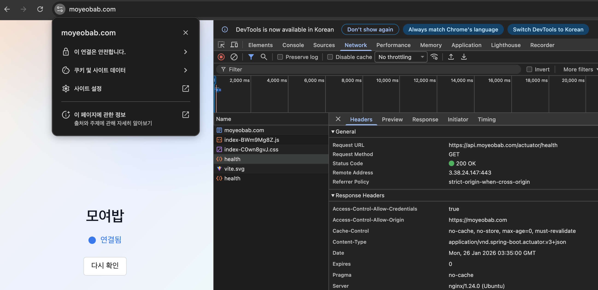

# 애플리케이션 정상 실행 및 접속 확인 (Big Bang 배포 기준)

이 문서는 컨테이너 없이 단일 EC2에 배포한 뒤, 정상 실행 여부를 확인하는 수동 점검 절차를 정리합니다.
최종 확인은 프론트에서 백엔드 헬스체크를 호출하는 페이지를 통해 수행합니다.

## 확인 시나리오 요약

1. 서비스 프로세스가 정상 기동됨
2. 필요한 포트가 리스닝 상태임
3. 프론트 ↔ 백엔드 연결이 정상 동작함

## 1. 서비스 상태 확인

```bash
sudo systemctl status nginx --no-pager
sudo systemctl status postgresql --no-pager
sudo systemctl status redis-server --no-pager
sudo systemctl status moyeobab-api --no-pager
sudo systemctl status recommend --no-pager
```

## 2. 포트 리스닝 확인

```bash
sudo ss -lntp
```

확인 포트:

- 80, 443 (Nginx)
- 8080 (Backend)
- 8000 (AI, 선택)
- 5432 (PostgreSQL)
- 6379 (Redis)

## 3. 프론트/백엔드 연동 확인 (핵심)

프론트에 헬스체크 전용 페이지를 추가하고, 백엔드 헬스체크 엔드포인트로 요청을 보냅니다.

예시 흐름:

1. 브라우저에서 프론트 도메인 접속
2. 헬스체크 페이지에서 요청 실행
3. 응답(HTTP 200/OK 등)이 UI에 표시됨
4. 브라우저 개발자 도구(Network)에서 상태 코드 확인

> 실제 헬스체크 엔드포인트 경로는 백엔드 구현에 맞춰 지정합니다.

### 로컬 확인(옵션)

```bash
curl -i http://127.0.0.1:8080/<HEALTH_ENDPOINT>
```

## 4. 로그 확인 (문제 발생 시)

```bash
sudo journalctl -u nginx -f
sudo journalctl -u moyeobab-api -f
sudo journalctl -u recommend -f
```

## 참고 이미지


