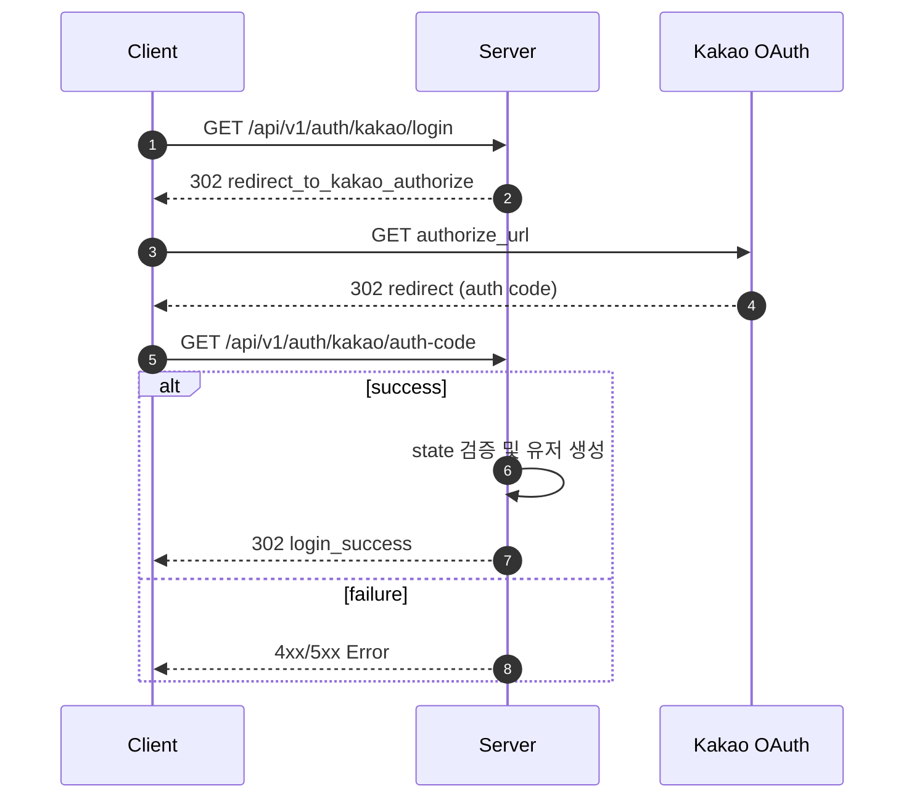
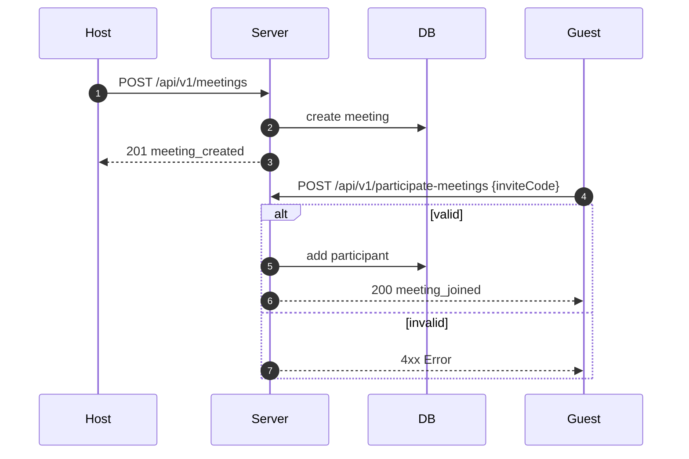
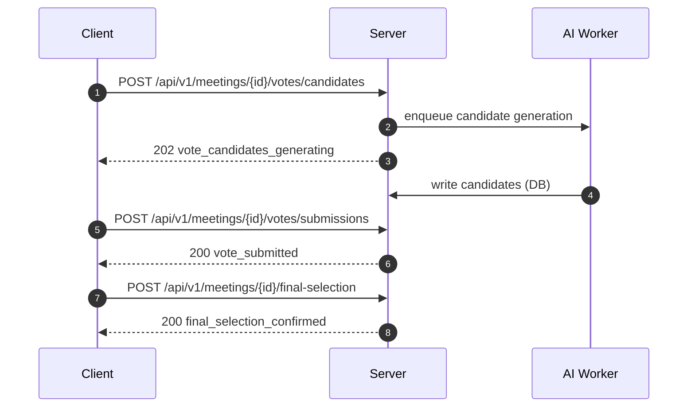

# 우리 서비스에 적합한 SLI 지표 선정

본 문서는 서비스의 모든 유저 저니를 검토하고, 그중 핵심 가치를 전달하는 Critical User Journey (CUJ)를 선별하여 품질 지표(SLI)를 선정하는 과정을 기술한다.

---

## 1. SLI의 정의 및 도입 필요성

### 1.1 SLI의 정의 (Google SRE 기준)

SLI (Service Level Indicator)는 서비스 수준 척도를 의미하며, 서비스의 상태를 나타내는 정량적인 측정값이다. Google SRE 가이드에 따르면, 이는 단순 시스템 메트릭(CPU, Memory 등)이 아닌 사용자가 실제로 경험하는 품질(User Happiness)을 수치화한 것이어야 한다.

### 1.2 왜 SLI를 사용하는가?

서비스 품질 관리에 SLI를 도입해야 하는 핵심적인 이유는 다음과 같다.

1. 사용자 경험의 객관화
   - "서비스가 느린 것 같다"는 막연한 느낌을 "응답시간이 500ms를 초과하는 비율이 10% 증가했다"는 구체적인 사실로 전환한다.
   - 이를 통해 팀 내외부에서 모호한 논쟁을 줄이고 데이터 기반의 대화가 가능하다.

2. 신뢰성의 정량적 기준 수립
   - 완벽한 서비스(100% 가동)는 불가능하고 비용이 무한대로 든다.
   - SLI는 "어느 정도까지 오류를 허용할 것인가"에 대한 합의점(SLO)을 설정하는 기초가 된다.

3. 의사결정의 근거 제공
   - 새로운 기능을 배포할지, 아니면 시스템 안정화에 집중할지를 결정할 때 SLI 데이터가 명확한 판단 기준이 된다. (예: 에러율이 기준치 이하라면 과감한 배포 시도)

---

## 2. 전체 유저 저니 리스트업

서비스에서 발생하는 주요 기능 플로우 20개를 도메인별로 분류한 리스트이다.

| 번호 | 플로우 명                 | 도메인      | 설명                           |
| :--- | :------------------------ | :---------- | :----------------------------- |
| 1    | Kakao Login               | Auth        | 카카오 OAuth 로그인            |
| 2    | Logout                    | Auth        | 로그아웃                       |
| 3    | Onboarding                | Onboarding  | 약관 동의 + 취향 설정          |
| 4    | Agreement Detail          | Onboarding  | 약관 전문 조회                 |
| 5    | User Profile              | User        | 내 정보 조회                   |
| 6    | Withdraw                  | User        | 회원 탈퇴                      |
| 7    | Meeting List              | Meetings    | 내 모임 목록 조회              |
| 8    | Create Meeting + Join     | Meetings    | 모임 생성 및 참여              |
| 9    | Meeting Detail            | Meetings    | 모임 상세 조회                 |
| 10   | Update Meeting            | Meetings    | 모임 수정                      |
| 11   | Delete Meeting            | Meetings    | 모임 삭제                      |
| 12   | Leave Meeting             | Meetings    | 모임 떠나기                    |
| 13   | Restaurant Detail         | Restaurants | 식당 정보 조회                 |
| 14   | My Reviews                | Reviews     | 내 리뷰 목록                   |
| 15   | Create Review             | Reviews     | 리뷰 작성                      |
| 16   | Update Review             | Reviews     | 리뷰 수정                      |
| 17   | Delete Review             | Reviews     | 리뷰 삭제                      |
| 18   | Vote Candidate Generation | Votes       | AI 투표 후보 생성 (비동기)     |
| 19   | Vote Submit -> Finalize   | Votes       | 투표 제출 -> 결과 -> 최종 확정 |
| 20   | Presigned URL             | Uploads     | S3 파일 업로드 URL 발급        |

---

## 3. 핵심 유저 저니 (CUJ) 선정 근거

비즈니스 영향도와 사용자 경험의 필수성을 기준으로 3가지 핵심 여정을 선정하였다.

| CUJ                   | 포함 플로우                       | 선정 근거 (Rationale)                                            |
| :-------------------- | :-------------------------------- | :--------------------------------------------------------------- |
| CUJ 1: 신규 유저 진입 | 1. 로그인 + 3. 온보딩             | 서비스의 첫 관문이며 실패 시 사용 자체가 불가능한 지점임         |
| CUJ 2: 미팅 참여      | 8. 모임 생성/참여                 | 모임 기반 서비스의 정체성을 결정하는 핵심 기능임                 |
| CUJ 3: 투표 완료      | 18. 후보 생성 + 19. 투표/최종선정 | AI 추천을 통한 최종 의사결정이라는 서비스의 본질적 가치가 실현됨 |

---

## 4. CUJ별 상세 시퀀스 분석

선정된 CUJ의 흐름을 시퀀스 다이어그램으로 분석하여 측정 지표를 도출한다.

### 4.1 CUJ 1: 신규 유저 진입 (Login + Onboarding)

### 4.2 CUJ 2: 미팅 참여 (Create + Join)

### 4.3 CUJ 3: 투표 완료 (AI Generation + Vote)

---

## 5. CUJ별 측정 지표 (SLI) 상세 정의

각 CUJ의 특성에 맞춰 측정할 구체적인 지표(Indicator)와 측정 대상을 정의한다.

### 5.1 CUJ 1: 신규 유저 진입 (로그인 + 온보딩)

| 지표 유형      | 측정 방식             | 측정 대상 API                  | 비고                                |
| :------------- | :-------------------- | :----------------------------- | :---------------------------------- |
| 가용성         | 2xx 성공 응답 비율    | /auth/kakao/\*, /onboarding/\* | 외부 인증 연동 성공 여부 포함       |
| 응답시간 (p95) | 95번째 백분위 Latency | 동일                           | 리다이렉트 및 초기 데이터 로딩 시간 |
| 에러율         | 5xx 서버 에러 비율    | 동일                           | 서버 내부 오류만 집계               |

### 5.2 CUJ 2: 미팅 참여 (생성 + 참여)

| 지표 유형      | 측정 방식             | 측정 대상 API                              | 비고                    |
| :------------- | :-------------------- | :----------------------------------------- | :---------------------- |
| 가용성         | 2xx 성공 응답 비율    | POST /meetings, POST /participate-meetings | 핵심 쓰기 작업의 안정성 |
| 응답시간 (p95) | 95번째 백분위 Latency | 동일                                       | 단순 CRUD의 빠른 응답성 |
| 에러율         | 5xx 서버 에러 비율    | 동일                                       | 데이터 무결성 보장      |

### 5.3 CUJ 3: 투표 완료 (후보 생성 → 투표 → 최종선정)

| 지표 유형          | 측정 방식                | 측정 대상 API                  | 비고                       |
| :----------------- | :----------------------- | :----------------------------- | :------------------------- |
| 가용성             | 2xx 성공 응답 비율       | /votes/\*, /final-selection    | 투표 및 결과 확인 프로세스 |
| 응답시간 (p95)     | 95번째 백분위 Latency    | POST /submissions, GET /result | UI 인터랙션 반응 속도      |
| AI 처리 완료율     | 후보 생성 성공 / 요청 수 | POST /votes/candidates         | 비동기 AI 작업의 완결성    |
| AI 처리 시간 (p95) | 작업 큐 인입 ~ 완료 델타 | 동일                           | 사용자 대기 시간 관리      |

---

## 6. 지표 선정 원칙 (Rationale)

- 가용성: 동시 접속이 발생하는 서비스 구조상 한 명의 오류가 그룹 전체의 경험 저하로 이어짐을 고려함.
- 응답시간 (p95): 평균 뒤에 숨은 느린 요청들을 포착하여 대다수 사용자의 실질적인 만족도를 측정함.
- 5xx 에러율: 클라이언트 측 이슈가 아닌 서버 측의 순수한 신뢰성만을 지표화하기 위해 5xx 응답에 집중함.
- 비동기 특화 지표: HTTP 응답 이후 백그라운드에서 진행되는 AI 연산의 품질을 보장하기 위해 별도 지표를 도입함.
