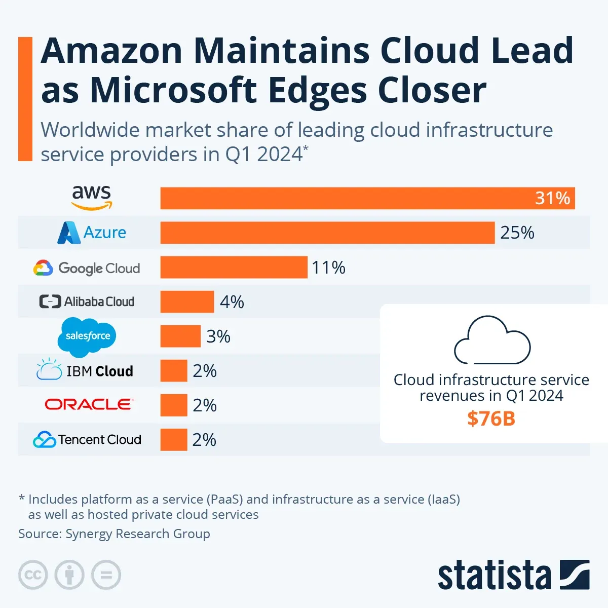
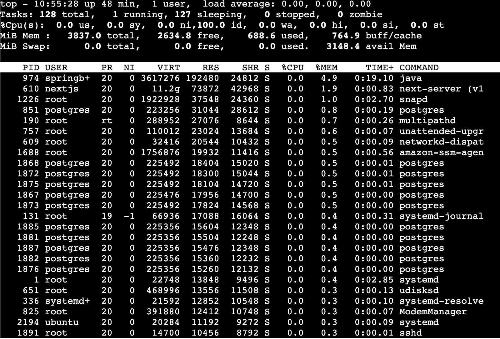
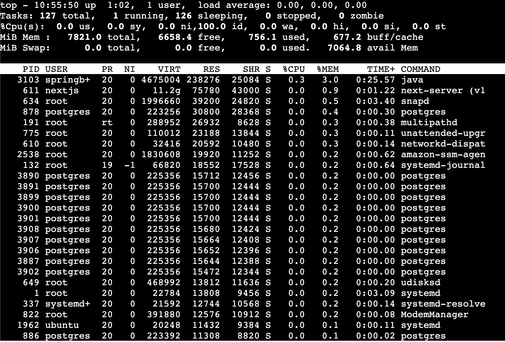
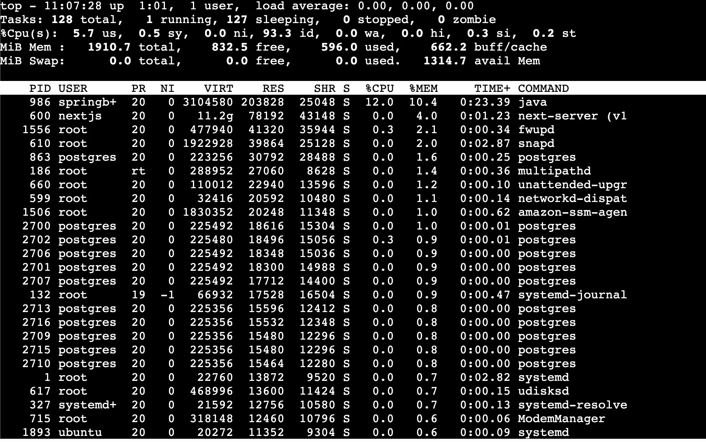
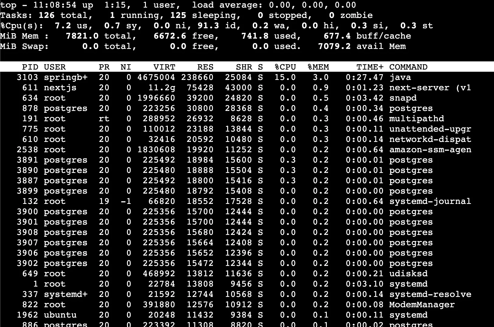

# AWS 와 대조군 비교분석

## 개요

| **기업**         | **서비스 명칭**      | **주요 강점**                 | **추천 용도**                   |
| ---------------- | -------------------- | ----------------------------- | ------------------------------- |
| **AWS**          | **EC2**              | 압도적인 기능과 생태계        | 모든 규모, 모든 목적            |
| **DigitalOcean** | **Droplets**         | 매우 단순한 UI, 고정 가격     | 스타트업, 개인 개발자, MVP      |
| **NCP (네이버)** | **Server**           | 국내 기술 지원, 한국 특화 API | 국내 대상 서비스, 공공 프로젝트 |
| **GCP**          | **Compute Engine**   | 데이터 분석, 커스텀 사양      | AI 개발, 데이터 워크로드        |
| **Azure**        | **Virtual Machines** | MS 제품군 하이브리드 구성     | 엔터프라이즈, Windows 서버      |
| **OCI**          | **Compute Instance** | 가성비(HPC, DB 최적화)        | 대규모 연산, Oracle DB 사용 시  |

### 1. 글로벌 표준 및 기술 경쟁력

- **대상:** **Microsoft Azure, Google Cloud (GCP)**
- **선정 이유:** AWS와 함께 글로벌 클라우드 시장을 양분하는 '하이퍼스케일(Hyperscale)' 경쟁사입니다. 기능의 다양성, 안정성, 엔터프라이즈 레벨의 기술 성숙도를 AWS와 동등한 체급(Apple-to-Apple)에서 비교하여, AWS가 기술적으로 여전히 우위인지 혹은 가격 거품인지 판단하기 위한 기준점입니다.
  - Azure
    - 엔터프라이즈 통합성 (Windows & Active Directory)
    - OpenAI 독점 파트너십 (Azure OpenAI Service)
    - GitHub와의 시너지
  - GCP:
    - 쿠버네티스 네이티브 (GKE)
    - 압도적인 데이터 분석 (BigQuery)
    - 네트워크 성능 및 비용 (Global Fiber)

**그럼에도 불구하고 AWS 인 이유**

- **Linux/Open Source 친화력:** Azure가 많이 좋아졌다고는 하나, 태생적으로 Windows 친화적입니다. 반면, AWS는 탄생부터 **Linux와 오픈소스가 1순위(First-class)**였습니다. Spring Boot(Java)와 리눅스 환경에서는 AWS의 도구들이 훨씬 자연스럽고 매끄럽게 동작합니다.
- **중립성(Neutrality):** Azure를 쓰면 결국 AD, Office 365, Teams 등 MS 생태계로 빨려 들어갑니다. AWS는 특정 소프트웨어 벤더에 종속되지 않은 **가장 중립적인 인프라**이기에, 다양한 오픈소스 기술 스택(Kafka, Redis, ES 등)을 가장 자유롭게 조합할 수 있습니다.
- **서비스 수명 주기(Stability):** 구글은 "돈 안 되면 끈다(Kill)"는 악명 높은 'Google Graveyard' 리스크가 있습니다. 반면, AWS는 한 번 출시한 서비스는 거의 영원히 지원합니다. (심지어 10년 전 구형 인스턴스도 여전히 돌아갑니다.) **비즈니스의 연속성** 면에서 AWS가 주는 신뢰감이 더 큽니다.
- **서드파티 생태계의 우선순위:** 테라폼(Terraform), 젠킨스(Jenkins), 데이터독(Datadog) 등 세상의 모든 모니터링/배포 도구가 신기능을 내놓을 때 AWS 버전을 가장 먼저 출시

### 2. 비용 대비 고성능

- **대상:** **Oracle Cloud (OCI)**
- **선정 이유:** 후발 주자로서 시장 침투를 위해 공격적인 가격 정책(성능 공유형 가격에 전용 성능 제공)을 펼치고 있는 '파괴적 혁신가'입니다. "동일 성능일 때 비용을 어디까지 낮출 수 있는가?"에 대한 최저가 하한선(Baseline)을 확인하기 위해 선정했습니다.

참고) https://www.oracle.com/cloud/oci-vs-aws/

**그럼에도 불구하고 AWS 인 이유**

- **생태계의 빈약함 -** OCI는 컴퓨팅(Compute)은 싸고 빠르지만, 그 외의 주변 서비스(Managed Services)의 완성도가 AWS에 비해 아직 부족하다.
- **미래 확장성의 한계 -** 지금은 단순한 .jar 배포지만, 서비스가 커져서 추가 기능이 붙으면 OCI 입장에서 고급기능을 위해 다른 클라우드에 의존해야하는 문제가 발생가능하다.
- 인력 채용과 러닝 커브 비용 - OCI 가 서버 비용은 저렴해도, 채용 난이도는 더 높다.

### 3. 지역 최적화 및 로컬 규제 대응

- **대상:** **Naver Cloud Platform (NCP)**
- **선정 이유:**
  - 단순 가상 서버뿐만 아니라, 관리형 DB, 컨테이너(Kubernetes Service), CI/CD 도구까지 AWS와 가장 유사한 포트폴리오를 갖추고 있습니다.
  - 한국 내 데이터센터 보유, 원화 결제 지원, 국내 컴플라이언스(CSAP 등) 대응에 가장 최적화된 토종 1위 사업자입니다.

**그럼에도 불구하고 AWS 인 이유**

- NCP에서의 RDS(관리형 DB), 오토스케일링 등 고급 설정이 상대적으로 복잡하고 느린 경우가 많음
- NCP도 해외 리전이 있지만, AWS만큼 촘촘하지 않아 글로벌 서비스 시 레이턴시 품질 차이가 큽니다.
- NCP는 사용자가 적다 보니, 공식 문서 외에는 트러블슈팅 정보를 찾기가 매우 어렵습니다. 에러가 나면 구글링 대신 고객센터에 문의하고 답변을 기다려야 합니다. 개발 속도(Time-to-market)에서 AWS가 훨씬 빠를 수밖에 없는 이유입니다.

### 4. 개발 생산성 및 단순성

- **대상:** **DigitalOcean**
- **선정 이유:** 복잡한 엔터프라이즈 기능 대신, 직관적인 UI와 투명한 요금 체계를 갖춘 개발자 친화적 서비스(Developer Cloud)입니다. 복잡한 AWS 아키텍처가 오버엔지니어링(Over-engineering)이 될 수 있는 **중소규모 프로젝트나 스타트업 환경에서의 효율성**을 대조하기 위해 선정했습니다.

참고) https://deploy.me/blog/aws-vs-digitalocean-2025

그럼에도 불구하고 AWS인 이유

- DigitalOcean은 싸고 단순하지만, 기능이 없어서 직접 만들어야 하는 것들이 너무 많습니다.
  → 보안의 부재, 세밀한 권한 제어 불가
- 성장의 천장(Glass Ceiling)이 너무 낮습니다
  → 인스턴스 타입의 한계, 글로벌 확장의 제약
- DigitalOcean은 공용 인터넷망 의존도가 높아, 국제 구간에서 네트워크가 출렁일 때 속도 저하가 더 잦습니다.

## 유사사양 대비 가격 비교

### ⚡ 성능 공유형 (Burstable)

> "가성비 중심" - 개발 서버, 트래픽이 들쑥날쑥한 웹 서버용

| 순위  | 공급자           | 인스턴스 모델     | **스펙 (CPU / RAM)** | 시간당 요금 (KRW) | 비고                                   |
| ----- | ---------------- | ----------------- | -------------------- | ----------------- | -------------------------------------- |
| **1** | **OCI**          | Standard.E4 (50%) | **2 vCPU\*** / 4GB   | **약 23원**       | Dedicated의 50% 가격 (1 OCPU = 2 vCPU) |
| **2** | **NCP**          | Compact (g1)      | **2 vCPU / 4GB**     | **약 40~50원**    | 한국 리전 최저가 보급형 라인           |
| **3** | **DigitalOcean** | Basic Droplet     | **2 vCPU / 4GB**     | **약 52원**       | ($0.036) 트래픽 비용 포함 장점         |
| **4** | **GCP**          | e2-medium         | **2 vCPU / 4GB**     | **약 58원**       | ($0.040) 자동 할인 적용 전             |
| **5** | **AWS**          | t3.medium         | **2 vCPU / 4GB**     | **약 75원**       | ($0.052) 서울 리전 표준 요금           |
| **6** | **Azure**        | B2s               | **2 vCPU / 4GB**     | **약 93원**       | ($0.064) 서울 리전 기준 다소 높음      |

### 🚀 성능 보장형 (Dedicated)

> "안정성 중심" - 실운영(Production) 서버, 게임 서버, DB용

| 순위  | 공급자           | 인스턴스 모델    | **스펙 (CPU / RAM)** | 시간당 요금 (KRW) | 비고                              |
| ----- | ---------------- | ---------------- | -------------------- | ----------------- | --------------------------------- |
| **1** | **OCI**          | VM.Standard.E4   | **2 vCPU\*** / 8GB   | **약 65원**       | 압도적 가성비 (1 OCPU = 2 vCPU)   |
| **2** | **NCP**          | Standard (s2-g3) | **2 vCPU / 8GB**     | **132원**         | **AWS보다 23원, DO보다 4원 저렴** |
| **3** | **DigitalOcean** | General Purpose  | **2 vCPU / 8GB**     | **약 136원**      | ($0.094) 트래픽 비용 포함 장점    |
| **4** | **AWS**          | m5.large         | **2 vCPU / 8GB**     | **약 155원**      | ($0.107) 서울 리전 표준 요금      |
| **5** | **Azure**        | D2s_v5           | **2 vCPU / 8GB**     | **약 164원**      | ($0.113) 리눅스 기준              |
| **6** | **GCP**          | n2-standard-2    | **2 vCPU / 8GB**     | **약 174원**      | ($0.120) 자동 할인 적용 전 가격   |

출처)

AWS: https://aws.amazon.com/ko/ec2/pricing/on-demand/

Digital Ocean: https://www.digitalocean.com/pricing/droplets

NCP: [https://www.fin-ncloud.com/charge/region/ko](https://www.ncloud.com/charge/price)

GCP: https://cloud.google.com/compute/all-pricing

Azure: https://azure.microsoft.com/en-us/pricing/details/virtual-machines/linux/

OCI: [https://www.oracle.com/kr/cloud/price-list/](https://www.oracle.com/cloud/compute/pricing/)

# Nginx와 대조군 비교분석

## 개요

| **비교 항목**    | **Nginx**         | **AWS ALB**                    | **Caddy**               | **Spring Cloud Gateway** |
| ---------------- | ----------------- | ------------------------------ | ----------------------- | ------------------------ |
| **설치 위치**    | EC2 내부          | **EC2 외부**                   | EC2 내부                | EC2 내부                 |
| **설정 난이도**  | 보통 (복잡함)     | **낮음 (GUI)**                 | **매우 낮음**           | 보통 (코딩 필요)         |
| **리소스 점유**  | 낮음              | **없음 (최고)**                | 매우 낮음               | 높음 (JVM 구동)          |
| **HTTPS 확장성** | 보통 (Certbot 등) | **매우 쉬움 (ACM)**            | **매우 쉬움 (자동)**    | 보통                     |
| **비용**         | 무료              | 월 $20~25                      | 무료                    | 무료                     |
| **한 줄 평**     | 검증된 표준       | **돈으로 관리 시간을 사는 법** | **설정이 가장 쉬운 SW** | Java 개발자에게 익숙함   |

Nginx의 역할: Reverse Proxy

Reverse Proxy를 둔 이유

- 단일 진입점 제공 및 경로 라우팅
- 보안을 강화할 수 있다.
- HTTPS 관련 인증서를 한 곳에서 처리할 수 있다.
- 버퍼링을 통해 클라이언트에게 응답을 조절할 수 있다.

### AWS ALB

- **관리의 완전 자동화 (Managed Service):** Nginx는 프로세스가 죽으면 직접 살려야 하지만, ALB는 AWS가 가용성을 100% 보장합니다. 사용자는 설치, 업데이트, OS 튜닝을 전혀 신경 쓸 필요가 없습니다.
- **ACM(AWS Certificate Manager) 무료 연동:** HTTPS를 적용할 때, 서버에 인증서 파일을 직접 올릴 필요가 없습니다. AWS에서 발급받은 무료 인증서를 클릭 몇 번으로 연결하고, **갱신까지 자동으로** 수행합니다.
- **상태 확인 (Health Check)의 고도화:** Nginx 무료 버전은 뒷단 서버(Next.js, Spring)가 죽었는지 확인하는 기능이 단순합니다. ALB는 인프라 레벨에서 주기적으로 핑을 날려 비정상 서버를 트래픽에서 즉시 제외합니다.
- **WAF(Web Application Firewall) 연동:** AWS의 보안 서비스인 WAF를 클릭 한 번으로 붙여서 SQL Injection이나 DDoS 공격을 손쉽게 막을 수 있습니다.

그럼에도 불구하고 AWS ALB가 아닌 Nginx인 이유

- EC2 인스턴스 성능에 여유가 있다면 비용 지불 없이 프록시 서버를 운영할 수 있다.
- **Nginx:** 특정 헤더를 아주 상세하게 변경하거나, 복잡한 정규표현식을 이용한 URL 리다이렉트(Rewrite), 특정 조건(User-Agent 등)에 따른 분기 처리가 코드 몇 줄로 가능합니다.
- 클라우드 종속성을 탈피할 수 있다.

### Caddy

- **On-Demand TLS (자동 HTTPS):** Nginx는 `certbot`을 따로 깔고 주기적으로 명령어를 날려야 하지만, Caddy는 도메인만 적어두면 알아서 인증서를 받아오고 갱신합니다. HTTPS를 쓸 계획이라면 가장 강력한 장점입니다.
- **단일 바이너리 운영:** Nginx는 설정 파일 외에도 운영체제에 따라 라이브러리 의존성이 복잡할 수 있습니다. Caddy는 Go 언어로 빌드된 **파일 하나**로 돌아가므로, 사용자님의 `jar` 실행 방식과 매우 유사한 '단순함'을 제공합니다.
- **HTTP/3 기본 지원:** 최신 전송 프로토콜인 HTTP/3(QUIC)를 별도 컴파일이나 설정 없이 즉시 지원하여 네트워크 속도를 최적화합니다.

그럼에도 불구하고 Caddy 가 아닌 Nginx인 이유

- 극강의 리소스 효율성
  - **메모리 점유율:** Nginx는 C언어 기반의 이벤트 드리븐 구조로, 수십 MB의 적은 RAM만으로도 수천 개의 동시 접속을 처리합니다. 반면 Go 언어 기반인 Caddy는 런타임과 가비지 컬렉션(GC) 때문에 Nginx보다 보통 2~4배 더 많은 메모리를 사용합니다.
  - **자원 양보:** Nginx가 아낀 메모리와 CPU는 고스란히 인스턴스가 더 원활하게 돌아가는 데 사용될 수 있습니다.
- 정적 파일 서빙 능력
  - **웹 서버로서의 본분:** Nginx는 디스크에 있는 정적 파일(이미지, JS, CSS 등)을 클라이언트에게 뿌려주는 속도가 현존하는 도구 중 최상위권입니다.
  - **효율적인 처리:** `sendfile` 등의 커널 기능을 활용하여 CPU 사용을 최소화하면서 파일을 전달합니다. Caddy도 잘하지만, 극단적인 성능 최적화가 필요할 때는 여전히 Nginx가 업계 표준입니다.
- 방대한 생태계와 레퍼런스
  - **문제 해결 속도:** Nginx는 20년 넘게 사용된 '업계의 표준'입니다. 복잡한 라우팅 오류, 보안 설정, 성능 튜닝에 직면했을 때 구글이나 Stack Overflow에서 찾을 수 있는 해결책의 양은 Caddy와 비교할 수 없을 정도로 압도적입니다.
  - **검증된 안정성:** "아무도 Nginx를 썼다고 해고당하지 않는다"는 말이 있을 정도로, 대규모 트래픽에서의 안정성과 신뢰도가 완벽하게 검증되어 있습니다.
- '자동 HTTPS'의 무의미함 (현재 상황 기준)
  - **선택의 기준:** 이는 Caddy의 가장 큰 구매 포인트(On-Demand TLS)가 사라진다는 뜻입니다.
  - **불필요한 기능:** 자동 HTTPS 기능을 쓰지 않는다면, 굳이 리소스를 더 먹고 레퍼런스가 적은 Caddy를 선택할 강력한 유인이 줄어듭니다. 오히려 익숙하고 가벼운 Nginx를 유지하는 것이 운영 리스크를 줄일 수 있기 때문입니다.

Spring Cloud Gateway

- **프로그래밍 방식의 라우팅:** Nginx는 설정 파일(.conf)을 수정해야 하지만, SCG는 Java 코드나 application.yml로 라우팅을 정의합니다. 즉, Git으로 관리하기 편하고 배포 파이프라인에 태우기 좋습니다.
- **Spring 생태계와 밀착 통합:** Spring Boot 사용자라면 익숙한 **Security, Micrometer(모니터링), Resilience4j(서킷 브레이커)** 등을 그대로 프록시 계층에서 사용할 수 있습니다.
- **동적 필터링:** 요청이 들어오거나 나갈 때 Java 코드로 헤더를 마음대로 주무르거나, 복잡한 비즈니스 로직 기반의 인증 처리를 프록시 단에서 직접 수행하기 매우 유리합니다.

그럼에도 불구하고 Spring Cloud Gateway가 아닌 Nginx인 이유

- 기술 스택의 불일치와 오버헤드
  **SCG는 Spring WebFlux와 Netty** 기반으로 설계되었습니다.
  - **불필요한 러닝 커브:** SCG를 도입하면 MVC 기반 개발자라도 비동기 논블로킹 방식(WebFlux)의 동작 원리를 이해해야 설정을 제대로 할 수 있습니다.
  - **라이브러리 충돌 위험:** 단일 서버 환경에서 MVC와 WebFlux 관련 라이브러리가 뒤섞이면 의존성 관리가 복잡해지고 프로젝트가 무거워집니다.
  - **Nginx의 범용성:** Nginx는 C언어로 작성된 독립 프로세스이므로, 백엔드가 MVC든 WebFlux든 상관없이 **프로토콜(HTTP)만 맞으면 완벽하게 작동**합니다.
- 메모리 사용량의 극명한 차이 (C vs JVM)
  - **Nginx (압도적 가벼움):** C 기반의 Nginx는 프록시 역할만 할 때 수십 MB의 메모리만 점유합니다.
  - **SCG (메모리 포식자):** SCG는 그 자체가 하나의 **Spring Boot 애플리케이션**입니다. 따라서 `jar`로 실행할 때 최소 256MB~512MB 이상의 JVM 힙 메모리를 미리 할당받아야 하며, 이는 사용자님의 **실제 비즈니스 로직(Spring MVC)과 DB(PostgreSQL)가 쓸 메모리를 뺏는 결과**를 초래합니다.
- 정적 리소스(Next.js) 처리 성능
  - **Nginx:** 원래 태생이 웹 서버입니다. Next.js의 이미지, JS, CSS 파일 같은 정적 리소스를 디스크에서 읽어 사용자에게 전달하는 속도는 Java 기반인 SCG가 따라올 수 없는 영역입니다.
  - **SCG:** API 라우팅과 필터링에 특화된 '게이트웨이'이지, 대량의 정적 파일을 서빙하도록 설계된 도구가 아닙니다. 정적 파일을 처리하게 시키면 CPU와 메모리 부하가 급증합니다.
- 운영 및 배포의 단순성
  - **의존성 분리:** Nginx는 시스템 레벨의 서비스입니다. 백엔드 Java 코드가 잘못되어 빌드가 깨지거나 `jar` 실행이 실패해도 Nginx는 살아있어 "점검 중" 페이지를 보여줄 수 있습니다.
  - **SCG:** 백엔드와 같은 Java 기반이므로, 환경 변수나 JVM 설정 오류 등으로 인해 함께 영향을 받을 확률이 높습니다.

## 트래픽 기준

| 항목        | 예상치       | 산정 근거                |
| ----------- | ------------ | ------------------------ |
| MAU         | 100명        | 초기 목표 사용자         |
| DAU         | 60명         | MAU의 12%                |
| 일일 요청량 | ~600 req/day | 사용자당 평균 10 req/day |

- 부트캠프 수강생 약 100명을 1차 사용자 풀로 가정하고, 과제·협업 맥락에서 약 60%가 일 1회 이상 사용한다고 가정 (MAU 500, DAU 60)
- 유저 플로우 (일일 요청량, 사용자당 평균 10 req/day, 10 \* 60(DAU) → 600 req/day)
  1. GET - 목록 조회
  2. POST - 모임 생성
  3. GET - 초대 코드
  4. GET - 모임 상세
  5. GET - 참여자 확인
  6. GET - 식당 목록
  7. POST - 투표 제출
  8. GET - 결과 조회
  9. POST - 최종 확정
  10. GET - 확정 후 상세 재조회

## 테스트

### 가설: T-series 적합

- 우리 트래픽은 상시 고부하가 아니라 피크가 짧게 오는 패턴
- T-series는 Burstable(크레딧 기반)이라 idle 시간에 크레딧을 쌓고 피크에 Burst로 대응 가능
- 따라서 비용을 최소화하면서 피크를 버틸 수 있음

### 인스턴스 후보 선정

- 후보 : t3.micro / t3.small / t3.medium / t3.large
- 목적 : “최소 스펙”을 찾기 위해 한 단계씩 올리며 한계점을 확인
- t3.micro
  
- t3.small
  
- t3.medium
  
- t3.large
  

## 부하 테스트

- t3.micro
  
- t3.small
  
- t3.medium
  
- t3.large
  
